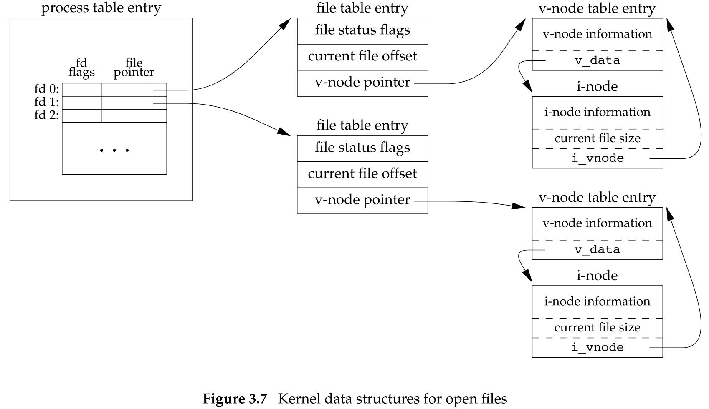
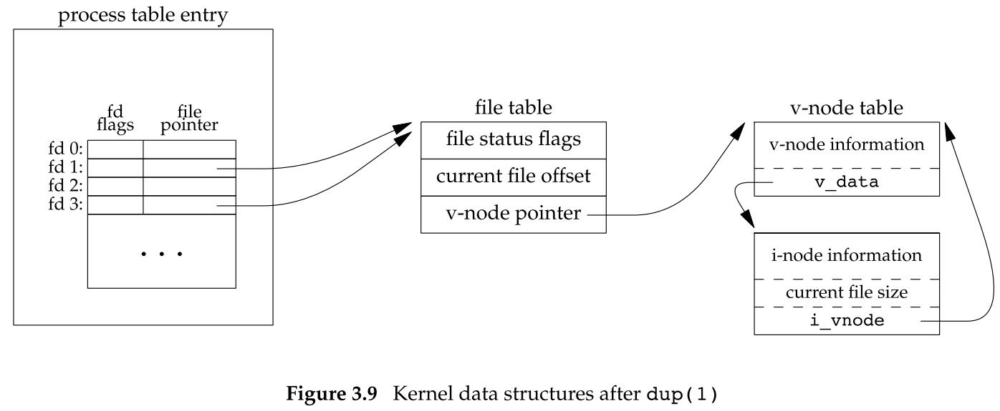

## 文件 I/O

### 3.1 引言

#### 不带缓冲的 I/O

术语不带缓冲指的是每个 `read` 和 `write` 都调用内核中的一个系统调用。

这些不带缓冲的 I/O 函数不是 ISO C 的组成部分，但是，它们是 POSIX.1 和 Single UNIX Specification 的组成部分。

### 3.2 文件描述符

对于内核而言，所有打开的文件都通过文件描述符引用。

文件描述符是一个非负整数。

当打开一个现有文件或创建一个新文件时，内核向进程返回一个文件描述符。

当读、写一个文件时，使用 `open` 或 `creat` 返回的文件描述符标识该文件，将其作为参数传送给 `read` 或 `write`。

UNIX 系统 shell 及很多应用程序的惯例（在符合 POSIX.1 的应用程序中，符号常量在头文件 <unistd.h> 中定义：

- 文件描述符 0 ：标准输入
  - `STDIN_FILENO`
- 文件描述符 1 ：标准输出
  - `STDOUT_FILENO`
- 文件描述符 2 ：标准错误
  - `STDERR_FILENO`

文件描述符的变化范围是 0 ~ `OPEN_MAX`-1。

### 3.3 函数 `open` 和 `openat`

调用 `open` 或 `openat` 函数可以打开或创建一个文件。

```c
#include <fcnt1.h>

int open(const char *path, int oflag, ... /* mode_t mode */);
int openat(int fd, const char *path, int oflag, ... /* mode_t mode */);
```

将最后一个参数写为 ...，ISO C 用这种方法表明余下的参数的数量及其类型是可变的。

对于 `open` 函数而言，仅当创建新文件时才使用最后这个参数。

在函数原型中将此参数放置在注释中。

参数：

- `path` 参数是要打开或创建文件的名字
- `oflag` 参数可用来说明此函数的多个选项，用下列一个或多个常量进行“或”运算构成 `oflag` 参数

  - `O_RDONLY`：只读打开
  - `O_WRONLY`：只写打开
  - `O_RDWR`：读写打开
    - 大多数实现将 `O_RDONLY` 定义为 0，`O_WRONLY` 定义为 1，`O_RDWR` 定义为 2。
  - `O_EXEC`：只执行打开
  - `O_SEARCH`：只搜索打开（应用于目录）
    - `O_SEARCH` 常量的目的在于在目录打开时验证它的搜索权限。对目录的文件描述符的后续操作就不需要再次检查对该目录的搜索权限。
  - **上述 5 个常量中必须且只能指定一个。**
  - `O_APPEND`：每次写时都追加到文件的尾端。
  - `O_CLOEXEC`：把 `FD_CLOEXEC` 常量设置为文件描述符标志。
  - `O_CREAT`：若此文件不存在则创建它。
    - 使用此选项时，`open` 函数需同时说明第 3 个参数 `mode`，用 `mode` 指定该新文件的访问权限位。
  - `O_DIRECTORY`：如果 `path` 引用的不是目录，则出错。
  - `O_EXCL`：如果同时指定了 `O_CREAT`，而文件已经存在，则出错。
    - 用此可以测试一个文件是否存在，如果不存在，则创建此文件，这使测试和创建两者成为一个原子操作。
  - `O_NOCTTY`：如果 `path` 引用的是终端设备，则不将该设备分配作为此进程的控制终端。
  - `O_NOFOLLOW`：如果 `path` 引用的是一个符号链接，则出错。
  - `O_NONBLOCK`：如果 `path` 引用的是一个 FIFO、一个块特殊文件或一个字符特殊文件，则此选项为文件的本次打开操作和后续的 I/O 操作设置为非阻塞方式。
  - `O_SYNC`：使每次 `write` 等待物理 I/O 操作完成，包括由该 `write` 操作引起的文件属性更新所需的 I/O。
  - `O_TRUNC`：如果此文件存在，而且为只写或读-写成功打开，则将其长度截断为 0。
  - `O_TTY_INIT`：如果打开一个还未打开的终端设备，设置非标准 `termios` 参数值，使其符合 Single UNIX Specification。
  - `O_DSYNC`：使每次 `write` 要等待物理 I/O 操作完成，但是如果该写操作并不影响读取刚写入的数据，则不需等待文件属性被更新。
  - `O_RSYNC`：使每一个以文件描述符作为参数进行的 `read` 操作等待，直至所有对文件同一部分挂起的写操作都完成。
  - **上述常量是可选的。**
- `fd` 参数把 `open` 和 `openat` 函数区分开，共有 3 种可能性：
  - `path` 参数指定的是绝对路径名。
    - `fd` 参数被忽略，`openat` 函数就相当于 `open` 函数。
  - `path` 参数指定的是相对路径名。
    - `fd` 参数指出了相对路径名在文件系统中的开始地址，`fd` 参数是通过打开相对路径名所在的目录来获取。
  - `path` 参数指定了相对路径名，`fd` 参数具有特殊值 `AT_FDCWD`。
    - 路径名在当前工作目录中获取，`openat` 函数在操作上与 `open` 函数类似。
- `...`
  - 将最后一个参数写为 ...，ISO C 用这种方法表明余下的参数的数量及其类型是可变的。对于 `open` 函数而言，仅当创建新文件时才使用最后这个参数。在函数原型中将此参数放置在注释中。

- `mode`：文件访问权限
  - 文件访问权限常量在 `<sys/stat.h>` 中定义，有下列九个：
  - `S_IRUSR`：用户读
  - `S_IWUSR`：用户写
  - `S_IXUSR`：用户执行
  - `S_IRGRP`：组读
  - `S_IWGRP`：组写
  - `S_IXGRP`：组执行
  - `S_IROTH`：其他读
  - `S_IWOTH`：其他写
  - `S_IXOTH`：其他执行

返回值：

- 成功：返回文件描述符
  - 由 `open` 和 `openat` 函数返回的文件描述符一定是最小的未用描述符数值。
- 失败：返回 -1。

`openat` 函数是 POSIX.1 最新版本中新增的一类函数之一，希望解决两个问题：

- 让线程可以使用相对路径名打开目录中的文件，而不再只能打开当前工作目录。
  - 同一进程中的所有线程共享相同的当前工作目录，因此很难让同样进程的多个不同线程在同一时间工作在不同的目录中。
- 可以避免 time-of-check-to-time-of-use（TOCTTOU）错误。
  - TOCTTOU 错误的基本思想是：如果有两个基于文件的函数调用，其中第二个调用依赖于第一个调用的结果，那么程序是脆弱的。因为两个调用并不是原子操作，在两个函数调用之间文件可能改变了，这样也就造成了第一个调用的结果就不再有效，使得最终的结果是错误的。

#### 文件名和路径名截断

在 POSIX.1 中，常量 `_POSIX_NO_TRUNC` 决定是要截断过长的文件名或路径名，还是返回一个出错。

若 `_POSIX_NO_TRUNC` 有效，则在整个路径名超过 `PATH_MAX`，或路径名中的任一文件名超过 `NAME_MAX` 时，出错返回，并将 `errno` 设置为 `ENAMETOOLONG`。

### 3.4 函数 `creat`

可以调用 `creat` 函数创建一个新文件。

```c
#include <fcnt1.h>

int creat(const char *path, mode_t mode);
```

参数：

- `path`：要创建文件的文件名
- `mode`：指定该文件的访问权限
  - 文件访问权限常量在 `<sys/stat.h>` 中定义，有下列九个：
  - `S_IRUSR`：用户读
  - `S_IWUSR`：用户写
  - `S_IXUSR`：用户执行
  - `S_IRGRP`：组读
  - `S_IWGRP`：组写
  - `S_IXGRP`：组执行
  - `S_IROTH`：其他读
  - `S_IWOTH`：其他写
  - `S_IXOTH`：其他执行

返回值：

- 若成功，返回为只写打开的文件描述符；
- 若出错，返回 -1。

`creat` 的一个不足之处是它以只写方式打开所创建的文件。

现在则可用下列方式调用 `open` 实现：

```c
open(path, O_WRONLY | O_CREAT | O_TRUNC, mode);
```

> 在早期的 UNIX 系统版本中，`open` 的第二个参数只能是 0、1 或 2，无法打开一个尚未存在的文件，因此需要另一个系统调用 `creat` 以创建新文件。现在，`open` 函数提供了选项 `O_CREAT` 和 `O_TRUNC`，于是也就不再需要单独的 `creat` 函数。

### 3.5 `close`

可以调用 `close` 函数关闭一个打开文件。

```c
#include <unistd.h>

int close(int fd);
```

参数：

- `fd`：待关闭文件的文件描述符。

返回值：

- 若成功，返回 0；
- 若出错，返回 -1。

### 3.6 函数 `lseek`

每个打开文件都有一个与其相关联的“当前文件偏移量”，它通常是一个非负整数，用以度量从文件开始处计算的字节数。通常，读、写操作都从当前文件偏移量处开始，并使偏移量增加所读写的字节数。按系统默认的情况，当打开一个文件时，除非指定 `O_APPEND` 选项，否则该偏移量被设置为 0。

可以调用 `lseek` 显示地为一个打开文件设置偏移量：

```c
#include <unistd.h>

off_t lseek(int fd, off_t offset, int whence);
```

参数：

- `fd`：文件的文件描述符
- `where`：
  - 绝对偏移量（`SEEK_SET`，0）
  - 相对于当前位置的偏移量（`SEEK_CUR`，1）
  - 相对文件尾端的偏移量（`SEEK_END`，2）
- 对参数 `offset` 的解释与参数 `where` 的值有关：
  - 若 `whence` 是 `SEEK_SET`，则将该文件的偏移量设置为距文件开始处 `offset` 个字节。
  - 若 `whence` 是 `SEEK_CUR`，则将该文件的偏移量设置为其当前值加 `offset`，`offset` 可为正或负。
  - 若 `whence` 是 `SEEK_END`，则将该文件的偏移量设置为文件长度加 `offset`，`offset` 可为正或负。

返回值：

- 若成功，返回新的文件偏移量；
- 若出错，返回 -1。

可用下列方式确定打开文件的当前偏移量：

```c
off_t currpos;
currpos = lseek(fd, 0, SEEK_CUR);
```

这种方法也可用来确定所涉及的文件是否可以设置偏移量。如果文件描述符指向的是一个管道、FIFO 或网络套接字，则 `lseek` 返回 -1，并将 `errno` 设置为 `ESPIPE`。

通常，文件的当前偏移量应当是一个非负整数，但是，某些设备也可能运行负的偏移量。所有在比较 `lseek` 的返回值时应当谨慎，不要测试它是否小于 0，而要测试它是否等于 -1。

> 在 Inter x86 处理器上运行的 FreeBSD 的设备 /dev/kmem 支持负的偏移量。

`lseek` 仅将当前的文件偏移量记录在内核中，它并不引起任何 I/O 操作。然后，该偏移量用于下一个读或写操作。

文件偏移量可以大于文件的当前长度，在这种情况下，对该文件的下一次写将加长该文件，并在文件中构成一个空洞，位于文件中但没有写过的字节都被读为 0。

文件中的空洞并不要求在磁盘上占用存储区。具体处理方式与文件系统的实现有关，当定位到超出文件尾端之后写时，对于新写的数据需要分配磁盘块，但是对于原文件尾端和新开始写位置之间的部分则不需要分配磁盘块。

注意：

- 尽管可以实现 64 位文件偏移量，但是能否创建一个大于 2GB（$2^31-1$ 字节）的文件则依赖于底层文件系统的类型。

### 3.7 函数 `read`

调用 `read` 函数从打开文件中读数据。

```c
#include <unistd.h>

ssize_t read(int fd, void *buf, size_t nbytes);
```

参数：

- `fd`：打开的文件的文件描述符
- `buf`：存放读取内容的缓冲区的地址（手动分配）
- `nbytes`：期望读取的字节数

返回值：

- 若成功，返回读到的字节数；若已到文件尾，返回 0；
- 若出错，返回 -1。

有多种情况可使实际读到的字节数少于要求读的字节数：

- 读普通文件时，在读到要求字节数之前已到达了文件尾端。
- 当从终端设备读时，通常一次最多读一行。
- 当从网络读时，网络中的缓冲机制可能造成返回值小于所要求读的字节数。
- 当从管道或 FIFO 读时，如若管道包含的字节少于所需的数量，那么 `read` 将只返回实际可用的字节数。
- 当从某些面向记录的设备（如磁带）读时，一次最多返回一个记录。
- 当一信号造成中断，而已经读了部分数据量时。

读操作从文件的当前偏移量处开始，在成功返回之前，该偏移量将增加实际读到的字节数。

### 3.8 函数 `write`

调用 `write` 函数向打开文件写数据：

```c
#include <unistd.h>

ssize_t write(int fd, const void *buf, size_t nbytes);
```

参数：

- `fd`：打开的文件的文件描述符
- `buf`：存放待写的数据内容的缓冲区的地址（手动分配）
- `nbytes`：期望写入的字节数

返回值：

- 若成功，返回已写的字节数；
- 若出错，返回 -1；
- 通常与参数 `nbytes` 的值相同，否则表示出错。
  - 出错的一个常见原因是磁盘已写满，或者超过了一个给定进程的文件长度限制。

写操作从文件的当前偏移量处开始，在成功返回之前，该偏移量将增加实际写的字节数。

### 3.9 I/O 的效率

大多数文件系统为改善性能都采用某种预读技术。当检测到正进行顺序读取时，系统就试图读入比应用所要求的更多数据，并假想应用很快就会读这些数据。

### 3.10 文件共享

UNIX 系统支持在不同的进程间共享打开文件。

内核使用 3 种数据结构表示打开文件，它们之间的关系决定了在文件共享方面一个进程对另一个进程可能产生的影响：

- 每个进程在进程表中都有一个记录项，记录项包含一张打开文件描述符表，可将其视为一个矢量，每个描述符占用一项。与每个文件描述符相关联的是：
  - 文件描述符标志（`close_on_exec`）
  - 指向一个文件表项的指针
- 内核为所有打开文件维持一张文件表。每个文件表项包含：
  - 文件状态标志（读、写、添写、同步和非阻塞等）
  - 当前文件偏移量
  - 指向该文件 v 节点表项的指针
- 每个打开文件（或设备）都有一个 v 节点（`v-node`）结构。v 节点包含了文件类型和对此文件进行各种操作函数的指针。对于大多数文件，v 节点还包含了该文件的 i 节点（`i-node`，索引节点）。这些信息是在打开文件时从磁盘上读入内存的，所以，文件的所有相关信息都是随时可用的。
  - 例如，i 节点包含了文件的所有者、文件长度、指向文件实际数据块在磁盘上所在位置的指针等。
  - Linux 没有使用 v 节点，而是使用了通用 i 节点结构。虽然两种实现有所不同，但在概念上，v 节点与 i 节点是一样的。两者都指向文件系统特有的 i 节点结构。

创建 v 节点结构的目的是对在一个计算机系统上的多文件系统类型提供支持。

<center class="half">
    
</center> 


如果两个独立进程各自打开了同一文件：

- 打开该文件的每个进程都获得各自的一个文件表项，但对一个给定的文件只有一个 v 节点表项。
- 之所以每个进程都获得自己的文件表项，是因为这可以使每个进程都有它自己的对该文件的当前偏移量。

<center class="half">
    
</center> 


操作说明：

- 在完成每个 `write` 后，在文件表项中的当前文件偏移量即增加所写入的字节数。如果这导致当前文件偏移量超出了当前文件长度，则将 i 节点表项中的当前文件长度设置为当前文件偏移量。
- 如果用 `O_APPEND` 标志打开一个文件，则相应标志也被设置到文件表项的文件状态标志中。每次对这种具有追加写标志的文件执行写操作时，文件表项中的当前文件偏移量首先会被设置为 i 节点表项中的文件长度。这就使得每次写入的数据都追加到文件的当前尾端处。
- 若一个文件用 `lseek` 定位到文件当前的尾端，则文件表项中的当前文件偏移量被设置为 i 节点表项中的当前文件长度（这与用 `O_APPEND` 标志打开文件是不同的）。
- `lseek` 函数只修改文件表项中的当前文件偏移量，不进行任何 I/O 操作。

文件描述符标志和文件状态标志在作用范围方面的区别：

- 前者只用于一个进程的一个描述符。
- 后者应用于指向该给定文件表项的任何进程中的所有描述符。

### 3.11 原子操作

Single UNIX Specification 包括了 XSI 扩展，该扩展允许原子性地定位并执行 I/O。`pread` 和 `pwrite` 就是这种扩展。

```c
#include <unistd.h>

ssize_t pread(int fd, void *buf, size_t nbytes, off_t offset);
ssize_t pwrite(int fd, const void *buf, size_t nbytes, off_t offset);
```

调用 `pread` 相当于调用 `lseek` 后调用 `read`，但是 `pread` 又与这种顺序调用有下列重要区别：

- 调用 `pread` 时，无法中断其定位和读操作。
- 不改变当前文件偏移量。

调用 `pwrite` 相当于调用 `lseek` 后调用 `write`，但也与它们有类似的区别：

- 调用 `pwrite` 时，无法中断其定位和写操作。
- 不改变当前文件偏移量。

一般而言，原子操作指的是由多步组成的一个操作。如果该操作原子地执行，则要么执行完所有步骤，要么一步也不执行，不可能只执行所有步骤的一个子集。

### 3.12 函数 `dup` 和 `dup2`

下面两个函数都可用来复制一个现有的文件描述符：

```c
#include <unistd.h>

int dup(int fd);
int dup2(int fd, int fd2);
```

参数：

- `fd`：被复制的文件描述符（已被打开）
- `fd2`：指定的新文件描述符的值（待生成）
  - 如果 `fd2` 已被打开，则先将其关闭。
  - 如果 `fd==fd2`，则 `dup2` 返回 `fd2`，而不关闭它。
  - 否则，`fd2` 的 `FD_CLOEXEC` 文件描述符标志就被清除，这样 `fd2` 在进程调用 `exec` 时是打开状态。

返回值：

- 若成功，返回新的文件描述符。
  - 返回的新文件描述符一定是当前可用文件描述符中的最小数值。
  - 返回的新文件描述符与参数 `fd` 共享同一个文件表项。
  - 每个文件描述符都有它自己的一套文件描述符标志，新文件描述符的执行时关闭（close-on-exec）标志总是由 `dup` 函数清除。
- 若出错，返回 -1。

<center class="half">
    
</center> 

复制一个描述符的另一种方法是使用 `fcntl` 函数：

- `dup(fd)` 等效于  `fcntl (fd, F_DUPFD, 0)`
- `dup2(fd, fd2)` 等效于 `close(fd2)` + `fcntl (fd, F_DUPFD, fd2)`
  - 这种情况并不完全等同：
    - `dup2` 是一个原子操作，而 `close` 和 `fcntl` 包括两个函数调用。
    - `dup2` 和 `fcntl` 有一些不同的 `errno`。

### 3.13 函数 `sync`、`fsync` 和 `fdatasync`

延迟写：

- 传统的 UNIX 系统实现在内核中设有缓冲区高速缓存或页高速缓存，大多数磁盘 I/O 都通过缓冲区进行。当我们向文件写入数据时，内核通常先将数据复制到缓冲区中，然后排入队列，晚些时候再写入磁盘。

通常，当内核需要重用缓冲区来存放其他磁盘块数据时，它会把所有延迟写数据块写入磁盘。为了保证磁盘上实际文件系统与缓冲区中内容的一致性，UNIX 系统提供了 `sync`、`fsync` 和 `fdatasync` 三个函数：

```c
#include <unistd.h>

int fsync(int fd);
int fdatasync(int fd);

void sync(void);
```

返回值：

- 若成功，返回 0；
- 若出错，返回 -1。

- `sync` 只是将所有修改过的块缓冲区排入写队列，然后就返回，它并不等待实际写磁盘操作结束。
  - 通常，称为 `update` 的系统守护进程周期性地调用（一般每隔 30 秒）`sync` 函数。
  - 这就保证了定期冲洗内核的块缓冲区。
  - 命令 `sync(1)` 也调用 `sync` 函数。
- `fsync` 函数只对由文件描述符 `fd` 指定的一个文件起作用，并且等待写磁盘操作结束才返回。
  - `fsync` 可用于数据库这样的应用程序，这种应用程序需要确保修改过的块立即写到磁盘上。
- `fdatasync` 函数类似于 `fsync`，但它只影响文件的数据部分。
  - 除数据外，`fsync` 还会同步更新文件的属性。

### 3.14 函数 `fcntl`

`fcntl` 函数可以改变已经打开文件的属性：

```c
#include <fcntl.h>

int fcntl(int fd, int cmd, ... /* int arg */);
```

功能：

- 复制一个已有的描述符
  - `cmd = F_DUPFD 或 F_DUPFD_CLOEXEC`
- 获取/设置文件描述符标志
  - `cmd = F_GETFD 或 F_SETFD`
- 获取/设置文件状态标志
  - `cmd = F_GETFL 或 F_SETFL`
- 获取/设置异步 I/O 所有权
  - `cmd = F_GETOWN 或 F_SETOWN`
- 获取/设置记录锁
  - `cmd = F_GETLK、F_SETLK 或 F_SETLKW`

参数：

- `cmd`：
  - `F_DUPFD`
    - 复制文件描述符 `fd`。
    - 新文件描述符作为函数值返回。
    - 新描述符与 `fd` 共享同一文件表项，但是，新描述符有它自己的一套文件描述符标志，其 `FD_CLOEXEC` 文件描述符标志被清除（这表示该描述符在 `exec` 时仍保持有效）。
  - `F_DUPFD_CLOEXEC`
    - 复制文件描述符，设置与新描述符关联的 `FD_CLOEXEC` 文件描述符标志的值。
    - 返回新文件描述符。
  - `F_GETFD`
    - 对应于 `fd` 的文件描述符标志作为函数值返回。
    - 当前只定义了一个文件描述符标志 `FD_CLOEXEC`。
  - `F_SETFD`
    - 对于 `fd` 设置文件描述符标志。
    - 新标志按第 3 个参数（取整型值）设置。
  - `F_GETFL`
    - 对应于 `fd` 的文件状态标志作为函数值返回。
    - 首先必须用屏蔽字 `O_ACCMODE` 取得访问方式位，然后将结果与 5 个访问方式标志相比较。
    - 在 `open` 函数时描述。
  - `F_SETFL`
    - 将文件状态标志设置为第 3 个参数的值（取整型值）。
    - 可以更改的标志是：
      - `O_APPEND`
      - `O_NONBLOCK`
      - `O_SYNC`
      - `O_DSYNC`
      - `O_RSYNC`
      - `O_FSYNC`
      - `O_ASYNC`
  - `F_GETOWN`
    - 获取当前接收 `SIGIO` 和 `SIGURG` 信号的进程 ID 或进程组 ID。
    - 正的表示进程 ID。
    - 负的表示进程组 ID。
  - `F_SETOWN`
    - 设置接收  `SIGIO` 和 `SIGURG` 信号的进程 ID 或进程组 ID。
    - 正的 `arg` 值定一个进程 ID，负的 `arg` 表示等于 `arg` 绝对值的一个进程组 ID。
  - `F_GETLK`
  - `F_SETLK`
  - `F_SETLKW`
- `arg`：
  - 一个整数
  - 指向一个结构的指针

返回值：

- 若成功，则依赖于 `cmd`。
- 若出错，返回 -1。

### 3.15 函数 `ioctl`

`ioctl` 函数一直是 I/O 操作的杂物箱。不能用本章中其他函数表示的 I/O 操作通常都能用 `ioctl` 表示。终端 I/O 是使用 `ioctl` 最多的地方。

```c
#include <unistd.h>		/* System V */

#include <sys/ioctl.h>	/* BSD and Linux */

int ioctl(int fd, int request, ...);
```

返回值：

- 若成功，返回其他值。
- 若出错，返回 -1。

每个设备驱动程序可以定义它自己专用的一组 `ioctl` 命令，系统则为不同种类的设备提供通用的 `ioctl` 命令。

### 3.16 `/dev/fd`

`/dev/fd` 的目录项是名为 0、1、2 等的文件。

打开文件 `/dev/fd/n` 等效于复制描述符 n（假设描述符 `n` 是打开的）。

在下列函数调用中：

```c
fd = open("/dev/fd/0", mode);
```

- 大多数系统忽略它所指定的 `mode`，而另外一些系统则要求 `mode` 必须是所引用的文件初始打开时所使用的打开模式的一个子集。
- Linux 实现中的 `/dev/fd` 是个例外。它把文件描述符映射成指向底层物理文件的符号链接。

### 习题

**当读/写磁盘文件时，本章中描述的函数确实是不带缓冲机制的吗？请说明原因。**

所有磁盘 I/O 都要经过 内核的块缓存区（也称为内核的缓冲区高速缓存）。唯一例外的是对原始磁盘设备的 I/O，但是我们不考虑这种情况。既然 `read` 和 `write` 的数据都要被内核缓冲，那么术语“不带缓冲的 I/O”指的是在用户的进程中对这两个函数不会自动缓冲，每次 `read` 或 `write` 就要进行一次系统调用。

