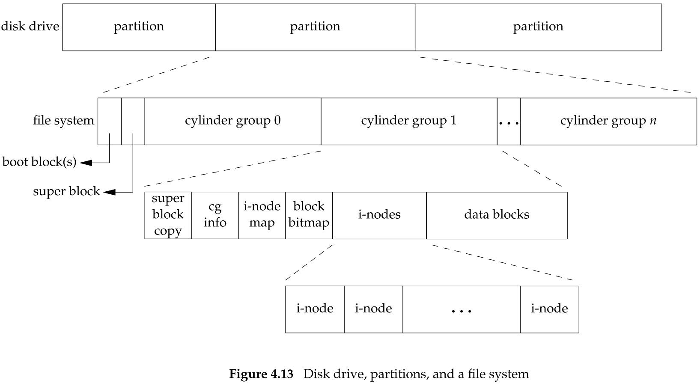
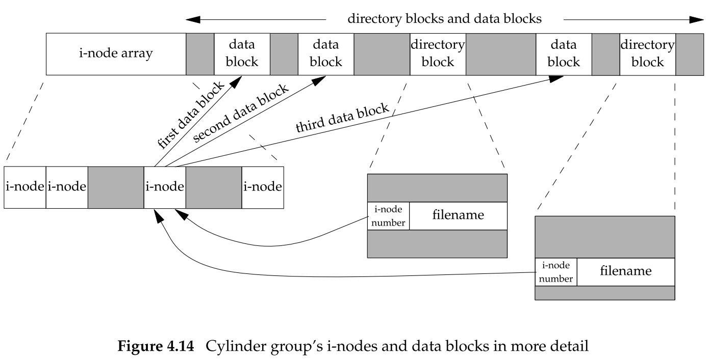
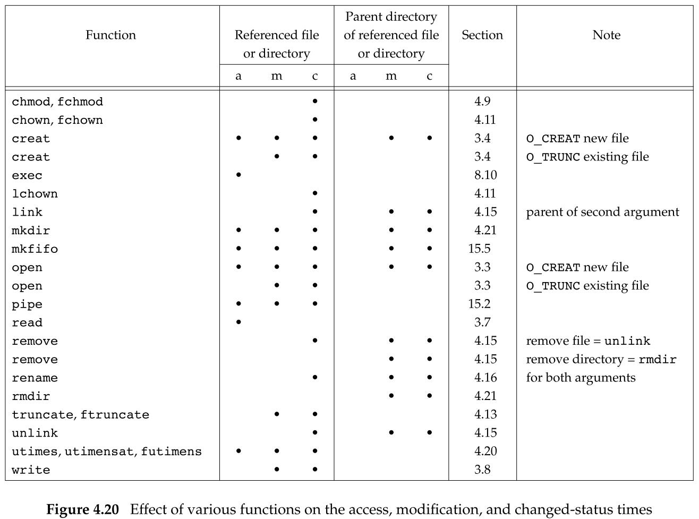

## 文件和目录

### 4.2 函数 `stat`、`fstat`、`fstatat` 和 `lstat`

```c
#include <ysy/stat.h>

int stat(const char *restrict pathname, struct stat *restrict buf);
int fstat(int fd, struct stat *buf);
int lstat(const char *restrict pathname, struct stat *restrict buf);
int fstatat(int fd, const char *restrict pathname, struct stat *restrict buf, int flag);
```

功能：

- `stat`：
  - 返回与 `pathname` 有关的信息结构。
- `fstat`：
  - 获得已在描述符 `fd` 上打开的文件的有关信息。
- `lstat`：
  - `lstat` 函数类似于 `stat`，但是当命名的文件是一个符号链接时，`lstat` 返回该符号链接的有关信息，而不是由该符号链接引用的文件的信息。
- `fstatat`：
  - 为一个相对于当前打开目录（由 `fd` 参数指向）的路径名返回文件统计信息。
  - `flag` 参数控制着是否跟随着一个符号链接：
    - 当 `AT_SYMLINK_NOFOLLOW` 标志被设置时，`fstatat` 不会跟随符号链接，而是返回符号链接本身的信息。
    - 否则，在默认情况下，返回的是符号链接所指向的实际文件的信息。
  - 如果 `fd` 参数的值是 `AT_FDCWD`，并且 `pathname` 参数是一个相对路径名，`fstatat` 会计算相对于当前目录的 `pathname` 参数。如果 `pathname` 是一个绝对路径，`fd` 参数就会被忽略。
    - 根据 `flag` 的取值，`fstatat` 的作用就跟 `stat` 或 `lstat` 一样。

参数：

- `fd`：打开的文件描述符

  - 对于 `fstat`，该文件就是待查看信息的文件
  - 对于 `fstatat`，该文件是并不是待查看信息的文件，待查看信息的文件是以该 `fd` 对于的目录相对路径定位的。

- `pathname`：文件或目录的名字

- `buf`：存放信息结构的缓冲区，函数用来填充由 `buf` 指向的结构

  - ```c
    struct stat {
    	mode_t				st_mode;	/* file type & mode (permissions) */
    	ino_t				st_ino;		/* i-node number (serial number) */
        dev_t				st_dev;		/* device number (file system) */
        dev_t				st_redv;	/* device number for special files */
        nlink_t				st_nlink;	/* number of links */
        uid_t				st_uid;		/* user ID of owner */
        gid_t				st_gid;		/* group ID of owner */
        off_t				st_size;	/* size in bytes, for regular files */
    	struct timespec		st_atime;	/* time of last access */
        struct timespec		st_mtime;	/* time of last modification */
        struct timespec		st_ctime;	/* time of last file status change */
        blksize_t			st_blksize;	/* best I/O block size */
        blkcnt_t			st_blocks;	/* number of disk blocks allocated */
    ```

- `flag`
  
  - 控制着 `fstatat` 函数是否跟随着返回一个符号链接。

返回值：

- 若成功，返回 0。
- 若出错，返回 -1。

### 4.3 文件类型

UNIX 系统的文件类型：

- 普通文件（regular file）
  - 这是最常用的文件类型，这种文件包含了某种形式的数据。至于这种数据是文本还是二进制数据，对于 UNIX 内核而言并无区别。对普通文件内容的解释由处理该文件的应用程序进行。
    - 例外是二进制可执行文件。为了执行程序，内核必须理解其格式。所有二进制可执行文件都遵循一种标准化的格式，这种格式使内核能够确定程序文本和数据的加载位置。
- 目录文件（directory file）
  - 这种文件包含了其他文件的名字以及指向与这些文件有关信息的指针。对一个目录文件具有读权限的任一进程都可以读该目录的内容，但只有内核可以直接写目录文件。进程必须使用相应的函数才能更改目录。
- 块特殊文件（block special file）
  - 这种类型的文件提供对设备（如磁盘）带缓冲的访问，每次访问以固定长度为单位进行。
- 字符特殊文件（character special file）
  - 这种类型的文件提供对设备不带缓冲的访问，每次访问长度可变。系统中的所有设备要么是字符特殊文件，要么是块特殊文件。
- FIFO
  - 这种类型的文件用于进程间通信，有事也称为命名管道（named pipe）。
- 套接字（socket）
  - 这种类型的文件用于进程间的网络通信。套接字也可用于在一台宿主机上进程之间的非网络通信。
- 符号链接（symbolic link）
  - 这种类型的文件指向另一个文件。

文件类型信息包含在 `stat` 结构的 `st_mode` 成员中。可以用下表中的宏（<sys/stat.h>）确定文件类型。这些宏的参数都是 `stat` 结构中的 `st_mode` 成员：

| 宏           | 文件类型     |
| ------------ | ------------ |
| `S_ISREG()`  | 普通文件     |
| `S_ISDIR()`  | 目录文件     |
| `S_ISCHR()`  | 字符特殊文件 |
| `S_ISBLK()`  | 块特殊文件   |
| `S_ISFIFO()` | 管道或 FIFO  |
| `S_ISLNK()`  | 符号链接     |
| `S_ISSOCK()` | 套接字       |

POSIX.1 允许实现将进程间同学（IPC）对象（如消息队列和信号量等）说明为文件。下表中的宏（<sys/stat.h>）可用来从 `stat` 结构中确定 IPC 对象的类型。这些宏与上表中的不同，它们的参数并非 `st_mode`，而是指向 `stat` 结构的指针。

| 宏              | 对象的类型   |
| --------------- | ------------ |
| `S_TYPEISMQ()`  | 消息队列     |
| `S_TYPEISSEM()` | 信号量       |
| `S_TYPEISSHM()` | 共享存储对象 |

### 4.4 设置用户 ID 和设置组 ID

与一个进程相关联的 ID 有 6 个或更多：

- 实际用户 ID 和实际组 ID 标识我们究竟是谁。

  - 这两个字段在登录时取自口令文件中的登录项。
  - 通常，在一个登录回话期间这些值并不改变，但是超级用户进程有方法改变它们。

- 有效用户 ID、有效组 ID 以及附属组 ID 决定了我们的文件访问权限。

- 保存的设置用户 ID 和保存的设置组 ID 在执行一个程序时包含了有效用户 ID 和有效用户组 ID 的副本。

通常，有效用户 ID 等于实际用户 ID，有效组 ID 等于实际组 ID。

每个文件有一个所有者和组所有者，所有者由 `stat` 结构中的 `st_uid` 指定，组所有者则由 `st_gid` 指定。

### 4.5 文件访问权限

`st_mode` 值也包含了对文件的访问权限位。当提及文件时，指的是前面所提到的任何类型的文件。

所有文件类型（目录、字符特别文件等）都有访问权限。

每个文件有 9 个访问权限位（<sys/stat.h>），可将它们分成 3 类：

| `st_mode` 屏蔽 | 含义     |
| -------------- | -------- |
| `S_IRUSR`      | 用户读   |
| `S_IWUSR`      | 用户写   |
| `S_IXUSR`      | 用户执行 |
| `S_IRGRP`      | 组读     |
| `S_IWGRP`      | 组写     |
| `S_IXGRP`      | 组执行   |
| `S_IROTH`      | 其他读   |
| `S_IWOTH`      | 其他写   |
| `S_IXOTH`      | 其他执行 |

- 我们用名字打开任一类型的文件时，对该名字中包含的每一个目录，包括它可能隐含的当前工作目录都应具有执行权限。这就是为什么对于目录，其执行权限位常被称为搜索位的原因。
- 对于一个文件的读权限决定了我们是否能够打开现有文件进行读操作。
  - 这与 `open` 函数的 `O_RDONLY` 和 `O_RDWR` 标志相关。
- 对于一个文件的写权限决定了我们是否能够打开现有文件进行写操作。
  - 这与 `open` 函数的 `O_WRONLY` 和 `O_RDWR` 标志相关。
- 为了在 `open` 函数中对一个文件指定 `O_TRUNC` 标志，必须对该文件具有写权限。
- 为了在一个目录中创建一个新文件，必须对该目录具有写权限和执行权限。
- 为了删除一个现有文件，必须对包含该文件的目录具有写权限和执行权限。对该文件本身则不需要有读、写权限。
- 如果用 7 个 `exec` 函数中的任何一个执行某个文件，都必须对该文件具有执行权限。该文件还必须是一个普通文件。

进程每次打开、创建或删除一个文件时，内核就进行文件访问权限测试，而这种测试可能涉及文件的所有者（`st_uid` 和 `st_gid`）、进程的有效 ID（有效用户 ID 和有效组 ID）以及进程的附属组 ID（若支持的话）。两个所有者 ID 是文件的性质，而两个有效 ID 和附属组 ID 则是进程的性质。

内核进行的测试具体如下：

- 若进程的有效用户 ID 是 0（超级用户），则允许访问。这给予了超级用户对整个文件系统进行处理的最充分的自由。
- 若进程的有效用户 ID 等于文件的所有者 ID（也就是进程拥有此文件），那么如果所有者适当的访问权限位被设置，则允许访问；否则拒绝访问。
  - 适当的访问权限位指的是：
    - 若进程为读而打开该文件，则用户读位应为 1；
    - 若进程为写而打开该文件，则用户写位应为 1；
    - 若进程将执行该文件，则用户执行位应为 1。
- 若进程的有效组 ID 或进程的附属组 ID 之一等于文件的组 ID，那么如果组适当的访问权限位被设置，则允许访问；否则拒绝访问。
- 若其他用户适当的访问权限位被设置，则允许访问；否则拒绝访问。

按顺序执行这 4 步：

- 如果进程拥有此文件（第 2 步），则按用户访问权限批准或拒绝该进程对文件的访问，不查看组访问权限。
- 如果进程不拥有该文件，但进程属于某个适当的组，则按组访问权限批准或拒绝该进程对文件的访问，不查看其他用户的访问权限。

### 4.6 新文件和目录的所有权

新文件的用户 ID 设置为进程的有效用户 ID。关于组 ID，POSIX.1 允许实现选择下列之一作为新文件的组 ID：

- 新文件的组 ID 可以是进程的有效组 ID。
- 新文件的组 ID 可以是它所在目录的组 ID。

### 4.7 函数 `access` 和 `faccessat`

当用 `open` 函数打开一个文件时，内核以进程的有效用户 ID 和有效组 ID 为基础执行其访问权限测试。

`access` 和 `facessat` 函数是按实际用户 ID 和实际组 ID 进行访问权限测试的。

```c
#include <unistd.h>

int access(const char *pathname, int mode);
int faccessat(int fd, const char *pathname, int mode, int flag);
```

参数：

- `mode`：指定要测试的模式

  - 如果要测试文件是否已存在，则 `mode` 设为 `F_OK`。
  - 否则，`mode` 设置为下列常量的按位或：
    - `R_OK`：测试读权限
    - `W_OK`：测试写权限
    - `X_OK`：测试执行权限

- `fd`：打开目录文件的描述符，或者 `AT_FDCWD`
  - `faccess` 函数与 `access` 函数在下面两种情况下是相同的：
    - `pathname` 参数为绝对路径
    - `fd` 参数取值为 `AT_FDCWD` 而 `pathname` 参数为相对路径
  - 否则，`faccessat` 计算相对于打开目录（由 `fd` 参数指向）的 `pathname`。
- `flag`：用于改变 `faccessat` 的行为：
  - 如果 `flag` 设置为 `AT_EACCESS`，访问检查用的是调用进程的有效用户 ID 和有效用户组 ID。

返回值：

- 若成功，返回 0；
- 若出错，返回 -1。

### 4.8 函数 `umask`

`umask` 函数为进程设置文件模式创建屏蔽字，并返回之前的值（没有出错返回）：

```c
#include <sys/stat.h>

mode_t umask(mode_t cmask);
```

参数：

- `cmask` 是由 `st_mode` 屏蔽中的 9 个常量中的若干个按位“或”构成的。

返回值：

- 旧的文件模式创建屏蔽字

在文件模式创建屏蔽字中为 1 的位，在文件 `mode` 中的相应位一定被关闭。

更改进程的文件模式创建屏蔽字并不影响其父进程（常常是 shell）的屏蔽字。

| 屏蔽位（八进制） | 含义     |
| ---------------- | -------- |
| 0400             | 用户读   |
| 0200             | 用户写   |
| 0100             | 用户执行 |
| 0040             | 组读     |
| 0020             | 组写     |
| 0010             | 组执行   |
| 0004             | 其他读   |
| 0002             | 其他写   |
| 0001             | 其他执行 |

Single UNIX Specification 要求 shell 应该支持符号形式的 `umask` 命令。与八进制格式不太，符号格式指定许可的权限而非拒绝的权限。

### 4.9 函数 `chmod`、`fchmod` 和 `fchmodat`

`chmod`、`fchmod` 和 `fchmodat` 这 3 个函数使我们可以更改现有文件的访问权限：

```c
#include <sys/stat.h>

int chmod(const char *pathname, mode_t mode);
int fchmod(int fd, mode_t mode);
int fchmodat(int fd, const char *pathname, mode_t mode, int flag);
```

为了改变一个文件的权限位，进程的有效用户 ID 必须等于文件的所有者 ID，或者该进程必须具有超级用户权限。

区别：

- `chmod` 函数在指定的文件上进行操作
- `fchmod` 函数对已打开的文件进行操作
- `fchmodat` 函数与 `chmod` 函数在下面两种情况下是相同的：
  - `pathname` 参数为绝对路径。
  - `fd` 参数取值为 `AT_FDCWD` 而 `pathname` 参数为相对路径。
  - 否则，`fchmodat` 计算相对于打开目录（由 `fd` 参数指向）的 `pathname`。

参数：

- `mode`：文件修改后的权限（取自 <sys/stat.h>）

  - | mode      | 说明                       |
    | --------- | -------------------------- |
    | `S_ISUID` | 执行时设置用户 ID          |
    | `S_ISGID` | 执行时设置组 ID            |
    | `S_ISVTX` | 保存正文（粘着位）         |
    | `S_IRWXU` | 用户（所有者）读、写和执行 |
    | `S_IRUSR` | 用户（所有者）读           |
    | `S_IWUSR` | 用户（所有者）写           |
    | `S_IXUSR` | 用户（所有者）执行         |
    | `S_IRWXG` | 组读、写和执行             |
    | `S_IRGRP` | 组读                       |
    | `S_IWGRP` | 组写                       |
    | `S_IXGRP` | 组执行                     |
    | `S_IRWXO` | 其他读、写和执行           |
    | `S_IROTH` | 其他读                     |
    | `S_IWOTH` | 其他写                     |
    | `S_IXOTH` | 其他执行                   |

- `flag`：用于改变 `fchmodat` 的行为

  - 当设置了 `AT_SYMLINK_NOFOLLOW` 标志时，`fchmodat` 并不会跟随符号链接。

返回值：

- 若成功，返回 0。
- 若出错，返回 -1。

### 4.10 粘着位

粘着位（sticky bit）是指，如果一个可执行程序文件的这一位被设置了，那么当该程序第一次被执行，在其终止时，程序正文部分的一个副本仍被保存在交换区（程序的正文部分是机器指令）。这使得下次执行该程序时能较快地将其装载入内存。

现在较新的 UNIX 系统大多数都配置了虚拟存储系统以及快速文件系统，所有不再需要使用这种技术。

现今的系统扩展了粘着位的使用范围，Single UNIX Specification 允许针对目录设置粘着位。如果对一个目录设置了粘着位，只有对该目录具有写权限并且满足下列条件之一的用户，才能删除或重命名该目录下的文件：

- 拥有此文件
- 拥有此目录
- 是超级用户

目录 /tmp 和 /var/tmp 是设置粘着位的典型候选择。

### 4.11 函数 `chown`、`fchown`、`fchownat` 和 `lchown`

下列函数可用于更改文件的用户 ID 和组 ID。如果两个参数 `owner` 或 `group` 中的任意一个是 -1，则对应的 ID 不变。

```c
#include <unistd.h>

int chown(const char *pathname, uid_t owner, gid_t group);
int fchown(int fd, uid_t owner, gid_t group);
int fchownat(int fd, const char *pathname, uid_t owner, gid_t group, int flag);
int lchown(const char *pathname, uid_t owner, gid_t group);
```

区别：

- 在所引用的文件是符号链接时，`lchown` 和 `fchownat`（设置了 `AT_SYMLINK_NOFOLLOW` 标志）更改符号链接本身的所有者，而不是该符号链接所指向的文件的所有者。
- `fchown` 函数改变 `fd` 参数指向的打开文件的所有者，既然它在一个已打开的文件上操作，就不能用于改变符号链接的所有者。

返回值：

- 若成功，返回 0。
- 若出错，返回 -1。

### 4.12 文件长度

`stat` 结构成员 `st_size` 表示以字节为单位的文件的长度，此字段只对普通文件、目录文件和符号链接有意义。

- 对于普通文件，其文件长度可以是 0，在开始读这种文件时，将得到文件结束指示。
- 对于目录，文件长度通常是一个数（如 16 或 512）的整数倍。
- 对于符号链接，文件长度是文件名中的实际字节数。

#### 文件中的空洞

空洞是由所设置的偏移量超过文件尾端，并写入了某些数据后造成的。

对于没有写过的字节位置，`read` 函数读到的字节是 0。

如果使用实用程序（如 `cat`）复制文件，那么所有这些空洞都会被填满，其中所有实际数据字节皆填写为 0。

### 4.13 文件截断

有时我们需要在文件尾端处截去一些数据以缩短文件。将一个文件的长度截断为 0 是一个特例，在打开文件时使用 `O_TRUNC` 标志可以做到这一点。

为了截断文件可以调用函数 `truncate` 和 `furuncate`：

```c
#include <unistd.h>

int truncate(const char *pathname, off_t length);
int ftruncate(int fd, off_t length);
```

参数：

- `length`：将一个现有文件长度截断为 `length`。
  - 如果该文件以前的长度大于 `length`，则超过 `length` 以外的数据就不再能访问。
  - 如果以前的长度小于 `length`，文家长度将增加，在以前的文件尾端和新的文件尾端之间的数据将读作 0（也就是可能在文件中创建了一个空洞）。

返回值：

- 若成功，返回 0。
- 若出错，返回 -1。

### 4.14 文件系统

<center class="half">
    
</center> 

我们可以把一个磁盘分成一个或多个分区。每个分区可以包含一个文件系统。

i 节点是固定长度的记录项，它包含有关文件的大部分信息。

<center class="half">
    
</center> 

上图中：

- 在图中有两个目录项指向同一个 i 节点。每个 i 节点中都有一个链接计数，其值是指向该 i 节点的目录项数。只有当链接计数减少至 0 时，才可删除该文件（也就是可以释放该文件占用的数据块）。在 `stat` 结构中，链接技术包含在 `st_nlink` 成员中，其基本系统数据类型是 `nlink_t`，这种链接类型称为硬链接。
- 另外一种链接类型称为符号链接。符号链接文件的实际内容（在数据块中）包含了该符号链接所指向的文件的名字。该 i 节点中的文件类型是 `S_IFLNK`，于是系统知道这是一个符号链接。
- i 节点包含了文件有关的所有信息：文件类型、文件访问权限位、文件长度和指向文件数据块的指针等。`stat` 结构中的大多数信息都取自 i 节点。只有两项重要数据存放在目录项中：文件名和 i 节点编号。i 节点变化的数据类型是 `ino_t`。
- 因为目录项中的 i 节点编号指向同一文件系统中的相应 i 节点，一个目录项不能指向另一个文件系统的 i 节点。
- 当在不更换文件系统的情况下为一个文件重命名时，该文件的实际内容并未移动，只需构造一个指向现有 i 节点的新目录项，并删除老的目录项，链接技术不会改变。

### 4.15 函数 `link`、`linkat`、`unlink`、`unlinkat` 和 `remove`

任何一个文件可以有多个目录项指向其 i 节点。创建一个指向现有文件的链接的方法是使用 `link` 函数或 `linkat` 函数。

```c
#include <unistd.h>

int link(const char *existingpath, const char *newpath);
int linkat(int efd, const char *existingpath, int nfd, const char *newpath, int flag);
```

参数：

- `existingpath`：现有文件（新创建的链接指向它）
- `newpath`：新创建的目录项，引用现有文件 `existingpath`
  - 如果 `newpath` 已经存在，则返回出错。
  - 值创建 `newpath` 中的最后一个分量，路径中的其他部分应当已经存在。
- 现有文件通过 `efd` 和 `existingpath` 参数指定：
  - 若 `existingpath` 是绝对路径，则忽略 `efd`。
  - 若 `existingpath` 是相对路径，则
    - 若 `efd = AT_FDCWD`，那么相应的路径名就通过相对于当前目录进行计算。
    - 若 `efd` 是一个打开的目录文件的文件描述符，则 `existingpath` 是相对于 `efd` 的目录文件。
- 新的路径名通过 `nfd` 和 `newpath` 参数指定：
  - 若 `newpath` 是绝对路径，则忽略 `nfd`。
  - 若 `newpath` 是相对路径，则
    - 若 `nfd = AT_FDCWD`，那么相应的路径名就通过相对于当前目录进行计算。
    - 若 `nfd` 是一个打开的目录文件的文件描述符，则 `newpath` 是相对于 `nfd` 的目录文件。
- `flag`：控制 `linkat` 函数是创建指向现有符号链接的链接还是创建指向现有符号链接所指向的文件的链接。
  - 如果 `flag = AT_SYMLINK_FOLLOW`，就创建指向符号链接目标的链接。
  - 如果这个标志被清除了，就创建指向符号链接本身的链接。

返回值：

- 若成功，返回 0。
- 若出错，返回 -1。

创建新目录项和增加链接计数应当是一个原子操作。

为了删除一个现有的目录项，可以调用 `unlink` 函数。

```c
#include <unistd.h>

int unlink(const char *pathname);
int unlinkat(int fd, const char *pathname, int flag);
```

参数：

- `flag`：使调用进程可以改变 `unlinkat` 函数的默认行为。
  - 当 `AT_REMOVEDIR` 标志被设置时，`unlinkat` 函数可以类似于 `rmdir` 一样删除目录。
  - 如果这个标志被清除，`unlinkat` 与 `unlink` 执行同样的操作。
- `pathname`：如果 `pathname` 是符号链接，那么 `unlink` 删除该符号链接，而不是删除由该链接所引用的文件。给出符号链接名的情况下，没有一个函数能删除由该链接所引用的文件。

返回值：

- 若成功，返回 0。
- 若出错，返回 -1。

这两个函数删除目录项，并将 `pathname` 所引用文件的链接计数减 1.如果对该文件还有其他链接，则仍可通过其他链接访问该文件的数据。如果出错，则不对该文件做任何修改。

关闭一个文件时，内核首先检查打开该文件的进程个数；如果这个计数达到 0，内核再去检查其链接计数；如果计数也是 0，那么就删除该文件的内容。

也可以用 `remove` 函数解出对一个文件或目录的链接：

- 对于文件，`remove` 的功能与 `unlink` 相同。
- 对于目录，`remove` 的功能与 `rmdir` 相同。

```c
#include <stdio.h>

int remove(const char *pathname);
```

### 4.16 函数 `rename` 和 `renameat`

文件或目录可以用 `rename` 函数或者 `renameat` 函数进行重命名。

```c
#include <stdio.h>

int rename(const char *oldname, const char *newname);
int renameat(in oldfd, const char *oldname, int newfd, const char *newname);
```

参数：

- 如果 `oldname` 指的是一个文件，那么为该文件或符号链接重命名。
  - 如果 `newname` 已存在：
    - 如果它引用一个目录，报错。
    - 如果它不是一个目录，则先将该目录项删除然后再完成重命名。
  - 对包含 `oldname` 的目录以及包含 `newname` 的目录，调用进程必须具有写权限，因为将更改这两个目录。
- 如果 `oldname` 指的是一个目录，那么为该目录重命名。
  - 如果 `newname` 已存在，则它必须引用一个目录，而且改名了应当是空目录（空目录指的是该目录中只有 . 和 .. 项），先将 `newname` 删除，然后完成重命名。
  -  `newname` 不能包含 `oldname` 作为其路径前缀。
- 如果 `oldname` 或 `newname` 引用符号链接，则处理的是符号链接本身，而不是它所引用的文件。
- 不能对 . 和 .. 重命名。
- 如果 `oldname` 和 `newname` 引用同样文件，则函数不做任何更改而成功返回。

返回值：

- 若成功，返回 0。
- 若出错，返回 -1。

### 4.17 符号链接

符号链接是对一个文件的间接指针。

硬链接直接指向文件的 i 节点。

引入符号链接的原因是为了避开硬链接的一些限制：

- 硬链接通常要求链接和文件位于同一文件系统中。
- 只有超级用户才能创建指向目录的硬链接（在底层文件系统支持的情况下）。

对符号链接以及它指向何种对象并无任何文件系统限制，任何用户都可以创建指向目录的符号链接。符号链接一般用于将一个文件或整个目录结构移到系统中另一个位置。

### 4.18 创建和读取符号链接

可以用 `symlink` 或 `symlinkat` 函数创建一个符号链接。

```c
#include <unistd.h>

int symlink(const char *actualpath, const char *sympath);
int symlinkat(const char *actualpath, int fd, const char * sympath);
```

返回值：

- 若成功，返回 0。
- 若出错，返回 -1。

在创建符号链接 `sympath` 时，并不要求 `actualpath` 已经存在，并且，`sympath` 和 `actualpath` 并不需要位于同一文件系统中。

因为 `open` 函数跟随符号链接，所有需要有一种方法打开该链接本身，并读该链接中的名字。`readlink` 和 `readlinkat` 函数提供了这种功能。

```c
#include <unistd.h>

ssize_t readlink(const char *restrict pathname, char *restrict buf, size_t bufsize);
ssize_t readlinkat(int fd, const char *restrict pathname, char *restrict buf, size_t bufsize);
```

返回值：

- 若成功，返回读取的字节数。
- 若出错，返回 -1。

两个函数组合了 `open`、`read` 和 `close` 的所有操作。如果函数执行，则返回读入 `buf` 的字节数。在 `buf` 中返回的符号链接的内容不以 `null` 字节终止。

### 4.19 文件的时间

对每个文件维护 3 个时间字段，它们的意义如下：

| 字段       | 说明                     | 例子             | ls(1) 选项 |
| ---------- | ------------------------ | ---------------- | ---------- |
| `st_atime` | 文件数据的最后访问时间   | `read`           | -u         |
| `st_mtime` | 文件数据的最后修改时间   | `write`          | 默认       |
| `st_ctime` | i 节点状态的最后更改时间 | `chmod`、`chown` | -c         |

<center class="half">
    
</center> 

### 4.20 函数 `futimens`、`utimensat` 和 `utimes`

一个文件的访问和修改时间可以用以下几个函数更改。`futimens` 和 `utimensat` 函数可以指定纳秒级精度的时间戳，用到的数据结构是与 `stat` 函数族相同的 `timespec` 结构。

```c
#include <sys/stat.h>

int futimens(int fd, const struct timespec times[2]);
int utimensat(int fd, const char *path, const struct timespec times[2], int flag);
```

参数：

- `times`：

  - 数组的第一个元素包含访问时间，第二个元素包含修改时间。
  - 这两个时间值是日历时间，不足秒的部分用纳秒表示。
  - 执行这些函数所要求的优先权取决于 `times` 参数的值。
  - 时间戳可以按下列 4 种方式之一进行指定：

    - 如果 `times` 参数是一个空指针，则访问时间和修改时间两者都设置为当前时间。
    - 如果 `times` 参数是指向两个 `timespec` 结构的数组：
      - 任一数组元素的 `tv_nsec` 字段的值为 `UTIME_NOW`，相应的时间戳就设置为当前时间，忽略相应的 `tv_sec` 字段。进程的有效用户 ID 必须等于该文件的所有者 ID；进程对该文件必须具有写权限，或者进程是一个超级用户进程。
      - 任一数组元素的 `tv_nsec` 字段的值为 `UTIME_OMIT`，相应的时间戳保持不变，忽略相应的 `tv_sec` 字段。如果两个 `tv_nsec` 字段的值都为 `UTIME_OMIT`，就不执行任何的权限检查。
      - 任一数组元素的 `tv_nsec` 字段的值为既不是 `UTIME_NOW` 也不是 `UTIME_OMIT`，相应的时间戳设置为相应的 `tv_sec` 和 `tv_nsec` 字段的值。进程的有效用户 ID 必须等于该文件的所有者 ID，或者进程必须是一个超级用户进程。对文件只具有写权限是不够的。

- `flag`：进一步修改默认行为

  - 如果设置了 `AT_SYMLINK_NOFOLLOW` 标志，则符号链接本身的时间就会被修改（如果路径名指向符号链接）。
  - 默认的行为是跟随符号链接，并把文件的时间改成符号链接的时间。

返回值：

- 若成功，返回 0。
- 若出错，返回 -1。

`futimens` 函数需要打开文件来更改它的时间，`utimensat` 函数提供了一种使用文件名更改文件时间的方法。

`futimens` 和 `utimensat` 函数都包含在 POSIX.1 中。

`utimes` 包含在 Single UNIX Specification 的 XSI 扩展选项中：

```c
#include <sys/time.h>

int utimes(const char *pathname, const struct timeval times[2]);
```

### 4.21 函数 `mkdir`、`mkdirat` 和 `rmdir`

用 `mkdir` 和 `mkdirat` 函数创建目录，用 `rmdir` 函数删除目录：

```c
#include <sys/stat.h>

int mkdir(const char *pathname, mode_t mode);
int mkdirat(int fd, const char *pathname, mode_t mode);
```

返回值：

- 若成功，返回 0。
- 若出错，返回 -1。

用 `rmdir` 函数可以删除一个空目录，空目录是只包含 . 和 .. 这两项的目录：

```c
#include <unistd.h>

int rmdir(const char *pathname);
```

返回值：

- 若成功，返回 0。
- 若出错，返回 -1。

如果调用此函数使目录的链接计数成为 0，并且也没有其他进程打开此目录，则释放由此目录占用的空间。

如果在链接计数达到 0 时，有一个或多个进程打开此目录，则在此函数返回前删除最后一个链接及 . 和 .. 项。另外，在此目录中不能再创建新文件。但是在最后一个进程关闭它之前并不释放此目录。

### 4.22 读目录

对某个目录具有访问权限的任一用户都可以读该目录，但是，为了防止文件系统产生混乱，只有内核才能写目录。一个目录的写权限位和执行权限位决定了在该目录中能否创建新文件以及删除文件，它们并不代表能否写目录本身。

```c
#include <dirent.h>

DIR *opendir(const char *pathname);
DIR *fdopendir(int fd);
										/* 若成功，返回指针；若出错，返回 NULL */
struct dirent *readdir(DIR *dp);
										/* 若成功，返回指针；若在目录尾货出错，返回 NULL */
void rewinddir(DIR *dp);
int closedir(DIR *dp);
										/* 若成功，返回 0；若出错，返回 -1 */
long telldir(DIR *dp);
										/* 与 dp 关联的目录中的当前位置 */
void seekdir(DIR *dp, ling loc);
```

### 4.23 函数 `chdir`、`fchidr` 和 `getcwd`

进程调用 `chdir` 或 `fchdir` 函数可以更改当前工作目录：

```c
#include <unistd.h>

int chdir(const char *pathname);
int fchdir(int fd);
```

返回值：

- 若成功，返回 0。
- 若出错，返回 -1。

在这两个函数中，分别用 `pathname` 或打开文件描述符来指定新的当前工作目录。

进程调用 `getcwd` 获取当前工作目录的绝对路径名：

```c
#include <unistd.h>

char *getcwd(char *buf, size_t size);
```

参数：

- `buf`：缓冲区地址
- `size`：缓冲区长度（以字节为单位）
  - 容纳绝对路径名再加上一个终止 null 字节，否则返回出错。

返回值：

- 若成功，返回 `buf`。
- 若出错，返回 NULL。

### 4.24 设备特殊文件

`st_dev` 存的是文件本身存储设备的主、次设备号，也就是硬盘的主、次设备号。

`st_rdev` 存的是针对驱动的字符设备和块设备文件的主、次设备号。

- 每个文件系统所在的存储设备都由其主、次设备号表示。
  - 设备号所用的数据类型是基本系统数据类型 `dev_t`。
  - 主设备号标识设备驱动程序，有时编码为与其通信的外设板。
  - 次设备号标识特定的子设备。
- 通常可以使用两个宏：`major` 和 `minor` 来访问主、次设备号，大多数实现都定义这两个宏，这就意味着我们无需关心这两个数是如何存放在 `dev_t` 对象中的。
- 系统中与每个文件名关联的 `st_dev` 值是文件系统的设备号，该文件系统包含了这一文件名以及与其对应的 i 节点。
- 只有字符特殊文件和块特殊文件才有 `st_rdev` 值，此值包含实际设备的设备号。

### 4.25 文件访问权限位小结

| mode      | 说明        | 对普通文件的影响                                             | 对目录的影响                                    |
| --------- | ----------- | ------------------------------------------------------------ | ----------------------------------------------- |
| `S_ISUID` | 设置用户 ID | 执行时设置有效用户 ID                                        | （未使用）                                      |
| `S_ISGID` | 设置组 ID   | 若组执行位设置，则执行时设置有效组 ID；否则使强制性锁起作用（若支持） | 将在目录中创建的新文件的组 ID 设置为目录的组 ID |
| `S_ISVTX` | 粘着位      | 在交换区缓存程序正文（若支持）                               | 限制在目录中删除和重命名文件                    |
| `S_IRUSR` | 用户读      | 许可用户读文件                                               | 许可用户读目录项                                |
| `S_IWUSR` | 用户写      | 许可用户写文件                                               | 许可用户在目录中删除和创建文件                  |
| `S_IXUSR` | 用户执行    | 许可用户执行文件                                             | 许可用户在目录中搜索给定路径名                  |
| `S_IRGRP` | 组读        | 许可组读文件                                                 | 许可组读目录项                                  |
| `S_IWGRP` | 组写        | 许可组写文件                                                 | 许可组在目录中中删除和创建文件                  |
| `S_IXGRP` | 组执行      | 许可组执行文件                                               | 许可组在目录中搜索给定路径名                    |
| `S_IROTH` | 其他读      | 许可其他读文件                                               | 许可其他读目录项                                |
| `S_IWOTH` | 其他写      | 许可其他写文件                                               | 许可其他在目录中删除和创建文件                  |
| `S_IXOTH` | 其他执行    | 许可其他执行文件                                             | 许可其他在目录中搜索给定路径名                  |
