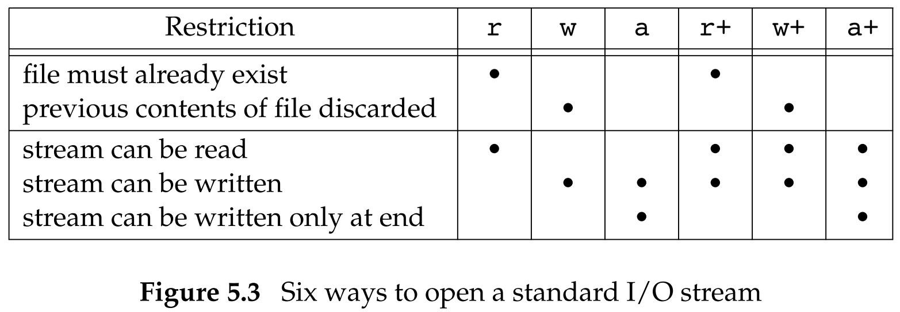

## 标准 I/O 库

### 5.2 流和 FILE 对象

对于标准 I/O 库，它们的操作是围绕流（stream）进行的。当用标准 I/O 库打开或创建一个文件时，我们已使一个流与一个文件相关联。

对于 ASCII 字符集，一个字符用一个字节表示。对于国际字符集，一个字符可用多个字节表示。标准 I/O 文件流可用于单字节或多字节（“宽”）字符集。

流的定向（stream's orientation）决定了所读、写的字符是单字节还是多字节的。

- 当一个流最初被创建时，它并没有定向。
- 如若在未定向的流上使用一个单字节 I/O 函数（<wchar.h>），则将该流的定向设置为宽定向的。
- 若在未定向的流上使用一个单字节 I/O 函数，则将该流的定向设为字节定向的。

只有两个函数可改变流的定向。

- `freopen` 函数清除一个流的定向。
- `fwide` 函数可用于设置流的定向。

```c
#include <stdio.h>
#include <wchar.h>

int fwide(FILE *fp, int mode);
```

参数：

- `mode`：
  - 若 `mode` 值为负，`fwide` 将试图使指定的流是字节定向的。
  - 若 `mode` 值为正，`fwide` 将试图使指定的流是宽定向的。
  - 若 `mode` 值为 0，`fwide` 将不试图设置流的定向，但返回标识该流定向的值。

返回值：

- 若流是宽定向的，返回正值。
- 若流是字节定向的，返回负值。
- 若流是未定向的，返回 0。

注意：

- `fwide` 并不改变已定向流的定向。
- `fwide` 无出错返回。
  - 在调用前先清除 `errno`，从返回时检查 `errno` 的值。

当打开一个流时，标准 I/O 函数 `fopen` 返回一个指向 FILE 对象的指针。该对象通常是一个结构，它包含了标准 I/O 库为管理该流需要的所有信息，包括用于实际 I/O 的文件描述符、指向用于该流缓冲区的指针、缓冲区的长度、当前在缓冲区中的字符数以及出错标志等。

### 5.3 标准输入、标准输出和标准错误

对一个进程预定义了 3 个流，并且这 3 个流可以自动地被进程使用（<stdio.h>）：

- 标准输入：文件指针 `stdin`   ——文件描述符 `STDIN_FILENO`
- 标准输出：文件指针 `stdout` ——文件描述符 `STDOUT_FILENO`
- 标准错误：文件指针 `stderr` ——文件描述符 `STDERR_FILENO`

### 5.4 缓冲

标准 I/O 库提供缓冲的目的是尽可能减少使用 `read` 和 `write` 调用的次数。它也对每个 I/O 流自动地进行缓冲管理，从而避免了应用程序需要考虑这一点所带来的麻烦。

标准 I/O 流提供 3 种类型的缓冲：

- 全缓冲
  - 在填满标准 I/O 缓冲区后才进行实际 I/O 操作。对于驻留在磁盘上的文件通常是由标准 I/O 库实施全缓冲的。在一个流上执行第一次 I/O 操作时，相关标准 I/O 函数通常调用 `malloc` 获得需使用的缓冲区。
  - 术语冲洗说明标准 I/O 缓冲区的写操作。缓冲区可由标准 I/O 例程自动地冲洗，或者可以调用函数 `fflush` 冲洗一个流。
- 行缓冲
  - 当在输入和输出中遇到换行符时，标准 I/O 库执行 I/O 操作。这允许我们一次输出一个字符（用标准 I/O 函数 `fputc`），但只有在写了一行之后才进行实际 I/O 操作。当流涉及一个终端时（如标注输入和标准输出），通常使用行缓冲。
  - 行缓冲的限制：
    - 因为标准 I/O 库用来收集每一行的缓冲区的长度是固定的，所以只要填满了缓冲区，那么即使还没有写一个换行符，也进行 I/O 操作。
    - 任何时候只要通过标准 I/O 库要求从(a)一个不带缓冲的流，或者(b)一个行缓冲的流得到输入数据，那么就会冲洗所有行缓冲输出流。
- 不带缓冲
  - 标准 I/O 库不对字符进行缓冲存储。
  - 标准错误流 `stderr` 通常是不带缓冲的，这就使得出错信息可以尽快显示除了，而不管它们是否含有一个换行符。

ISO C 要求下列缓冲特征：

- 当且仅当标准输入和标准输出并不指向交互式设备时，它们才是全缓冲的。
- 标准错误绝不会是全缓冲的。

很多系统默认使用下列类型的缓冲：

- 标准错误是不带缓冲的。
- 若是指向终端设备的流，则是行缓冲的；否则是全缓冲的。

对任何一个给定的流，如果我们并不喜欢这些系统默认，则可调用下列两个函数中的一个更改缓冲类型：

```c
#include <stdio.h>

void setbuf(FILE *restrict fp, char *restrict buf);
int setvbuf(FILE *restrict fp, char *restrict buf, int mode, size_t size);
```

参数：

- `fp`：被打开的文件对象的指针
- `buf`：为了带缓冲进行 I/O，`buf` 必须指向一个长度为 `BUFSIZ` 的缓冲区（该常量定义在 <stdio.h> 中）
  - 如果 `buf` 为 `NULL`，关闭缓冲。
  - 如果 `buf` 非 `NULL`，通常设定该流为全缓冲的。但是如果该流与一个设备终端相关，那么某些系统也可将其设置为行缓冲的。
  - `setvbuf` 中，如果 `buf` 为 `NULL` 而该流是带缓冲的，标准 I/O 库将自动的为该流分配适当长度的缓冲区。
- `mode`：缓冲类型
  - `_IOFBF`：全缓冲
  - `_IOLBF`：行缓冲
  - `_IONBF`：不带缓冲
- `size`：缓冲区的长度

返回值：

- 若成功，返回 0。
- 若出错，返回非 0。

任何时候，我们都可以强制冲洗一个流：

```c
#include <stdio.h>

int fflush(FILE *fp);
```

返回值：

- 若成功，返回 0。
- 若出错，返回 EOF。

此函数使该流所有未写的数据都被传送至内核。

作为一种特殊情形，如若 `fp` 是 NULL，则此函数将导致所有输出流被冲洗。

- 冲洗是双向的：
  - 输入流 ---> 用户缓冲区。
  - 输出流 ---> 内核 ---> 磁盘或者终端。
- 冲洗并不是立即写到磁盘文件中，冲洗只是负责数据传到内核。

### 5.5 打开流

下列 3 个函数打开一个标准 I/O 流。

```c
#include <stdio.h>

FILE *fopen(const char *restrict pathname, const char *restrict type);
FILE *freopen(const char *restrict pathname, const char *restrict type, FILE *restrict fp);
FILE *fdopen(int fd, const char *type);
```

区别：

- `fopen` 函数打开路径名为 `pathname` 的一个指定的文件。
- `freopen` 函数在一个指定的流上打开一个指定的文件，如若该流已经打开，则先关闭该流。若流已经定向，则使用 `freopen` 清楚该定向。此函数一般用于将一个指定的文件打开为一个预定义的流：标准输入、标准输出或标准错误。
- `fdopen` 函数取一个已有的文件描述符，并使一个标准的 I/O 流与该描述符相结合。此函数常用于由创建管道和网络通信信道函数返回的描述符。因为这些特殊类型的文件不能用标准 I/O 函数 `fopen` 打开，所以我们必须先调用设备专用函数以获得一个文件描述符，然后用 `fdopen` 使一个标准 I/O 流与该描述符相结合。

参数：

- `type`：指定对该 I/O 流的、读写方式，ISO C 规定该参数可以有 15 种不同的值

  - | `type`           | 说明                                   | `open(2)` 标志                  |
    | ---------------- | -------------------------------------- | ------------------------------- |
    | r 或 rb          | 为读而打开                             | `O_RDONLY`                      |
    | w 或 wb          | 把文件截断至 0 长，或为写而创建        | `O_WRONLY | O_CREAT | O_TRUNC`  |
    | a 或 ab          | 追加：为在文件尾写而打开，或为写而创建 | `O_WRONLY | O_CREAT | O_APPEND` |
    | r+ 或 r+b 或 rb+ | 为读和写而打开                         | `O_RDWR`                        |
    | w+ 或 w+b 或 wb+ | 把文件截断至 0 长，或为读和写而打开    | `O_RDWR | O_CREAT | O_TRUNC`    |
    | a+ 或 a+b 或 ab+ | 为在文件尾读和写而打开或创建           | `O_RDWR | O_CREAT | O_APPEND`   |

  - 使用字符 b 作为 `type` 的一部分，使得标准 I/O 系统可以区分文本和二进制文件。因为 UNIX 内核并不对着两种文件进行区分，所以在 UNIX 系统环境下指定字符 b 作为 `type` 的一部分实际上并无作用。

  - 对于 `fdopen`，因为该描述符已被打开，所以 `fdopen` 为写而打开并不截断该文件，标准 I/O 追加写方式也不能用于创建该文件。

  - 当用追加写类型打开一个文件后，每次写都将数据写到文件的当前尾端处。如果有多个进程用标准 I/O 追加写方式打开同一文件，那么来自每个进程的数据都将正确地写到文件中。

  - 打开一个流的 6 中不同的的方式：

 <center class="half">
 	
</center> 

返回值：

- 若成功，返回文件指针。
- 若出错，返回 NULL。

调用 `flose`  关闭一个打开的流：

```c
#include <stdio.h>

int fclose(FILE *fp);
```

返回值：

- 若成功，返回 0。
- 若出错，返回 EOF。

在该文件被关闭之前，冲洗缓冲中的输出数据，缓冲区中的任何输入数据被丢弃，如果标准 I/O 库已经为该流自动分配了一个缓冲区，则释放此缓冲区。

当一个进程正常终止时（直接调用 `exit` 函数，或从 `main` 函数返回），所有带未写缓冲数据的标准 I/O 流都被冲洗，所有打开的标准 I/O 流都被关闭。

### 5.6 读和写流

一旦打开了流，可在 3 中不同类型的非格式化 I/O 中进行选择，对其进行读、写操作：

- 每次一个字符的 I/O。
  - 一次读或写一个字符，如果流是带缓冲的，则标准 I/O 函数处理所有缓冲。
- 每次一行的 I/O。
  - `fgets` 和 `fputs`
- 直接 I/O。
  - `fread` 和 `fwrite`
  - 每次 I/O 操作读或写某种数量的对象，而每个对象具有指定的长度。

#### 输入函数

以下 3 个函数可用于一次读一个字符：

```c
#include <stdio.h>

int getc(FILE *fp);
int fgetc(FILE *fp);
int getchar(void);
```

区别：

- 函数 `getchar` 等同于 `getc(stdin)`。
- `getc` 可被实现为宏，而 `fgetc` 不能实现为宏。

返回值：

- 若成功，返回下一个字符。
- 若已到达文件尾端或出错，返回 EOF。

为了区分出错还是到到文件尾端，必须调用 `ferror` 或 `feof`：

```c
#include <stdio.h>

int ferror(FILE *fp);
int feof(FILE *fp);

void clearerr(FILE *fp);
```

返回值：

- 若条件为真，返回非 0（真）；
- 否则，返回 0（假）。

在大多数实现中，为每个流在 FILE 对象中维护了两个标志：

- 出错标志；
- 文件结束标志。

调用 `clearerr` 可以清楚这两个标志。

从流中读取数据以后，可以调用 `ungetc` 将字符再押送回流中：

```c
#include <stdio.h>

int ungetc(int c, FILE *fp);
```

返回值：

- 若成功，返回 c。
- 若出错，返回 EOF。

回送的字符，不一定是上次读到的字符。

不能回送 EOF，但是当文件已经到达尾端时，仍可以回送一个字符，下次读将返回该字符，再读则返回 EOF。能这样做的原因是，一次成功的 `ungetc` 调用会清除该流的文件结束标志。

- 用 `ungetc` 压送回字符时，并没有将它们写到底层文件中或设备上，只是将它们写回标准 I/O 库的流缓冲区中。

#### 输出函数

对应于上述的每个输入函数都有一个输出函数：

```c
#include <stdio.h>

int putc(int c, FILE *fp);
int fputc(int c, FILE *fp);
int putchar(int c);
```

区别：

- `putchar(c)` 等同于 `putc(c, stdout`。
- `putc` 可被实现为宏，而 `fputc` 不能实现为宏。

返回值：

- 若成功，返回 c。
- 若出错，返回 EOF。

### 5.7 每次一行 I/O

下面 2 个函数提供每次输入一行的功能：

```c
#include <stdio.h>

char *fgets（char *restrict buf, int n, FILE *restrict fp);
char *gets(char *buf);
```

区别：

- `gets` 从标准输入读，而 `fgets` 从指定的流读。
- `gets` 不将换行符存入缓冲区中，而 `fgets` 存入。
- `gets` 不推荐使用，原因是调用者在使用 `gets` 时不能指定缓冲区的长度，可能造成缓冲区溢出。

返回值：

- 若成功，返回 `buf`。
- 若已到达文件尾端或出错，返回 EOF。

这两个函数都指定了缓冲区的地址，读入的行将送入其中。

`fputs` 和 `puts` 提供每次输出一行的功能：

```c
#include <stdio.h>

int fputs(const char *restrict str, FILE *restrict fp);
int puts(const char *str);
```

区别：

- `fputs` 将一个以 null 字节终止的字符串写到指定的流，尾端的终止符 null 不写出。
  - 这并不一定是每次输出一行，因为字符串不需要换行符作为最后一个非 null 字节。
- `puts` 将一个以 null 字节终止的字符串写到标准输出，终止符不写出。但是 `puts` 随后又将一个换行符写到标准输出。
  - 同样避免使用，以免需要记住它在最后是否添加了一个换行符。

返回值：

- 若成功，返回非负值。
- 若出错，返回 EOF。

### 5.8 标准 I/O 的效率

使用标准 I/O 例程的一个优点是无需考虑缓冲及最佳 I/O 长度的选择。

使用每次一行的 I/O 版本的速度大约是每次一个字符版本速度的两倍。

标准 I/O 库与直接调用 `read` 和 `write` 函数相比并不慢很多。对于大多数比较复杂的应用程序，最主要的用户 CPU 时间是由应用本身的各种处理消耗的，而不是由标准 I/O 例程消耗的。

### 5.9 二进制 I/O

下列两个函数执行二进制 I/O 操作：

```c
#include <stdio.h>

size_t fread(void *restrict ptr, size_t size, size_t nobj, FILE *restrict fp);
size_t fwrite(const void *restrict ptr, size_t size, size_t nobj, FILE *restrict fp);
```

参数：

- `ptr`：存放二进制数据对象的缓冲区地址
- `size`：单个二进制数据对象的字节数（比如一个 `struct` 的大小）
- `nobj`：二进制数据对象的数量
- `fp`：打开的文件对象指针

返回值：读或写的对象数

- 对于读，如果出错或到达文件尾端，则此数字可以少于 `nobj`。在这种情况下，应该调用 `ferror` 或 `feof` 判断究竟是哪一种情况。
- 对于写，如果返回值少于所要求的 `nobj`，则出错。

使用二进制 I/O 的基本问题是，它只能用于读在同一系统上已写的数据。

现在，很多异构系统通过网络相互连接起来，在一个系统上写的数据，要在另一个系统上进行处理。在这种环境下，这两个函数可能就不能正常工作，其原因是：

- 在一个结构中，统一成员的偏移量可能随编译程序和系统的不同而不同（由于不同的对齐要求）。
- 用来存储多字节整数和浮点值的二进制格式在不同的系统结构间也可能不同。

### 5.10 定位流

有 3 种方法定位标准 I/O 流：

- `ftell` 和 `fseek` 函数。
  - V7
  - 假定文件的位置可以存放在一个长整型中。
- `ftello` 和 `fseeko` 函数。
  - Single UNIX Specification
  - 使用 `off_t` 数据类型代替了长整型。
- `fgetpos` 和 `fsetpos` 函数。
  - ISO C
  - 使用一个抽象数据类型 `fpos_t` 记录文件的位置，这种数据类型可以根据需要定义为一个足够大的数，用以记录文件位置。

需要移植到非 UNIX 系统上运行的应用程序应当使用 `fgetpos` 和 `fsetpos`：

```c
#include <stdio.h>

long ftell(FILE *fp);
// 若成功，返回当前文件位置指示；若出错，返回 -1L

int fseek(FILE *fp, long offset, int whence);
// 若成功，返回 0；若出错，返回 -1

void rewind(FILE *fp);
// 将一个流设置到文件的起始位置
```

参数：

- `offset`：偏移量。
- `whence`：偏移量的解释方式
  - `SEEK_SET`：从文件的起始位置开始
  - `SEEK_CUR`：从文件的当前位置开始
  - `SEEK_END`：从文件的尾端开始

除了偏移量的类型是 `off_t` 而非 `long` 以外，`ftello` 函数与 `ftell` 相同，`fseeko` 函数与 `fseek` 相同：

```c
#include <stdio.h>

off_t ftello(FILE *fp);
// 若成功，返回当前文件位置；若出错，返回 (off_t)-1

int fseeko(FILE *fp, off_t offset, int whence);
// 若成功，返回 0；若出错，返回 -1
```

`fgetpos` 将文件位置指示器的当前值存入由 `pos` 指向的对象中。在以后调用 `fsetpos` 时，可以使用此值将流重新定位至该位置：

```c
#include <stdio.h>

int fgetpos(FILE *restrict fp, fpos_t *restrict pos);
int fsetpos(FILE *fp, const fpos_t *pos);
// 若成功，返回 0；若出错，返回非 0
```

### 5.11 格式化 I/O

#### 格式化输出

格式化输出是由 5 个 `printf` 函数来处理的：

```c
#include <stdio.h>

int printf(const char *restrict format, ...);
int fprintf(FILE *restrict fp, const char *restrict format, ...);
int dprintf(int fd, const char *restrict format, ...);
// 若成功，返回输出字符数；若输出出错，返回负值

int sprintf(char *restrict buf, const char *restrict format, ...);
// 若成功，返回存入数组的字符数；若编码出错，返回负值

int snprintf(char *restrict buf, size_t n, const char *restrict format, ...);
// 若缓冲区足够大，返回将要存入数组的字符数；若编码出错，返回负值
```

区别：

- `printf` 将格式化数据写到标准输出
- `fprintf` 写至指定的流
- `dprintf` 写至指定的文件描述符
  - 不需要调用`fopen` 将文件描述符转换为文件指针
- `sprintf` 将格式化的字符送入数组 `buf` 中，并在该数组的尾端自动加一个 `null` 字节，但该字符不包括在返回值中
  - `sprintf` 函数可能会造成由 `buf` 指向的缓冲区的溢出，调用者有责任确保该缓冲区足够大
- `snprintf` 中缓冲区长度是一个显示参数，超过缓冲区尾端写的所有字符都被丢弃。与 `sprintf` 相同，该返回值不包括结尾的 null 字节。

参数：

- `format, ...`：输出的格式化字符串，一个转换说明有 4 个可选择的部分：

  - `%[flags][fldwidth][precision][lenmodifier]convtype`

  - `flags`

    - | 标准     | 说明                                               |
      | -------- | -------------------------------------------------- |
      | ‘        | 将整数按千位分组字符                               |
      | -        | 在字段内左对齐输出                                 |
      | +        | 总是显示带符号转换的正负号                         |
      | （空格） | 如果第一个字符不是正负号，则在其前面加上一个空格   |
      | #        | 指定另一种转换形式（对于十六进制格式，加 0x 前缀） |
      | 0        | 添加前导 0（而非空格）进行填充                     |

  - `fldwidth`：说明最小字段宽度，转换后参数字符如果小于宽度，则多余字符位置用空格填充。

    - 字段宽度是一个非负十进制数，或者是一个星号 `*`

  - `precision`：说明整型转换后最少输出数字位数、浮点数转换后小数点后的最少位数、字符串转换后最大字节数。

    - 精度是一个点 `.`，后跟随一个可选的非负十进制数或者一个星号 `*`

  - `lenmodifier`：说明参数长度：

    - | 长度修饰符 | 说明                                     |
      | ---------- | ---------------------------------------- |
      | hh         | `signed` 或 `unsigned char`              |
      | h          | `signed` 或 `unsigned short`             |
      | l          | `signed` 或 `unsigned long` 或宽字符类型 |
      | ll         | `signed` 或 `unsigned long long`         |
      | j          | `intmax_t` 或 `uintmax_t`                |
      | z          | `size_t`                                 |
      | t          | `ptrdiff_t`                              |
      | L          | `long double`                            |

  - `convtype` 不是可选的，它控制如何解释参数：

    - | 转换类型 | 说明                                                         |
      | -------- | ------------------------------------------------------------ |
      | d、i     | 有符号十进制                                                 |
      | o        | 无符号八进制                                                 |
      | u        | 无符号十进制                                                 |
      | x、X     | 无符号十六进制                                               |
      | f、F     | 双精度浮点数                                                 |
      | e、E     | 指数格式双精度浮点数                                         |
      | g、G     | 根据转换后的值解释为 f、F、e 或 E                            |
      | a、A     | 十六进制指数格式双进度浮点数                                 |
      | c        | 字符（若带长度修饰符 l，为宽字符）                           |
      | s        | 字符串（若带长度修饰符 l，为宽字符）                         |
      | p        | 指向 void 的指针                                             |
      | n        | 到目前为止，此函数调用输出的字符数将被写入到指针所指向的带符号整型中 |
      | %        | 一个 % 字符                                                  |
      | C        | 宽字符（XSI 扩展，等效于 lc）                                |
      | S        | 宽字符串（XSI 扩展，等效于 ls）                              |

- `buf`：一个缓冲区的指针，格式化输出到该缓冲区中

下列 5 种 `printf` 族的变体类似于上面的 5 种，但是可变参数表（...）替换成了 `arg`：

```c
#include<stdarg.h>
#include<stdio.h>
int vprintf(const char *restrict format,va_list arg);
int vfprintf(FILE *restrict fp,const char*restrict format,va_list arg);
int vdprintf(int fd,const char *restrict format,va_list arg);
// 若成功，返回输出字符数；若输出出错，返回负值

int vsprintf(char *restrict buf,const char*restrict format,va_list arg);
// 若成功，返回存入数组的字符数；若编码出错，返回负值

int vsnprintf(char *restrict buf,size_t n,const char *restrict format,va_list arg);
// 若缓冲区足够大，返回将要存入数组的字符数；若编码出错，返回负值
```

#### 格式化输入

执行格式化输入处理的是 3 个 `scanf` 函数：

```c
#include <stdio.h>

int scanf(const char *restrict format, ...);
int fscanf(FILE *restrict fp, const char *restrict format, ...);
int sscanf(const char *restrict buf, const char *restrict format, ...);
// 若成功，返回赋值的输入项数；若输入出错或在任一转换前已到达文件尾端，返回 EOF
```

`scanf` 族用于分析输入字符串，并将字符序列转换成指定类型的变量。在格式之后的各参数包含了变量的地址，用转换结构对这些变量赋值。

一个转换说明有 3 个可选择的部分：

- `%[*][fldwidth][m][lenmodifier]convtype`：
  - `*`：用于抑制转换，按照转换说明的其余部分对输入进行转换，但转换结果并不存放在参数中，而是抛弃。
  
  - `fldwidth`：说明最大宽度，即最大字符数
  
  - `m`：赋值分配符
  
    - 可以用于 `%c`、`%s` 以及 `%[转换符]`，迫使内存缓冲区分配空间以接纳转换字符串
    - 相关的参数必须是指针地址，分配的缓冲区地址必须复制给该指针
    - 如果调用成功，该缓冲区不再使用时，由调用者负责通过调用 `free` 函数来释放该缓冲区
  
  - `lenmodifier`：说明要转换结果赋值的参数大小
  
  - `convtype`：与 `printf` 中相比，输入中带符号的可赋予无符号类型
    
    - | 转换类型               | 说明                                                         |
      | ---------------------- | ------------------------------------------------------------ |
      | d                      | 有符号十进制，基数为 10                                      |
      | i                      | 有符号十进制，基数由输入格式决定                             |
      | o                      | 无符号八进制（输入可选定有符号）                             |
      | u                      | 无符号十进制，基数为 10（输入可选定有符号）                  |
      | a、A、e、E、f、F、g、G | 浮点数                                                       |
      | c                      | 字符（若带长度修饰符 l，为宽字符）                           |
      | s                      | 字符串（若带长度修饰符 l，为宽字符）                         |
      | [                      | 匹配列出的字符序列，以 ] 终止                                |
      | [^                     | 匹配除列出字符以外的所有字符，以 ] 终止                      |
      | p                      | 指向 void 的指针                                             |
      | n                      | 将到目前位置，此函数调用读取的字符数将被写入到指针所指向的无符号整型中 |
      | %                      | 一个 % 字符                                                  |
      | C                      | 宽字符（XSI 扩展，等效于 lc）                                |
      | S                      | 宽字符串（XSI 扩展，等效于 ls）                              |

与 `printf` 族相同，`scanf` 族也使用由 <stdarg.h> 说明的可变长度参数表：

```c
#include<stdarg.h>
#include<stdio.h>
int vscanf(const char*restrict format,va_list arg);
int vfscanf(FILE *restrict fp,const char *restrict format,va_list arg);
int vsscanf(const char *restrict buf,const char *restrict format,va_list arg);
// 若成功，返回指定的输入项目数；若输入出错或在任一转换前文件结束，返回 EOF
```

### 5.12 实现细节

每个标准 I/O 流都有一个与其相关联的文件描述符，可以对一个流调用 `fileno` 函数以获得其描述符：

```c
#include <stdio.h>

int fileno(FILE *fp);
// 返回与该流相关联的文件描述符
```

> `fileno` 不是 ISO C 标准部分，而是 POSIX.1 支持的扩展。

如果要调用 `dup` 或 `fcntl` 等函数，需要此函数。

### 5.13 临时文件

ISO C 标准 I/O 库提供了两个函数以帮助创建临时文件：

```c
#include <stdio.h>

char *tmpnam(char *ptr);
// 返回值：指向唯一路径名的指针

FILE *tmpfile(void);
// 返回值：若成功，返回文件指针；若出错，返回 NULL
```

参数：

- `ptr`：指向存放临时文件名的缓冲区的指针
  - 若 `ptr` 为 NULL，则所产生的路径名存放在一个静态区中，指向该静态区的指针作为函数值返回。后续调用 `tmpnam` 时，会重写该静态区。
  - 若 `ptr` 不是 NULL，则认为它应该是指向长度至少是 `L_tmpnam`（<stdio.h>）个字符的数组。所产生的路径名存放在该数组中，`ptr` 也作为函数值返回。

`tmpnam` 函数产生一个与现有文件名不同的一个有效路径名字符串。每次调用它时，都产生一个不同的路径名，最多调用次数是 `TMP_MAX`（<stdio.h>）。

`tmpfile` 创建一个临时二进制文件（类型 `wb+`），在关闭该文件或程序结束时将自动删除这种文件。

- `tmpfile` 函数经常使用的标准 UNIX 技术是先调用 `tmpnam` 产生一个唯一的路径名，然后用该路径名创建一个文件，并立即 `unlink` 它。
  - 对一个文件解出链接并不删除其内容，关闭该文件时才删除其内容。而关闭文件可以是显式的，也可以在程序终止时自动进行。

注意：UNIX 对二进制文件不进行特殊区分。

执行这两个函数时，会出现：

```
warning: the use of `tmpnam' is dangerous, better use `mkstemp'
```

原因是 `tmpnam` 和 `tmpfile` 有一个缺点：

- 在返回唯一的路径名和用该名字创建文件之间存在一个时间窗口，在这个时间窗口中，另一进程可以用相同的名字创建文件。

Single UNIX Specification 为处理临时文件定义了另外两个函数，即 `mkdtemp` 和 `mkstemp`，它们是 XSI 的扩展部分：

```c
#include <stdlib.h>

char *mkdtemp(char *template);
// 返回值：若成功，返回指向目录名的指针；若出错，返回 NULL

int mkstemp(char *template);
// 返回值：若成功，返回文件描述符；若出错，返回 -1
```

区别：

- `mkdtemp` 函数创建了一个目录，该目录有一个唯一的名字。
  - 创建的目录使用访问权限位集：`S_IRUSR | S_IWUSR | S_IXUSR`。
  - 调用进程的文件模式创建屏蔽字可以进一步限制这些权限。
- `mkstemp` 函数创建了一个文件，该文件有一个唯一的名字。
  - 返回的文件描述符以读写方式打开。
  - 使用访问权限位：`S_IRUSR | S_IWUSR`。

参数：

- `template`：字符串
  - 这个字符串是后 6 位设置为 `XXXXXX` 的路径名。
  - 函数将这些占位符替换成不同的字符来构建一个唯一的路径名。
  - 如果成功的话，这两个函数将修改 `template` 字符串反应临时文件的名字。

### 5.14 内存流

标准 I/O 库把数据缓存在内存中，因此每次一字符和每次一行的 I/O 更有效。我们也可以通过调用 `setbuf` 或 `setvbuf` 函数让 I/O 库使用我们自己的缓冲区。

内存流：

- SUSv4 中支持。
- 一种标准 I/O 流，虽然仍使用 FILE 指针进行访问，但其实并没有底层文件。
- 所有的 I/O 都是通过在缓冲区与主存直接来回传送字节来完成的。
- 即便这些流看起来像文件流，它们的某些特征使其更适用于字符串操作。

有 3 个函数可用于内存流的创建，第一个是 `fmemopen` 函数：

```c
#include <stdio.h>

FILE *fmemopen(void *restrict buf, size_t size, const char *restrict type);
// 返回值：若成功，返回流指针；若错误，返回 NULL
```

参数：

- `buf`：指向缓冲区的开始位置

- `size`：指定了缓冲区大小的字节数

  - 如果 `buf` 参数为 NULL，函数分配 `size` 字节数的缓冲区，并当流关闭时释放缓冲区。

- `type`：控制如何使用流

  - | type             | 说明                                     |
    | ---------------- | ---------------------------------------- |
    | r 或 rb          | 为读而打开                               |
    | w 或 wb          | 为写而打开                               |
    | a 或 ab          | 追加：为在第一个 null 字节出写而打开     |
    | r+ 或 r+b 或 rb+ | 为读和写打开                             |
    | w+ 或 w+b 或 wb+ | 把文件截断至 0 长，为读和写而打开        |
    | a+ 或 a+b 或 ab+ | 追加：为在第一个 null 字节处读和写而打开 |

  - 以追加方式打开内存流时，如果缓冲区中不存在 `null` 字节，则当前位置设为缓冲区结尾的后一个字节。

  - 如果 `buf` 是  NULL，则打开流进行读或者写都没有任何意义。

    - 因为此时缓冲区是通过 `fmemopen` 分配的，没有办法找到缓冲区的地址。

  - 追加 null 需要满足两个条件：

    - 增加流缓冲区中数据量。
    - 调用 `fclose、fflush、fseek、fseeko、fsetpos` 。

用于创建内存流的其他两个函数分别是 `open_memstream` 和 `open_wmemstream`：

```c
#include <stdio.h>
FILE *open_memstream(char **bufp, size_t *sizep);

#include <wchar.h>
FILE *open_wmemstream(wchar_t **bufp, size_t *sizep);

// 若成功，返回流指针；若出错，返回 NULL
```

区别：

- `open_memstream` 函数创建的流是面向字节的
- `open_wmemstream` 函数创建的流是面向宽字节的
- 与 `fmemopen` 相比：
  - 创建的流只能写打开；
  - 不能指定自己的缓冲区，但可以分别通过 `bufp` 和 `sizep` 参数访问缓冲区地址和大小；
    - 缓冲区地址和长度只有在调用 `fclose` 或 `fflush` 才有效；
    - 这些值只有在下一次流写入或调用 `fclose` 前才有效，因为缓冲区可以增长，可能需要重新分配，如果出现这种情况，缓冲区的内存地址在下一次调用 `fclose` 或 `fflush` 会改变；
  - 关闭流后需要自行释放缓冲区；
  - 对流添加字节会增加缓冲区大小。

参数：

- `bufp`：指向缓冲区地址的指针（用于返回缓冲区地址）
- `sizep`：指向缓冲区大小的指针（用于返回缓冲区大小）

因为避免了缓冲区溢出，内存流非常适用于创建字符串。因为内存流只访问主存，不访问磁盘上的文件，所以对于把标准 I/O 流作为参数用于临时文件的函数来说，会有很大的性能提升。

### 5.15 标准 I/O 的替代软件

标准 I/O 库的一个不足之处是效率不高，这与它需要复制的数据量有关：

- 当使用每次一行的函数 `fgets` 和 `fputs` 时，通常需要复制两次数据：
  - 在内核和标准 I/O 缓冲区之间（当调用 `read` 和 `write` 时）
  - 在标准 I/O 缓冲区和用户程序中的行缓冲区之间

