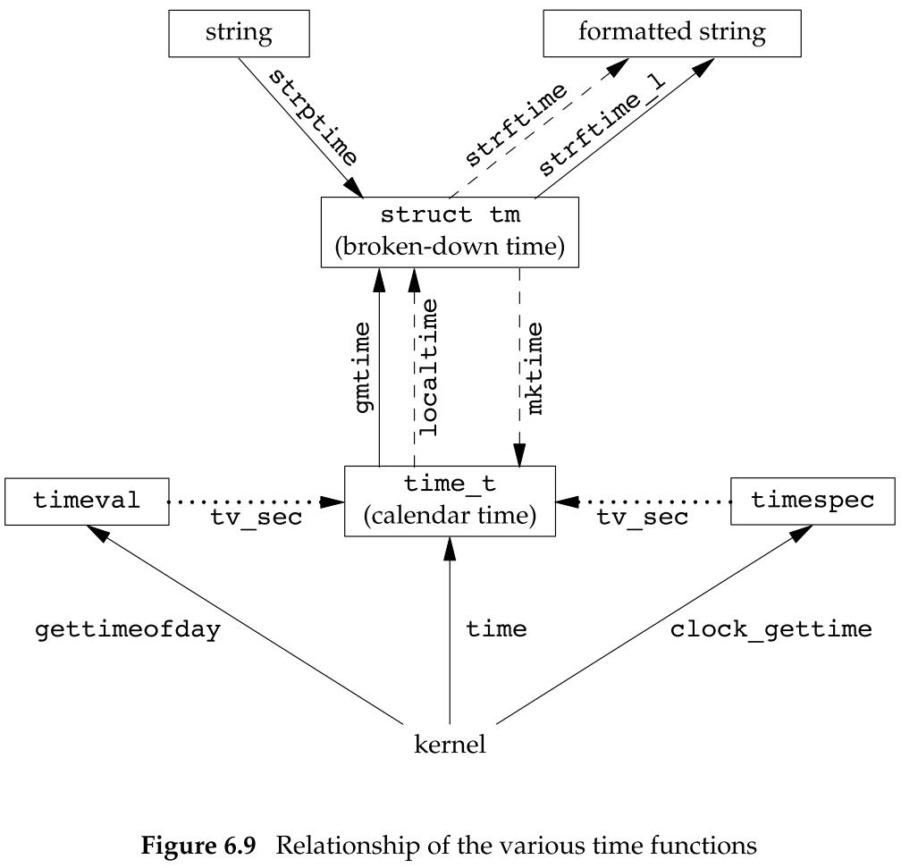
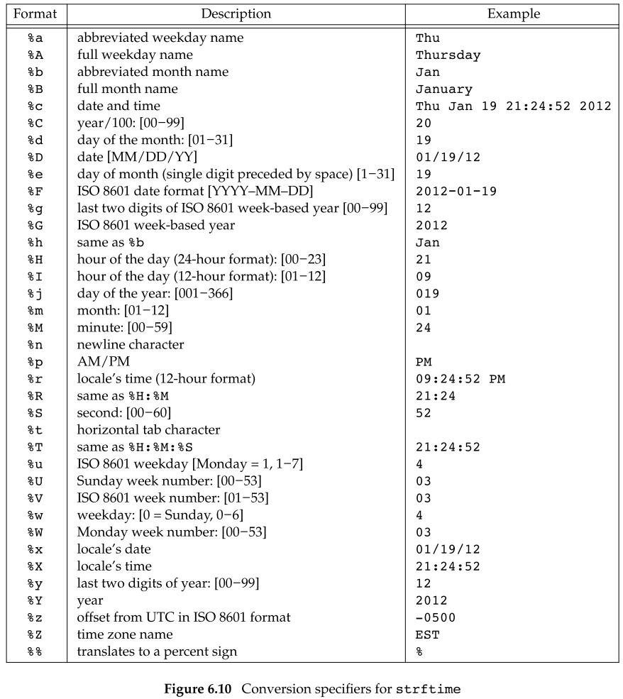
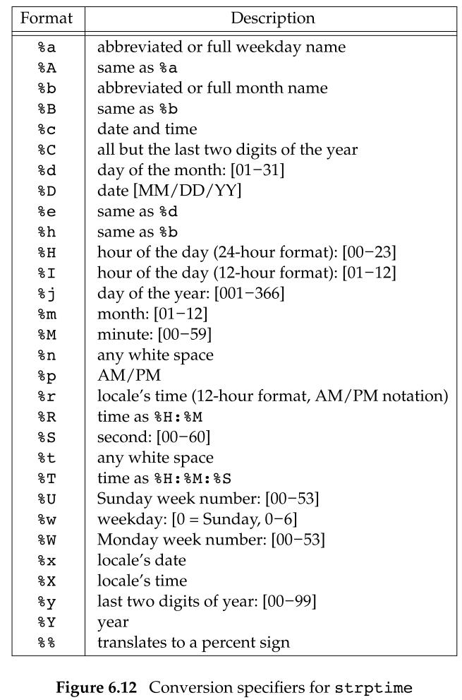

## 系统数据文件和信息

### 6.1 引言

UNIX 系统的正常运作需要使用大量与系统有关的数据文件

- 由于历史原因，这些数据文件都是 ASCII 文本文件。
- 我们使用标准 I/O 库读这些文件。

但是对于较大的系统，顺序扫描口令文件很花费时间，我们需要能够以非 ASCII 文本格式存放这些文件，但仍向使用其他文件格式的应用程序提供接口。

### 6.2 口令文件

口令文件 `/etc/passwd` 是一个 ASCII 文件，每一行包含下表所示的各字段，字段之间用冒号分隔。这些字段包含在 <pwd.h> 中定义的 `passwd` 结构中：

| 说明                   | struct passwd 成员 |
| ---------------------- | ------------------ |
| 用户名                 | char *pw_name      |
| 加密口令               | char *pw_passwd    |
| 数值用户 ID            | uid_t pw_uid       |
| 数值组 ID              | gid_t pw_gid       |
| 注释字段               | char *pw_gecos     |
| 初始工作目录           | char *pw_dir       |
| 初始 shell（用户程序） | char *pw_shell     |
| 用户访问类             | char *pw_class     |
| 下次更改口令时间       | time_t pw_change   |
| 账户有效期时间         | time_t pw_expire   |

关于口令文件：

- 通常有一个用户名为 root 的登录项，其用户 ID 是0。
- 加密口令字段包含了一个占位符，现在将加密口令字存放在另一个文件中。
- 口令文件项中的某些字段可能是空。
  - 如果加密口令字段为空，说明该用户没有口令。
  - 如果注释字段为空，不会产生任何影响。
- shell 字段包含了一个可执行程序名，它被用作该用户的登录 shell。
  - 若该字段为空，则取系统默认值，通常是 `/bin/sh`。
  - 若该字段为 `/dev/null`，则说明这是一个设备，不是可执行文件，将其用于此处的目的是，阻止任何人以该用户的名义登录到该系统。
- 为了阻止一个特定用户登录系统，除使用 `/dev/null` 外，还有若干种替代方法。
  - 常见的一种是将 `/bin/false` 用作登录 shell。
  - 另一种是用 `/bin/true` 禁止一个账号。
- 使用 `nobody` 用户名可以使任何人都可登录至系统，但其用户 ID 和组 ID 不提供任何特权。
  - 该用户 ID 和组 ID 只能访问人人皆可读、写的文件。
- 提供 `finger(1)` 命令的某些 UNIX 系统支持注释字段中的附加信息。

POSIX.1 定义了两个获取口令文件项的函数。在给出用户登录名或数值用户 ID 后，这两个函数就能查到相关项：

```c
#include <pwd.h>

struct passwd *getpwuid(uid_t uid);
struct passwd *getpwnam(const char *name);
// 返回值：若成功，返回指针；若出错，返回 NULL
```

参数：

- `uid`：用户 ID
- `name`：用户名

这两个函数都返回一个指向 `passwd` 结构的指针，该结构已由这两个函数在执行时填入信息。`passwd` 结构通常是函数内部的静态变量，只要调用任一相关函数，其内容就会被重写。

如果要查看整个口令文件，下列 3 个函数可用于此种目的：

```c
#include <pwd.h>

struct passwd *getpwent(void);
// 返回值：若成功，返回指针；若出错或到达文件尾端，返回 NULL

void setpwent(void);
void endpwent(void);
```

区别：

- 调用 `getpwent` 时，它返回口令文件中的下一个记录项。
  - 如同上面所述的两个函数一样，它返回一个由它填写好的 `passwd` 结构的指针，每次调用此函数时都重写该结构。
  - 在第一次调用该函数时，它打开它所使用的各个文件。
- 函数 `setpwent` 用来将 `getpwent` 的读写地址指向密码文件开头，`endpwent` 则关闭这些文件。
  - 在使用 `getpwent` 查看玩口令文件后，一定要调用 `endpwent` 关闭这些文件。
  - `getpwent` 知道什么时间应当打开它所使用的文件（第一次被调用时），但是它并不知道何时关闭这些文件。

### 6.3 阴影口令

加密口令是经单向加密算法处理过的用户口令副本。因为此算法是单向的，所以不能从加密口令猜测到原来的口令。

对于一个加密口令，找不到一种算法可以将其反变换到明文口令（明文口令是在 Password: 提示后键入的口令）。但是可以对口令进行猜测，将猜测的口令经单向算法变换成加密形式，然后将其与用户的加密口令相比较。

- 如果用户口令是随机选择的，那么这种方法并不是很有效。

为使企图这样做的人难以获得原始资料（加密口令），现状，某些系统将加密口令存放在另一个通常称为阴影口令的文件中（`/etc/shadow`），该文件至少要包含用户名和加密口令。与该口令相关的其他信息也可存放在该文件中：

| 说明                       | struct spwd 成员     |
| -------------------------- | -------------------- |
| 用户登录名                 | char *sp_namp        |
| 加密口令                   | char *sp_pwdp        |
| 上次更改口令以来经过的时间 | int sp_lstchg        |
| 经多少天后允许更改         | int sp_min           |
| 要求更改尚余天数           | int sp_max           |
| 超期警告天数               | int sp_warn          |
| 账户不活动之前尚余天数     | int sp_inact         |
| 账户超期天数               | int sp_expire        |
| 保留                       | unsigned int sp_flag |

只有用户登录名和加密口令这两个字段是必需的，其他的字段控制口令更改的频率，或者说口令的衰老以及账户仍然处于活动状态的时间。

阴影口令文件不应该是一般用户可以读取的

- 仅有少数几个程序需要访问加密口令，如 `login(1)` 和 `passwd(1)`。
  - 这些程序常常是设置用户 ID 为 root 的程序。
- 普通口令文件 `/etc/passwd` 可由各用户自由读取。

与访问口令文件的一组函数相类似，有另一组函数可用于访问阴影口令文件：

```c
#include <shadow.h>

struct spwd *getspnam(const char *name);
struct spwd *getspent(void);
// 返回值：若成功，返回指针；若出错或到达文件尾端，返回 NULL

void setspend(void);
void endspent(void);
```

### 6.4 组文件

UNIX 组文件包含下列字段，这些字段包含在 <grp.h> 中所定义的 `group` 结构中。

| 说明                   | struct group 成员 |
| ---------------------- | ----------------- |
| 组名                   | char *gr_name     |
| 加密口令               | char *gr_passwd   |
| 数值组 ID              | int gr_gid        |
| 指向各用户名指针的数组 | char **gr_mem     |

字段 `gr_mem` 是一个指针数组，其中每个指针指向一个属于该组的用户名，该数组以 null 指针结尾。

可以用下列两个由 POSIX.1 定义的函数来查看组名或数值组 ID：

```c
#include <grp.h>

struct group *getgrgid(git_t gid);
struct group *getgrnam(const char *name);
// 返回值：若成功，返回指针；若出错，返回 NULL
```

参数：

- `gid`：组 ID
- `name`：组名

如同对口令文件进行操作的函数一样，这两个函数通常也返回指向一个静态变量的指针，在每次调用时都重写该静态变量。

如果需要搜索整个组文件，则须使用下列 3 个函数：

```c
#include<grp.h>
struct group *getgrent(void);
// 返回值：若成功，返回指针；若出错或到达文件尾端，返回 NULL
void setgrent(void);
void endgrent(void);
```

区别：

- `setgrent` 函数打开组文件（如若它尚未打开）并反饶它。
- `getgrent` 函数从组文件中读下一个记录，如若该文件尚未打开，则先打开它。
- `endgrent` 函数关闭组文件。

### 6.5 附属组 ID

附属组 ID 是 POSIX.1 要求的特性。常量 `NGROUPS_MAX` 规定了附属组 ID 的数量，其常用值是 16。

使用附属组 ID 的优点是不必再显式地经常更改组。一个用户会参与多个项目，因此也就要同时属于多个组。

为了获取和设置附属组 ID，提供了下列 3 个函数：

```c
#include <unistd.h>
int getgroups(int gidsetsize, gid_t grouplist[]);
// 返回值：若成功，返回附属组 ID 数量；若出错，返回 -1

#include <grp.h> /* on Linux */
#include <unistd.h> /* on FreeBSD, Mac OS X, and Solaris */
int setgroups(int ngroups, const gid_t grouplist[]);

#include<grp.h>    	/* on Linux and Solaris */
#include<unistd.h>	/* on FreeBSD and Mac OS X */
int initgroups(const char *username, gid_t basegid);
// 返回值：若成功，返回 0；若出错，返回 -1
```

功能：

- `getgroups` 将进程所属用户的各附属组 ID 填写到数组 `grouplist` 中，填写入该数组的附属组 ID 数最多为 `gidsetsize` 个，实际填写到数组中的附属组 ID 数由函数返回。
  - 如若 `gidsetsize = 0`，则函数只返回附属组 ID 数，而对 `grouplist` 则不做修改。
- `setgroups` 可由超级用户调用以便为调用进程设置附属组 ID 表。
  - `grouplist` 是组 ID 数组。
  - `ngroups` 说明了数组中的元素数，其值不能大于 `NGROUPS_MAX`。
- 通常，只有 `initgroups` 函数调用 `setgroups`，`initgroups` 读整个组文件（`getgrent`、`setgrent` 和 `endgrent`），然后对 `username` 确定其组的成员关系。然后，它调用 `setgroups`，以便为该用户初始化附属组 ID 表。
  - 因为 `initgroups` 要调用 `setgroups`，所以只有超级用户才能调用 `initgroups`。

### 6.7 其他数据文件

一般情况下，对于每个数据文件至少有 3 个函数：

- `get` 函数：读下一个记录，如果需要，还会打开该文件。
  - 此种函数通常返回指向一个结构的指针。
  - 当已到达文件尾端时返回空指针。
  - 大多数 `get `函数返回指向一个静态存储类结构的指针，如果需要保存其内容，则需要复制它。
- `set` 函数：打开相应数据文件（如果尚未打开），然后反绕该文件。
  - 如果希望在相应文件起始处开始处理，则调用该函数。
- `end `函数：关闭相应数据文件。
  - 在结束了对相应数据文件的读、写操作后，总应该调用此函数以关闭所有相关文件。

另外，如果数据文件支持某种形式的键搜索，则也提供搜索具有指定键的记录的例程。

下表中列出了 UNIX 常用的数据文件：

| 说明 | 数据文件       | 头文件     | 结构     | 附加的键搜索函数                 |
| ---- | -------------- | ---------- | -------- | -------------------------------- |
| 口令 | /etc/passwd    | <pwd.h>    | passwd   | getpwnam、getpwuid               |
| 组   | /etc/group     | <grp.h>    | group    | getgrnam、getgrgid               |
| 阴影 | /etc/shadow    | <shadow.h> | spwd     | getspnam                         |
| 主机 | /etc/hosts     | <netdb.h>  | hostent  | getnameinfo、getaddrinfo         |
| 网络 | /etc/networks  | <netdb.h>  | netent   | getnetbyname、getnetbyaddr       |
| 协议 | /etc/protocols | <netdb.h>  | protoent | getprotobyname、getprotobynumber |
| 服务 | /etc/services  | <netdb.h>  | servent  | getservbyname、getservbyport     |

### 6.8 登录账户记录

大多数 UNIX 系统都提供下列两个数据文件：

- `utmp` 文件：记录当前登录到系统的各个用户。
- `wtmp` 文件：跟踪各个登录和注销事件。

在 V7 中，每次写入这两个文件中的是包含下列结构的一个二进制记录：

```c
struct utmp {
    char ut_line[8];	/* tty line: "ttyh0", "ttyd0", "ttyp0", ... */
    char ut_name[8];	/* login name */
    long ut_time;		/* seconds since Epoch */
};
```

- 登录时，`login` 程序填写此类型结构，然后将其写入到 `utmp` 文件中，同时也将其添写到 `wtmp` 文件中。
- 注销时，`init` 进程将 `utmp` 文件中相应的记录擦除（每个字节都填写 null 字节），并将一个新的记录添写到 `wtmp` 文件中。
  - 在 `wtmp` 文件的注销记录中，`ut_name` 字段清除为 0。
- 在系统重启时，以及更改系统时间和日期的前后，都将在 `wtmp` 文件中追加写特殊的记录项。
- `who` 程序读取 `utmp` 文件，并以可读格式打印其内容。
- `last` 程序读取 `wtmp` 文件，并打印所选择的记录。
- 在 Linux 系统中，这两个文件的路径是 `/var/run/utmp` 以及 `/var/log/wtmp`。

### 6.9 系统标识

POSIX.1 定义了 `uname` 函数，它返回与主机和操作系统有关的信息：

```c
#include <sys/utsname.h>

int uname(struct utsname *name);
// 返回值：若成功，返回非负值；若出错，返回 -1
```

通过该函数的参数向其传递一个 `utsname` 结构的地址，然后该函数填写此结构。

- POSIX.1 只定义了该结构中最少需要提供的字段（都是字符数组），每个数组的长度由实现确定。

- 某些操作系统会在该结构中提供了另外一些字段：

  - ```c
    struct utsname {
        char sysname[];		/* name of the operating system */
        char nodename[];	/* name of this node */
        char release[];		/* current release of operating system */
        char version[];		/* current version of this release */
        char machine[];		/* name of hardware type */
    };
    ```

  - 每个字符串都以 `null` 字节结尾。

  - `utsname` 结构中的信息通常可用 `uname(1)` 命令打印。

 `gethostname` 函数只返回主机名，该名字通常就是 TCP/IP 网络上主机的名字：

```c
#include <unistd.h>

int gethostname(char *name, int namelen);
// 返回值：若成功，返回 0；若出错，返回 -1
```

参数：

- `name`：放置主机名字符串的缓冲区
- `namelen`：`name` 缓冲区的长度
  - 如果提供足够的空间，则通过 `name` 返回的字符串以 null 结尾；
  - 如果没有提供足够的空间，则没有说通过 `name` 返回的字符串是否以 null 结尾。

`hostname` 命令可用来获取和设置主机名。

主机名通常在系统自举时设置，它由 `/etc/rc` 或 `init` 取自一个启动文件。

### 6.10 时间和日期例程

UNIX 内核提供的基本时间服务是计算自协调世界时（UTC，1970-01-01 00:00:00）这一特定时间以来经过的秒数。

- 这个时间称作日历时间
- 用数据类型 `time_t` 表示
- 日历时间包括时间和日期
- UNIX 在这方面与其他操作系统的区别是：
  - 以协调统一时间而非本地时间计时；
  - 可自动进行转换，如变换到夏令时；
  - 将时间和日期作为一个量值保存。

各个时间函数之间的关系：

<center class="half">
    
</center> 

图中用虚线表示的 3 个函数受到环境变量 `TZ` 的影响：

- 如果定义了 `TZ`，则这些函数将使用其值代替系统默认时区。
- 如果 `TZ` 为空，则使用协调统一时间 UTC

`time` 函数返回当前时间和日期：

```c
#include <time.h>

time_t time(time_t *calptr);
// 返回值：若成功，返回时间值；若出错，返回 -1
```

时间值作为函数值返回，如果参数非空，则时间值也存放在由 `calptr` 指向的单元内。

时钟通过 `clockid_t` 类型进行标识：

| 标识符                    | 选项                   | 说明                     |
| ------------------------- | ---------------------- | ------------------------ |
| CLOCK_REALTIME            |                        | 实时系统时间             |
| CLOCK_MONOTONIC           | _POSIX_MONOTONIC_CLOCK | 不带负跳数的实时系统时间 |
| CLOCK_PROCESS_CPUTIMME_ID | _POSIX_CPUTIME         | 调用进程的 CPU 时间      |
| CLOCK_THREAD_CPUTIME_ID   | _POSIX_THREAD_CPUTIME  | 调用线程的时间           |

`clock_gettime` 函数可用户获取指定时钟的时间：

```c
#include <sys/time.h>

int clock_gettime(clockid_t clock_id, struct timespec *tsp);
// 返回值：若成功，返回 0；若出错，返回 -1
```

参数：

- `clockid_id`：时钟类型
- `tsp`：存放获取时间的 `timespec` 结构（它把时间表示为秒和纳秒）的指针

`clock_getres` 函数把参数 `tsp` 指向的 `timespec` 结构初始化为与 `clock_id` 参数对应的时钟精度：

```c
#include <sys/time.h>

int clock_getres(clockid_t clock_id, struct timespec *tsp);
// 返回值：若成功，返回 0；若出错，返回 -1
```

要对特定的时钟设置时间，可以调用 `clock_settime` 函数：

```c
#include <sys/time.h>

int clock_settime(clockid_t clock_id,const struct timepsec *tsp);
// 返回值：若成功，返回 0；若出错，返回 -1
```

- 我们需要适当的特权来更改时钟值
- 有些时钟是不能修改的

`gettimeofday` 函数相比 `time` 函数，提供了更高的精度（已被弃用）：

```c
#include <sys/time.h>

int gettimeofday(struct timeval *restrict tp,void *restrict tzp);
// 返回值：总是返回 0
```

参数：

- `tp`：存放当前时间的 `timeval` 结构（将当前时间表示为秒和微秒）的指针
- `tzp`：唯一合法值是 `NULL`。其他值都将产生不确定的结果。

 `tm` 结构：

```c
struct tm {			/* a broken-down time */ 
    int tm_sec;		/* seconds after the minute: [0 - 60] */ 
    int tm_min; 	/* minutes after the hour: [0 - 59] */ 
    int tm_hour; 	/* hours after midnight: [0 - 23] */ 
    int tm_mday; 	/* day of the month: [1 - 31] */ 
    int tm_mon;		/* months since January: [0 - 11] */ 
    int tm_year; 	/* years since 1900 */ 
    int tm_wday; 	/* days since Sunday: [0 - 6] */ 
    int tm_yday; 	/* days since January 1: [0 - 365] */ 
    int tm_isdst;	/* daylight saving time flag: <0, 0, >0 */
};
```

其中：

- 秒可以超过 60 的理由是可以表示闰秒。
- 除了月日字段，其他字段的值都以 0 开始。
- 如果夏令时生效，则夏令时标志值为正；如果为非夏令时时间，则该标志值为 0；如果此信息不可用，则其值为负。

两个函数 `localtime` 和 `gmtime` 将日历时间转换成分解的时间：

```c
#include <time.h>

struct tm *gmtime(const time_t *calptr);
struct tm* localtime(const time_t *calptr);
// 返回值：若成功，返回指向分解的 tm 结构的指针；若出错，返回 NULL
```

区别：

- `localtime` 将日历时间转换成本地实际（考虑本地时区和夏令时标志）
  - 由 `TZ` 环境变量指定
- `gmtime` 将日历时间转换成协调统一时间的年、月、日、时、分、秒、周日分解结构。

参数：

- `calptr`：指向日历时间的指针

函数 `mktime` 以本地时间的年、月、日等作为参数，将其变换成 `time_t` 值：

```c
#include<time.h>

time_t mktime(struct tm *tmptr);
// 返回值：若成功，返回日历时间；若出错，返回 -1
```

参数：

- `tmptr`：指向 `struct tm` 结构的指针

函数 `strftime` 是一个类似于 `printf` 的时间值函数。它非常复杂，可以通过可用的多个参数来定制产生的字符串：

```c
#include<time.h>

size_t strftime(char *restrict buf, 
                size_t maxsize,
                const char *restrict format,
                const struct tm *restrict tmptr);

size_t strftime_l(char *restrict buf,
                  size_t maxsize,
                  const char *restrict format,
                  const struct tm *restrict tmptr,
                  locale_t locale);
// 返回值：若有空间，返回存入数组的字符数；否则，返回 0
```

参数：

- `buf`：存放格式化后的时间字符串的缓冲区的地址
  - 如果 `buf` 长度足以存放格式化结果以及一个 null 终止符，则该函数返回在 `buf` 中存放的字符数（不包括 null 终止符）；否则该函数返回 0。
- `maxsize`：存放格式化后的时间字符串的缓冲区的大小
- `format`：控制时间值的格式

<center class="half">
    
</center> 

- `tmptr`：存放时间的 `struct tm` 结构的指针
- `locale`：指定的区域

`strptime` 函数是 `strftime` 的逆向版本，它把字符串时间转换成分解时间：

```c
#include<time.h>

char *strptime(const char *restrict buf,
               const char *restrict format,
               struct tm *restrict tmptr);
// 返回值：若成功，指向上次解析的字符的下一个字符的指针；否则，返回 NULL
```

参数：

- `buf`：存放已经格式化的时间字符串的缓冲区的地址
- `format`：给出了 `buf` 缓冲区中的格式化时间字符串的格式
  - 与 `strftime` 函数的说明稍有不同

<center class="half">
    
</center> 

- `tmptr`：存放时间的 `struct tm` 结构的指针