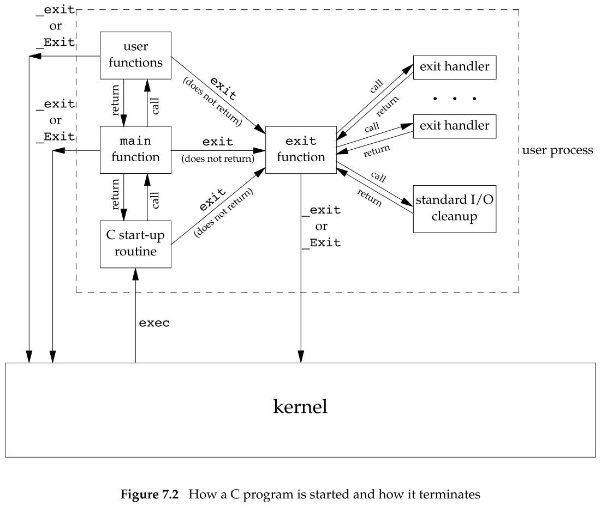
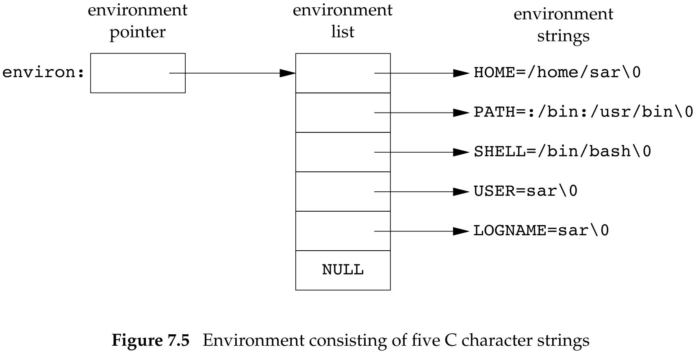
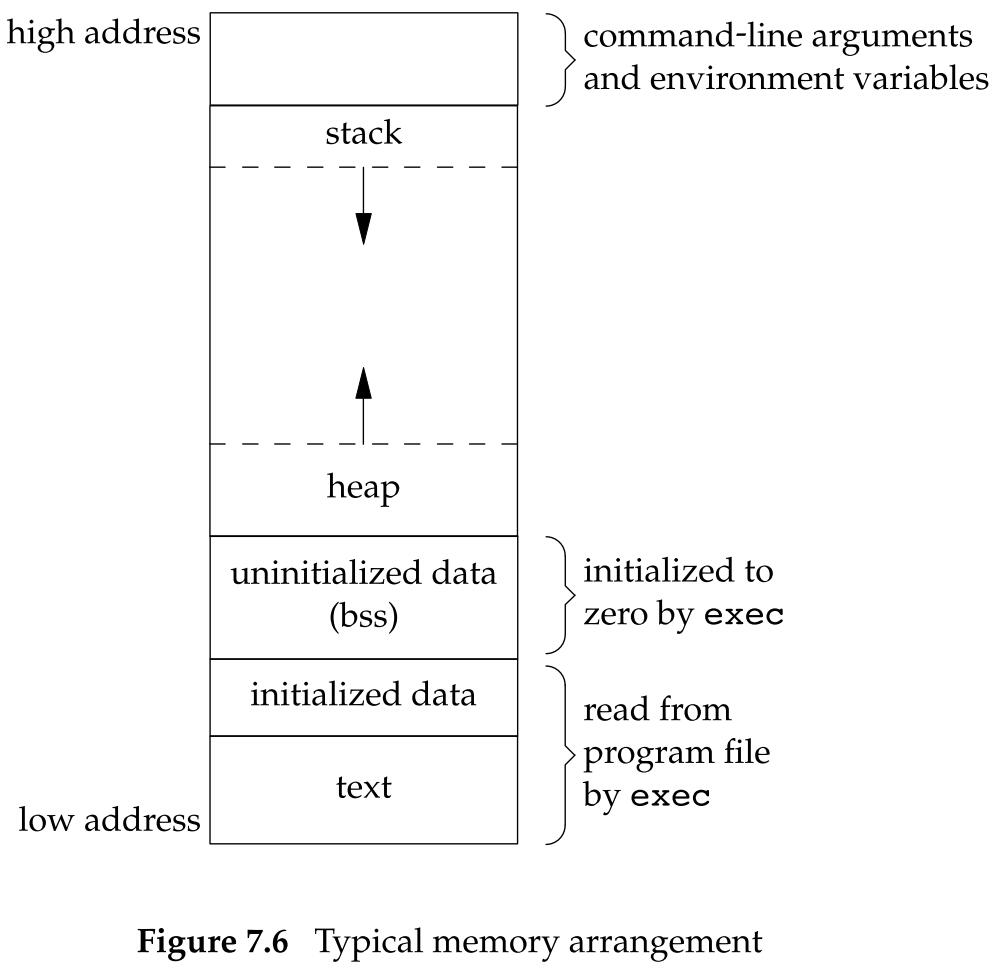
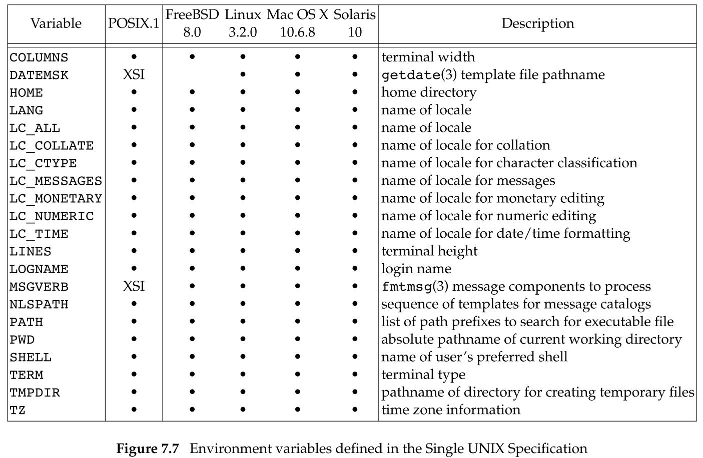

## 进程环境

### 7.2 `main` 函数

C 程序总是从 `main` 函数开始执行的。`main` 函数的原型是：

```c
int main(int argc, char *argv[]);
```

- 参数：
  - `argc`：命令行参数的数目
  - `argv`：指向各命令行参数的指针所构成的数组。
    - `ISOC` 和 `POSIX` 都要求 `argv[argc]` 是一个空指针。

当内核执行 C 程序时：

- 通过使用一个 `exec` 函数实现。

- 在调用 `main` 之前先调用一个特殊的启动例程。

- 可执行程序文件将此启动例程指定为程序的起始地址——这是由链接器设置的，而链接器由 C 编译器调用。
- 启动例程从内核取得命令行参数和环境变量值，然后为按上述方式调用 `main` 函数做好安排。

### 7.3 进程终止

有 8 种方式使进程终止，其中 5 种为正常终止，3 种为异常终止：

- 正常终止：
  - 从 `main` 返回；
  - 调用 `exit`；
  - 调用 `_exit` 或 `_Exit`；
  - 最后一个线程从其启动例程返回；
  - 从最后一个线程调用 `pthread_exit` 函数。
- 异常终止：
  - 调用 `abort`；
  - 接到一个信号；
  - 最后一个线程对取消请求作出响应。

启动例程：

- 从 `main` 返回后立即调用 `exit` 函数；
- 常常用汇编语言编写
- 如果用 C 代码形式表示，它调用 `main` 函数的形式为
  - `exit(main(grgc, argv));`

#### 退出函数

3 个函数用于正常终止一个程序：

```c
#include <stdlib.h>
void exit(int status);
void _Exit(int status);

#include <unistd.h>
void _exit(int status);
```

区别：

- 使用不同头文件的原因是 `exit` 和 `_Exit` 是由 ISO C 说明的， 而 `_exit` 是由 POSIX.1 说明的。
- `_exit`  和 `_Exit` 立即进入内核
- `exit` 先执行一些清理处理，然后进入内核
  - 由于历史原因，`exit` 函数总是执行一个标准 I/O 库的清理关闭操作：对于所有打开流调用 `fclose` 函数，这造成输出缓冲中的所有数据都被冲洗（写到文件上）。

参数：

- `status`：终止状态（或退出状态）

  - 大多数 UNIX 系统 shell 都提供检查进程终止状态的方法。

  - 如果：

    - 调用这些函数式不带终止状态；
    - `main` 执行了一个无返回值的 `return` 语句;
    - `main` 没有声明返回类型为整型；

    则该进程的终止状态是未定义的。

  - 如果 `main` 的返回类型为整型，并且 `main` 执行到最后一条语句时返回（隐式返回），那么该进程的终止状态是 0。

`main` 函数返回一个整型值与用该值调用 `exit` 是等价的。

于是在 `main` 函数中，`exit(0);` 等价于 `return (0);`。

#### 函数 `atexit`

按照 ISO C 的规定，一个进程可以登记多至 32 个函数，这些函数将由 `exit` 自动调用，我们称这些函数为终止处理程序，并调用 `atexit` 函数来登记这些函数：

```c
#include <stdlib.h>

int atexit(void (*func)(void));
// 返回值：若成功，返回 0；若出错，返回非 0
```

参数：

- `func`：一个函数指针
  - 当调用此函数时无需向它传递任何参数，也不期望它返回一个值。
  - `exit` 调用这些函数的顺序与它们登记时候的顺序相反。
  - 同一函数如若登记多次，也会被调用多次。

下图显示了一个 C 程序是如何启动的，以及它终止的各种方式：

<center class="half">
    
</center> 

注意：

- 内核使程序执行的唯一方法是调用一个 `exec` 函数。
- 进程自愿终止的唯一方法是显式或隐式地（通过调用 `exit`）调用 `_exit` 或 `_Exit`。
- 进程也可非自愿地由一个信号使其终止。

### 7.5 环境表

每个进程都接收到一张环境表：

- 与参数表一样，环境表也是一个字符指针数组
  - 其中每个指针包含一个以 `null` 结束的 C 字符串的地址
    - 这些字符串称之为环境字符串
  - 全局变量 `environ` 则包含了该指针数组的地址：
    - `extern char **environ;`
  - 我们称 `environ` 为环境指针，它位于 <unistd.h> 中，指针数组为环境表，其中各指针指向的字符串为环境字符串。
  - 按照惯例，环境字符串由 `name=value` 这种格式的字符串组成。
  - 通常用 `getenv` 和 `putenv` 函数来访问特定的环境变量，而不是用 `environ` 变量，但是如果要查看整个环境，则必须使用 `environ` 指针。

<center class="half">
    
</center> 

### 7.6 C 程序的存储空间布局

C 程序一直由下列几部分组成：

- 正文段：这是由 CPU 执行的机器指令部分。

  - 通常，正文段是可共享的，所以即使是频繁执行的程序在存储器中也只需有一个副本。
  - 正文段常常是只读的，以防止程序由于意外而修改其指令。

- 初始化数据段：通常将此段称为数据段。

  - 包含了程序中需明确地赋初值的变量：

    - 函数外的赋初值的声明
    - 函数内的赋初值的声明

    以其初值存放在初始化数据段中。

- 未初始化数据段：通常将此段称为 bss 段。

  - 在程序开始执行之前，内核将此段中的数据初始化为 0 或者空指针。
  - 包含了程序未明确地赋初值的变量：
    - 函数外的未赋初值的声明
    - 函数内的未赋初值的声明

- 栈：临时变量以及每次函数调用时所需要保存的信息都存放在此段中。

  - 每次函数调用时，函数返回地址以及调用者的环境信息（如某些机器寄存器的值）都存放在栈中。
  - 最近被调用的函数在栈上为其临时变量分配存储空间。
  - 通过这种方式使用栈，C 递归函数可以工作。
    - 递归函数每次调用自身时，就创建一个新的栈帧。
    - 因此一次函数调用中的变量集不会影响另一次函数调用实例中的变量。

- 堆：通常在堆中进行动态存储分配。

  - 由于历史习惯，堆位于未初始化数据段和栈之间。

<center class="half">
    
</center> 

`size(1)` 命令报告正文段、数据段和 bss 段的长度（以字节为单位）。

### 7.7 共享库

共享库使得可执行文件中不再需要包含公用的库函数，而只需在所有进程都可引用的存储区中保存这种库例程的一个副本。

程序第一次执行或者调用某个库函数时，用动态链接方法将程序与共享库函数相链接。

这减少了每个可执行文件的长度，但增加了一些运行时间开销。这种时间开销发生在该程序第一次被执行时，或者每个共享库函数第一次被调用时。

共享库的另一个优点是可以用库函数的新版本代替老版本，而无需对使用该库的程序重新连接编辑（嘉定参数的数目和类型都没有发生改变）。

### 7.8 存储空间分配

ISO C 说明了 3 个用于存储空间动态分配的函数：

- `malloc`，分类指定字节数的存储区。
  - 此存储区中的初始值不确定。
- `calloc`，为指定数量指定长度的对象分配存储空间。
  - 该空间中的每一位（bit）都初始化为 0。
- `realloc`，增加或减少以前分配区的长度。
  - 当增加长度时，可能需要将以前分配区的内容移到另一个足够大的区域，以便在尾端提供增加的存储区，而新增区域内的初始值不确定。

```c
#include <stdlib.h>

void *malloc(size_t size);
void *calloc(size_t nobj, size_t size);
void *realloc(void *ptr, size_t newsize);
// 若成功，返回非空指针；若出错，返回 NULL

void free(void *ptr);
```

参数：

- `realloc` - `ptr`：
  - 如果 `ptr` 是 NULL，则 `realloc` 与 `malloc` 功能相同，是分配一个指定长度为 `newsize` 字节的动态存储空间。

注意：

- 这 3 个分配函数所返回的指针一定是适当对齐的，使其可以用于任何数据对象。
- 因为这 3 个 `alloc` 函数都返回通用指针 `void *`，所以如果在程序中包括了 `#include <stdlib.h>`（以获得函数原型），那么当我们将这些函数返回的指针赋予一个不同类型时，就不需要显式地执行强制类型转换。
- 函数 `free` 释放 `ptr` 指向的存储空间。被释放的空间通常被送入可用存储区池，以后可在调用上述 3 个分配函数时再分配。 

- `realloc`可以增加、减少之前分配的动态存储区长度。
	
	- 对于增加动态存储区的情况：
		- 如果在原来动态存储区位置后面有足够的空间可以扩充，则可以在原存储区位置上向高地址扩充，无需移动任何原先的内容，并返回与传给它相同的指针值。
		- 如果在原来动态存储区位置后面没有足够的空间可以扩充，则 `realloc` 分配另一个足够大的动态存储区，然后将原先的内容复制到新的存储区。然后释放原存储区，返回新分配存储区的指针。
	
- 这些分配函数通常使用 `sbrk` 系统调用实现。该系统调用扩充或缩小进程的堆。
	
	- 大多数 `malloc` 和 `free` 的实现都不减小进程的存储空间。释放的空间可供以后再分配，但将它们保持在 `malloc` 池中而不返回给内核。
	- 大多数实现所分配的存储空间要比所要求的稍大一些，额外的空间用来记录管理信息，例如分配块的长度、指向下一个分配块的指针等。
	  - 如果超过一个已分配区的尾端或者在已分配区起始位置之前进行写操作，则会改写另一块的管理记录信息。这种类型的错误是灾难性的，但是因为这种错误不会很快就暴露出来，所以很难发现。
	- 在动态分配的缓冲区前或后进行写操作，破坏的可能不仅仅是该区的管理记录信息。
	  - 在动态分配的缓冲区前后的存储空间很可能用于其他动态分配的对象。
	  - 这些对象与破坏它们的代码可能无关，这造成寻求信息破坏的源头更加困难。
	
	- 如果一个进程调用 `malloc` 函数，但是没有调用 `free` 函数，则该进程占用的存储空间就会连续增加，这被称为内存泄漏。
	  - 进程地址空间长度慢慢增加，直至不再有空闲空间。
	  - 此时，由于过度的换页开销，会造成性能下降。

#### 替代的存储空间分配程序

- `libmalloc`
- `vmalloc`
- `quick-fit`
- `jemalloc`
- `TCMalloc`
- `alloca`

### 7.9 环境变量

环境字符串的形式是：`name=value`

UNIX 内核并不查看这些字符串，它们的解释完全取决于各个应用程序。

ISO C 定义了一个函数 `getenv`，可以用其取环境变量值，但是该标准又称环境的内容是由实现定义的：

```c
#include <stdlib.h>

char *getenv(const char *name);
// 返回值：若找到，指向 name 关联的 value 指针；若未找到，返回 NULL
```

此函数返回一个指针，它指向 `name=value` 字符串中的 `value`。我们应当使用 `getenv` 从环境中取一个指定环境变量的值，而不是直接访问 `environ`。

下图列出了由 Single UNIX Specification 定义的环境变量：

<center class="half">
    
</center> 

注意：ISO C 没有定义任何环境变量。

除了获取环境变量值，有时也需要设置环境变量：

```c
#include <stdlib.h>

int putenv(char *str);
// 返回值：若成功，返回 0；若出错，返回非 0

int setenv(const char *name, const char *value, int rewrite);
int unsetenv(const char *name);
// 返回值：若成功，返回 0；若出错，返回 -1
```

区别：

- `putenv` 取形式为 `name=value` 的字符串，将其放到环境表中。
  - 如果 `name` 已经存在，则先删除其原来的定义。
- `setenv` 将 `name` 设置为 `value`。
  - 如果 `name` 已经存在
    - 若 `rewrite` 非 0，则首先删除现有的定义；
    - 若 `rewrite` 为 0，则不删除现有的定义；
- `unsetenv` 删除 `name` 的定义。
  - 即使不存在这种定义也不算出错。
- `setenv` 必须分配存储空间，以便依据其参数创建 `name=value` 字符串。`putenv` 可以自由地将传递给它的参数字符串直接放到环境中，因此将存放在栈中的字符串作为参数传递给 `putenv` 就会发生错误，因为从当前函数返回时，其栈帧占用的存储区可能将被重用。

这些函数内部操作环境表非常复杂：

- 删除一个`name`：
  - 先在环境表中找到该指针，然后将所有的后续指针都向环境表的首部顺次移动一个位置。
- 修改一个现有的 `name`：

  - 如果新 `value` 的长度少于或等于现有 `value` 的长度，则只需要将新字符串复制到原字符串所用的空间中；
  - 如果新 `value` 的长度大于现有 `value` 的长度，则必须调用 `malloc` 为新字符串分配空间，然后将新字符串复制到该空间，接着使环境表中针对 `name` 的指针指向新分配区。
- 增加一个新的 `name`：
  - 调用 `malloc` 为新的指针表分配空间。
  - 如果这是第一次增加一个新 `name`
    - 调用 `malloc` 为新的指针表分配空间
    - 将原来的环境表复制到新分配区
    - 将新的 `name=value` 字符串的指针存放到该指针表的表尾
    - 将一个空指针存放在其后
    - 使 `environ` 指向新指针表
  - 如果这不是第一次增加一个新的 `name`

    - 调用 `realloc`，以分配比原空间多存放一个指针的空间
    - 将指向新 `name=value` 字符串的指针存放在该表表尾
    - 将一个空指针存放在其后

### 7.10 函数 `setjmp` 和 `longjmp`

在 C 中，`goto` 语句是不能跨越函数的，而执行这种类型跳转功能的是函数 `setjmp` 和 `longjmp`。这两个函数对于处理发生在很深层嵌套函数调用中的出错情况是非常有用的。它们不是由普通的 C 语言 `goto` 语句在一个函数内实施的跳转，而是在栈上跳过若干调用帧，返回到当前函数调用路径上的某一个函数中。

```c
#include <setjmp.h>

int setjmp(jmp_buf env);
// 返回值：若直接调用，返回 0；若从 longjmp 返回，则为非 0

void longjmp(jmp_buf env, int val);
```

参数：

- 对于`setjmp`函数：
  - `env`：是一个特殊类型 `jmp_buf`
    - 是某种形式的数组，其中存放在调用 `longjmp` 时能用来恢复栈状态的所有信息。
    - 因为需在 `longjmp` 中引用 `env` 变量，所以通常将 `env` 变量定义为全局变量。
  - `val`：将成为从 `setjmp` 处返回的值。
    - 对于一个 `setjmp`，可以有多个 `longjmp`。

### 7.11 函数 `getrlimit` 和 `setrlimit`

每个进程都有一组资源限制，其中一些可以用 `getrlimit` 和 `setrlimit` 函数查询和更改：

```c
#include <sys/resource.h>

int getrlimit(int resource, struct rlimit *rlptr);
int setrlimit(int resource, const struct rlimit *rlptr);
// 返回值：若成功，返回 0；若出错，返回非 0
```

参数：

- `resource`：指定的资源，取下列值之一：

  - `RLIMIT_AS`：进程总的可用存储空间的最大长度（字节）。
    - 这会影响到 `sbrk` 函数和 `mmap` 函数。
  - `RLIMIT_CORE`：`core` 文件的最大字节数。
    - 如果为 0，则阻止创建 `core` 文件
  - `RLIMIT_CPU`：CPU时间的最大量值（秒）。
    - 当超过此软限制时，向该进程发送 `SIGXCPU` 信号。
  - `RLIMIT_DATA`：数据段的最大字节长度。
    - 是初始化、非初始以及堆的总和。
  - `RLIMIT_FSIZE`：可以创建的文件的最大字节长度。
    - 当超过此软限制时，向该进程发送 `SIGXFSX` 信号。
  - `RLIMIT_MEMLOCK`：一个进程使用 `mlock` 能够锁定在存储空间中的最大字节长度。
  - `RLIMIT_MSGQUEUE`：进程为 `POSIX` 消息队列可分配的最大存储字节数。
  - `RLIMIT_NICE`：为了影响进程的调度优先级，友好值可设置的最大限制。
  - `RLIMIT_NOFILE`：每个进程能打开的最多文件数。
    - 更改此限制将影响到 `sysconf` 函数在参数 `_SC_OPEN_MAX` 中返回的值。
  - `RLIMIT_NPROC`：每个实际用户 ID 可以拥有的最大子进程数。
    - 更改此限制将影响到 `sysconf` 函数在参数 `_SC_CHILD_MAX` 中返回的值。
  - `RLIMIT_RSS`：最大驻内存集字节长度。
    - 如果可用的物理存储器非常少，则内核将从进程处取回超过 RSS 的部分。
  - `RLIMIT_SIGPENDING`：一个进程可排队的信号的最大数量。
    - 这个限制是 `sigqueue` 函数实施的。
  - `RLIMIT_STACK`：栈的最大字节长度。
  - `RLIMIT_SWAP`：用户可消耗的交换空间的最大字节数。
  - `RLIMIT_VMEM`：`RLIMIT_AS` 的同义词。
  - 资源限制影响到调用进程并由其子进程继承。

- `rlptr`：指向下列结构的指针

  ```c
  struct rlimit {
  	rlim_t rlim_cur;	/* soft limit: current limit */
  	rlim_t rlim_max;	/* hard limit: maximum value for rlim_cur */
  }
  ```

  - 在 `getrlimit` 中，它返回资源限制值。
  - 在 `setrlimit`中，它存放待设置的资源限制值。
  - 常量 `RLIM_INFINITY` 指定了一个无限量的限制。

在更改资源限制时，必须遵循下列 3 条规则：

- 任何一个进程都可将一个软限制值更改为小于或等于其硬限制值。
- 任何一个进程都可降低其硬限制值，但它必须大于或等于其软限制值。
  - 这种降低，对普通用户而言是不可逆的。
- 只有超级用户进程可以提高硬限制值。

### 习题

**是否有方法不适应（a）参数传递、（b）全局变量这两种方法，将 `main` 中的参数 `argc` 和 `argv` 传递给它所调用的其他函数？**

由于 `argc` 和 `argv` 的副本不像 `environ` 一样保存在全局变量中，所以在大多数 UNIX 系统中没有其他办法。

**在有些 UNIX 系统实现中执行程序时访问不到其数据段的 0 单元，这是一种有意的安排，为什么？**

当 C 程序解引用一个空指针出错时，执行该程序的进程将终止。

可以利用这种方法终止进程。

**如果用 `calloc` 分配一个 `long` 型的数组，数组的初始值是否为 0？如果用 `calloc` 分配一个指针数组，数组的初始值是否为空指针？**

`calloc` 将分配的内存空间初始化为 0。

但是 ISO C 并不保证 0 值与浮点 0 或空指针的值相同。


