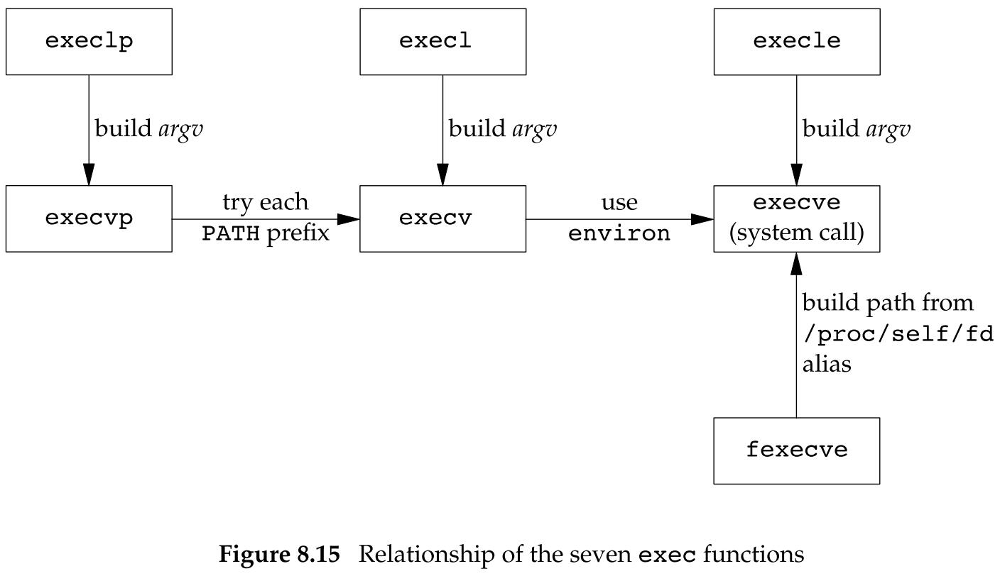
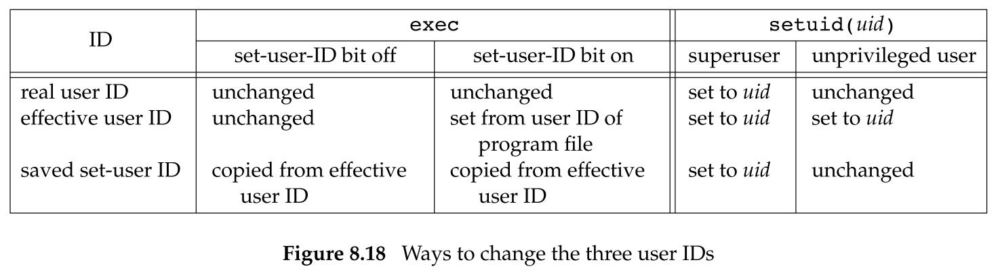
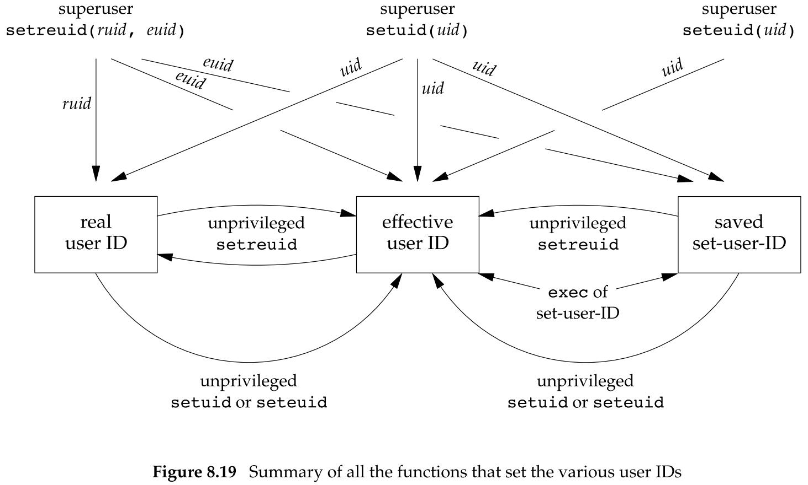
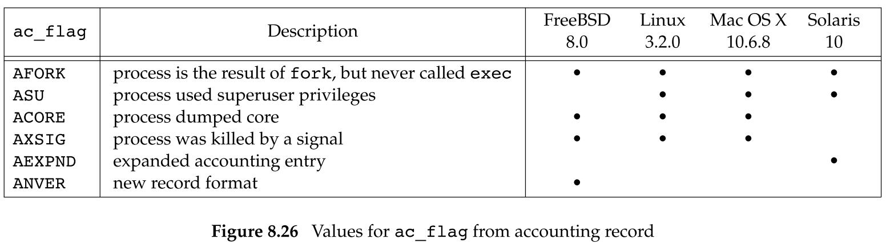

## 进程控制

### 8.2 进程标识

每个进程都有一个非负整数表示的唯一进程 ID。

- 因为进程 ID 标识总是唯一的，常将其用作其他标识符的一部分以保证其唯一性。

虽然是唯一的，但是进程 ID 是可复用的。

- 当一个进程终止后，其进程 ID 就成为复用的候选者。
- 大多数 UNIX 系统实现延迟复用算法，使得赋予新建进程的 ID 不同于最近终止进程所使用的 ID。
- 这防止了将新进程误认为是使用同一 ID 的某个已终止的先前进程。

系统中有一些专用进程，但具体细节随实现而不同。

- ID 为 0 的进程通常是调度进程，常常被称为交换进程。
  - 该进程是内核的一部分，它并不执行任何磁盘上的程序，因此也被称为系统进程。
- ID 为 1 的进程通常是 `init` 进程，在自举过程结束时由内核调用。
  - 该进程的程序文件在 UNIX 早期版本是 `/etc/init`，在较新的版本中是 `/sbin/init`。
  - 该进程负责在自举内核后启动一个 UNIX 系统。
  - 该进程通常读取与系统有关的初始化文件（`/etc/rc*` 文件，`/etc/inittab` 文件以及 `/etc/init.d` 中的文件），并将系统引导到一个状态（如多用户）。
  - 该进程永远不会终止。
  - 该进程是一个普通的用户进程（与交换进程不同，它不是内核中的系统进程），但是它以超级用户特权运行。

每个 UNIX 系统实现都有它自己的一套提供操作系统服务的内核进程。

除了进程 ID，每个进程还有一些其他标识符。下列函数返回这些标识符：

```c
#include <unistd.h>

pid_t getpid(void);		// 返回值：调用进程的进程 ID
pid_t getppid(void);	// 返回值：调用进程的父进程 ID

uid_t getuid(void);		// 返回值：调用进程的实际用户 ID
uid_t geteuid(void);	// 返回值：调用进程的有效用户 ID

gid_t getgid(void);		// 返回值：调用进程的实际组 ID
gid_t getegid(void);	// 返回值：调用进程的有效组 ID
```

注意：这些函数都没有出错返回。

### 8.3 函数 `fork`

一个现有的进程可以调用 `fork` 函数创建一个新进程：

```c
#include <unistd.h>

pid_t fork(void);
// 返回值：若成功，子进程返回 0，父进程返回子进程 ID；若出错，返回 -1
```

由 `fork` 创建的新进程被称为子进程。

`fork` 函数被调用一次，但返回两次。

将子进程 ID 返回给父进程的理由是：一个进程的子进程可以有多个，并且没有一个函数使一个进程可以获得其所有子进程的进程 ID。

子进程继续执行 `fork` 调用之后的指令。

- 子进程是父进程的副本。
  - 获得父进程数据空间、堆和栈的副本。
- 父进程和子进程并不共享这些存储空间部分。
- 父进程和子进程共享正文段。

由于在 `fork` 之后经常跟随着 `exec`，所以现在的很多实现并不执行一个父进程数据段、栈和堆的完全副本。

- 作为替代，使用了写时复制（Copy-On-Write，COW）技术，
- 这些区域由父进程和子进程共享，而且内核将它们的访问权限改变为只读。
- 如果父子进程中任一个试图修改这些区域，则内核只为修改区域的那块内存制作一个副本，通常是虚拟存储系统中的一“页”。

一般来说，在 `fork` 之后是父进程先执行还是子进程先执行是不确定的，这取决于内核所使用的调度算法。如果要求父进程和子进程之间相互同步，则要求某种形式的进程间通信。

#### 文件共享

在重定向父进程的标准输出时，子进程的标准输出也被重定向。

实际上，`fork` 的一个特性是父进程的所有打开文件描述符都被复制到子进程中。

- 这里的“复制”，指对每个文件描述符来说，就好像执行了 `dup` 函数。父进程和子进程每个相同的打开描述符共享一个文件表项。

父进程和子进程共享同一个文件偏移量。

在 `fork` 之后处理文件描述符有以下两种常见的情况：

- 父进程等待子进程完成。
  - 父进程无需对其描述符做任何处理。
  - 当子进程终止后，它曾经进行过读、写操作的任一共享描述符的文件偏移量已做了相应更新。
- 父进程和子进程各自执行不同的程序段。
  - 父进程和子进程各自关闭它们不需要使用的文件描述符，这样就不会干扰对方使用的文件描述符。这种方法是网络服务进程经常使用的。

除了打开文件之外，父进程的很多其他属性也由子进程继承：

- 实际用户 ID、实际组 ID、有效用户 ID、有效组 ID
- 附属组 ID
- 进程组 ID
- 会话 ID
- 控制终端
- 设置用户 ID 标志和设置组 ID 标志
- 当前工作目录
- 根目录
- 文件模式创建屏蔽字
- 信号屏蔽和安排
- 对任一打开文件描述符的执行时关闭标志
- 环境
- 连接的共享存储段
- 存储映像
- 资源限制

父进程和子进程之间的区别具体如下：

- `fork` 的返回值不同
- 进程 ID 不同
- 各自的父进程 ID 不同
- 子进程的  `tms_utime`，`tms_stime`，`tms_cutime` 和 `tms_ustime` 的值设置为 0
- 子进程不继承父进程设置的文件锁
- 子进程的未处理闹钟被清除
- 子进程的未处理信号集设置为空集

使 `fork` 失败的两个主要原因是：

- 系统中已经有了太多的进程。
- 该实际用户 ID 的进程总数超过了系统限制。
  - `CHILD_MAX` 规定了每个实际用户 ID 在任一时刻可拥有的最大进程数。

`fork` 有两种用法：

- 一个父进程希望复制自己，使父进程和子进程同时执行不同的代码段。
  - 这在网络服务进程中是常见的：
    - 父进程等待客户端的服务请求。
    - 当这种请求到达时，父进程调用 `fork`，使子进程处理此请求。
    - 父进程继续等待下一个服务请求。
- 一个进程要执行一个不同的程序。
  - 这对 shell 是常见的情况：
    - 子进程从 `fork` 返回后立即调用 `exec`。

### 8.4 函数 `vfork`

`vfork ` 函数的调用序列和返回值与 `fork` 相同，但两者的语义不同：

- `vfork` 函数用于创建一个新进程，而该新进程的目的是执行一个新程序。
- `vfork` 与 `fork` 一样都创建一个子进程，但是它并不将父进程的地址空间完全复制到子进程中，因为子进程会立即调用 `exec`（或 `exit`），于是也就不会引用该地址空间。
  - 不过在子进程调用 `exec` 或 `exit` 之前，它在父进程的空间中运行。
  - 这种优化工作方式在某些 UNIX 系统的实现中提高了效率，但如果子进程修改数据（除了用于存放 `vfork` 返回值的变量）、进行函数调用或者没有 `exec` 或 `exit` 就返回都可能会带来未知的结果。
- `vfokr` 保证子进程先运行，在它调用 `exec` 或 `exit` 之后父进程才可能被调度运行，当子进程低啊用这两个函数中的任意一个时，父进程会恢复运行。
  - 如果在调用这两个函数之前子进程依赖于父进程的进一步动作，则会导致死锁。

### 8.5 函数 `exit`

进程有 8 种方式使进程终止，其中 5 种为正常终止，3 种为异常终止：

- 正常终止：
  - 在 `main` 函数内执行 `return` 语句。
    - 这等效于调用 `exit`。
  - 调用 `exit` 函数。
    - 此函数由 ISO C 定义，其操作包括调用个终止处理程序（终止处理程序在调用 `atexit` 函数时登记），然后关闭所有标准 I/O 流等。
    - 因为 ISO C 并不处理文件描述符、多进程以及作业控制，所以这一定义对 UNIX 系统而言是不完整的。
  - 调用 `_exit` 或 `_Exit` 函数。
    - ISO C 定义 `_Exit`，其目的是为进程提供一种无需运行终止处理程序或信号处理程序而终止的方法。
    - 在 UNIX 系统中，`_exit` 和 `_Exit` 是同义的，并不冲洗标准 I/O 流。
    - `_exit` 是由 POSIX.1 说明的，它由 `exit` 调用，处理 UNIX 系统特定的细节。
  - 进程的最后一个线程在其启动例程中执行 `return` 语句。
    - 该线程的返回值不用作进程的返回值。
    - 当最后一个线程从其启动例程返回时，该进程以终止状态 0 返回。
  - 进程的最后一个线程调用 `pthread_exit` 函数。
    - 进程的终止状态总是 0，这与传送给 `pthread_exit` 的参数无关。
- 异常终止：
  - 调用 `abort`。
    - 它产生 `SIGABRT` 信号，是下一种异常终止的一个特例。
  - 接到一个信号。
    - 信号可由进程自身（如调用 `abort` 函数）、其他进程或内核产生。
  - 最后一个线程对“取消”请求作出响应。
    - 默认情况下，“取消”以延迟的方式发生：一个线程要求取消另一个线程，若干时间之后，目标线程终止。

不管进程如何终止，最后都会执行内核中的同一段代码。这段代码为相应进程关闭所有打开描述符，释放它对所使用的存储器等。

对上述任意一种终止情形，我们都希望终止进程能够通知其父进程它是如何终止的。

- 对于 3 个终止函数，实现这一点的方法是，将其退出状态作为参数传递给函数。
- 在异常终止情况下，该终止进程的父进程都能用 `wait` 或 `waitpid` 函数取得其终止状态。
- 注意，退出状态是传递给 3 个终止函数的参数，或 `main` 的返回值，在最后调用 `_exit` 时，内核将退出状态转换成终止状态。

如果子进程先终止：

- 子进程将其终止状态返回给父进程。

如果父进程先终止：

- 对于父进程已经终止的所有进程，它们的父进程都改为 `init` 进程。
- 我们称这些进程由 `init` 进程收养，其操作过程大致是：
  - 在一个进程终止时，内核逐个检查所有活动进程，以判断它是否是正要终止进程的子进程，如果是，则该进程的父进程 ID 就更改为 1。
- 这种处理方法保证了每个进程有一个父进程。

内核为每个终止子进程保存了一定量的信息，所以当终止进程的父进程调用 `wait` 函数或者 `waitpid` 函数时，可以得到这些信息。

- 这些信息至少包括：终止进程的进程 ID、该进程的终止状态、该进程使用的 CPU 时间总量。
- 一个已经终止、但是等待父进程对它进行善后处理的进程称作僵死进程，在 `ps` 命令中显示为 `Z`。
  - 所谓善后处理，就是父进程调用 `wait` 函数或者 `waitpid` 函数读取终止进程的残留信息
  - 一旦父进程进行了善后处理，则终止进程的所有占用资源（包括残留信息）都得到释放，该进程被彻底销毁
- 对于 `init` 进程:
  - 任何时候只要有一个子进程终止，就立即调用 `wait` 函数取得其终止状态。
  - 这种做法防止系统中塞满了僵死进程。

### 8.6 函数 `wait` 和 `waitpid`

当一个进程正常或异常终止时，内核就向其父进程发送 SIGCHLD 信号。

- 因为子进程终止是一个异步事件，所以这种信号是内核向父进程发送的异步进程。

- 父进程可以选择忽略该信号。这是系统的默认动作。
- 父进程也可以提供一个该信号发生时即被调用执行的函数（信号处理程序）。

如果进程由于接收到 SIGCHLD 信号而调用 `wait`，我们期望 `wait` 会立即返回。

但是如果在随机时间点调用 `wait`，则进程可能会阻塞。

```c
#include <sys/wait.h>

pid_t wait(int *statloc);
pid_t waitpid(pid_t pid, int *statloc, int options);
// 返回值：若成功，返回进程 ID；若出错，返回 0 或 -1
```

区别：

- 在一个子进程终止前，`wait` 使其调用者阻塞，而 `waitpid` 有一选项，可使调用者不阻塞。
- `waitpid` 并不等待在其调用之后的第一个终止子进程，它有若干个选项，可以控制它所等待的进程。
- 如果子进程已经终止，并且是一个僵死进程，则 `wait` 立即返回并取得该子进程的状态；否则 `wait` 使其调用者阻塞，直到一个子进程终止。
- 如果调用者阻塞而且它有多个子进程，则在其某一子进程终止时，`wait` 就立即返回。
- 因为 `wait` 返回终止子进程的进程 ID，所以它总能了解是哪一个子进程终止了。
- `waitpid` 可等待一个特定进程，而 `wait` 则返回任一终止子进程的状态。
- `waitpid` 提供了一个 `wait` 的非阻塞版本。有时希望获取一个子进程的状态，但不想阻塞。

参数：

- `staloc`：存放子进程终止状态的地址。
  
  - 如果不关心子进程的终止状态，可以将该参数设为空指针。
  
- `pid`：
  - 如果 `pid==-1`：则等待任一子进程终止。
  - 如果 `pid>0`：则等待进程 ID 等于 `pid` 的那个子进程终止。
  - 如果 `pid==0`：则等待组 ID 等于调用进程组 ID 的任一子进程终止。
  - 如果 `pid<0`：等待组 ID 等于 `pid` 绝对值的任一子进程终止。

- `options`：使我们进一步控制 `waitpid` 的操作。

  - 或者是0，或者是下列常量按位或的结果：
    
    | 常量         | 说明                                                         |
    | ------------ | ------------------------------------------------------------ |
    | `WCONTINUED` | 若实现支持作业控制，那么由 `pid ` 指定的任一子进程在停止后已经继续，但其状态尚未报告，则返回其状态（POSIX.1 的 XSI 扩展）。 |
    | `WNOHANG`    | 若由 `pid` 指定的子进程并不是立即可用的，则 `waitpid` 不阻塞，此时其返回值为 0。 |
    | `WUNTRACED`  | 若实现支持作业控制，而由 `pid` 指定的任一子进程已处于停止状态，并且其状态自停止以来还未报告过，则返回其状态。`WIFSTOPPED` 宏确定返回值是否对应于一个停止的子进程。 |

有 4 个互斥的宏可用来取得进程终止的原因，它们的名字都以 WIF 开始。基于这 4 个宏中哪一个值为真，就可选用其他宏来取得退出状态、信号编号等。

| 宏                     | 说明                                                         |
| ---------------------- | ------------------------------------------------------------ |
| `WIFEXITED(status)`    | 若为正常终止子进程返回的状态，则为真。对于这种情况可执行 `WEXITSTATUS(status)`，获取子进程传送给 `exit` 或 `_exit` 参数的低 8 位。 |
| `WIFSIGNALED(status)`  | 若为异常终止子进程返回的状态，则为真（接到一个不捕捉的信号）。对于这种情况，可执行 `WTERMSIG(status)`，获取使子进程终止的信号编号。另外，有些实现定义宏 `WCOREDUMP(status)`，若已产生终止进程的 core 文件，则它返回真。 |
| `WIFSTOPPED(status)`   | 若为当前暂停子进程的返回的状态，则为真。对于这种情况，可执行 `WSTOPSIG(status)`，获取使子进程暂停的信号编号。 |
| `WIFCONTINUED(status)` | 若在作业控制暂停后已经继续的子进程返回了状态，则为真（POSIX.1 的 XSI 扩展，仅用于 `waitpid`）。 |

### 8.7 函数 `waitid`

Single UNIX Specification 包括了另一个取得进程终止状态的函数——`waitid`，此函数类似于 `waitpid`，但提供了更多的灵活性。

```c
#include <sys/wait.h>

int waitid(id_type_t idtype, id_t id, siginfo_t *infop, int options);
// 返回值：若成功，返回 0；若出错，返回 -1
```

参数：

- `idtype`：可以为下列常量：

  | 常量   | 说明                                                         |
  | ------ | ------------------------------------------------------------ |
  | P_PID  | 等待一特定进程：`id` 包含要等待子进程的进程 ID               |
  | P_PGID | 等待一特定进程组中的任一子进程：`id` 包含要等待子进程的进程组 ID |
  | P_ALL  | 等待任一子进程：忽略 `id`                                    |

- `id`：指定要等待的子进程 ID，其作用与 `idtype` 的值相关。

- `infop`：一个缓冲区的地址。

  - 该缓冲区由 `waitid` 填写，包含了造成子进程状态改变的有关信号的详细信息。

- `options`：指示调用者关注哪些状态变化。可以是下列常量的按位或：

  | 常量       | 说明                                                         |
  | ---------- | ------------------------------------------------------------ |
  | WCONTINUED | 等待一进程，它以前曾被停止，此后又已继续，但其状态尚未报告。 |
  | WEXITED    | 等待已退出的进程                                             |
  | WNOHANG    | 如无可用的子进程退出状态，立即返回而非阻塞                   |
  | WNOWAIT    | 不破坏子进程退出状态。该子进程退出状态可由后续的 `wait`、`waitid` 或 `waitpid` 调用取得 |
  | WSTOPPED   | 等待一进程，它已经停止，但其状态尚未报告                     |
  `WCONTINUED`、`WEXITED` 或 `WSTOPPED` 这 3 个常量之一必须在 `options` 参数中指定。

### 8.8 函数 `wait3` 和 `wait4`

函数 `wait3` 和 `wait4` 提供的功能比 `wait`、`waitpid` 和 `waitid` 所提供的功能要多一个，这与附加参数有关。该参数允许内核返回由终止进程及其所有子进程使用的资源概况。

```c
#include <sys/types.h>
#include <sys/wait.h>
#include <sys/time.h>
#include <sys/resource.h>

pid_t wait3(int *statloc, int options, struct rusage *rusage);
pid_t wait4(pid_t pid, int *statloc, int options, struct rusage *rusage);
// 返回值：若成功，返回进程 ID；若出错，返回 -1
```

参数：

- `statloc`：存放子进程终止状态的缓冲区的地址。
  - 如果不关心子进程的终止状态，可以将它设为空指针。
- `rusage`：存放由 `wait3` 和 `wait4` 返回的终止子进程的资源统计信息的缓冲区地址。
  - 资源统计信息包括用户 CPU 时间总量、系统 CPU 时间总量、缺页次数、接收到信号的次数等。
- `pid` 和 `options` 参数的意义与 `waitpid` 相同。

### 8.9 竞争条件

当多个进程都企图对共享数据进行某种处理，而最后的结果又取决于进程运行的顺序时，我们认为发生了竞争条件。

如果在 `fork` 之后的某种逻辑显式或隐式地依赖于在 `fork` 之后是父进程先运行还是子进程先运行，那么 `fork` 函数就会是竞争条件活跃的滋生地。

如果一个进程希望等待一个子进程终止，则它必须调用 `wait` 函数中的一个。如果一个进程要等待其父进程终止，则可使用下列形式的循环：

```c
while (getppid() != 1) {
	sleep(1);
}
```

这种形式的循环称为轮询，它的问题是浪费了 CPU 时间，因为调用者每隔 1s 都被唤醒，然后进行条件测试。

为了避免竞争条件和轮询，在多个进程之间需要有某种形式的信号发送和接收的方法。在 UNIX 中可以使用信号机制，各种形式的进程间通信（IPC）也可以使用。

### 8.10 函数 `exec`

当进程调用一种 `exec` 函数时，该进程执行的程序完全替换为新程序，而新程序则从其 `main` 函数开始执行。因为调用 `exec` 并不创建新进程，所以前后的进程 ID 并未改变。`exec` 只是用磁盘上的一个新程序替换了当前进程的正文段、数据段、堆段和栈段。

有 7 种不同的 `exec` 函数可供使用，它们常常被统称为 `exec` 函数，我们可以使用这 7 个函数中的任一个。这些 `exec` 函数使得 UNIX 系统进程控制原语更加完善。用 `fork` 可以创建新进程，用 `exec` 可以初始执行新的程序。`exit` 函数和 `wait` 函数处理终止和等待终止。这些是我们需要的基本的进程控制原语。

```c
#include <unistd.h>

int execl(const char *pathname, const char *arg0, ... /* (char *)0 */);
int execv(const char *pathname, char *const argv[]);
int execle(const char *pathname, const char *arg0, 
           ... /* (char *)0, char *const envp[] */);
int execve(const char *pathname, char *const argv[], char *const envp[]);
int execlp(const char *filename, const char *arg0, ... /* (char *)0 */);
int execvp(const char *filename, char *const argv[]);
int fexecve(int fd, char *const argv[], cahr *const envp[]);
// 返回值：若成功，不返回；若出错，返回 -1
```

区别：

- 前 4 个函数取路劲名作为参数，后 2 个函数则取文件名作为参数，最后一个取文件描述符作为参数。
- 当指定 `filename` 作为参数时：
  - 如果 `filename` 中包含 `/`，就将其视为路径名；
  - 否则，按照 PATH 环境变量，在它所指定的各目录中搜寻可执行文件。
    - PATH 变量包含了一张目录表（称为路径前缀），目录之间用冒号分隔。
- 如果 `execlp` 或 `execvp` 使用路劲前缀中的一个找到了一个可执行文件，但是该文件不是由连接器产生的机器可执行文件，就认为该文件是一个 shell 脚本，于是试着调用 /bin/sh，并以该 `filename` 作为 shell 的输入。
- `fexecv` 函数避免了寻找正确的可执行文件，而是依赖调用进程来完成这项工作。调用进程可以使用文件描述符验证所需要的文件并且无竞争地执行该文件。否则，拥有特权的恶意用户就可以在找到文件位置并且验证之后，但在调用进程执行该文件之前，替换可执行文件（或可执行文件的部分路径）。
- 函数 `execl`、`execlp` 和 `execle` 要求将新程序的每个命令行参数都说明为一个单独的参数。这种参数表以空指针结尾。
- 函数 `execv`、`execvp`、`execve` 和 `fexecve` 应先构造一个指向各参数的指针数组，然后将该数组地址作为这 4 个函数的参数。
- 以 `e` 结尾的 3 个函数（`execle`、`execve` 和 `fexecve`）可以传递一个指向环境字符串指针数组的指针。其他 4 个函数则使用调用进程中的 `environ` 变量为新程序复制现有的环境。

注意：

- 每个系统对参数表和环境表的总长度都有一个限制。

  - 在 POSIX.1 系统中，此值至少是 4096 字节。
  - 当使用 shell 的文件名扩充功能产生一个文件名列表时，可能会受到此值的限制。
  - 为了摆脱对参数表长度的限制，我们可以使用 `xargs(1)` 命令，将长参数表断开成几部分。

- 在执行 `exec` 后，进程 ID 没有改变，但新进程从调用进程继承了的下列属性：

  - 进程 ID 和父进程 ID
  - 实际用户 ID 和实际组 ID
  - 附属组 ID
  - 进程组 ID
  - 会话 ID
  - 控制终端
  - 闹钟尚余留的时间
  - 当前工作目录
  - 根目录
  - 文件模式创建屏蔽字
  - 文件锁
  - 进程信号屏蔽
  - 未处理信号
  - 资源限制
  - 友好值
  - `tms_utime`、`tms_stime`、`tms_cutime` 以及 `tms_cstime` 值

  对打开文件的处理于每个描述符的执行时关闭（close-on-exec）标志值有关。

  - 进程中每个打开描述符都有一个执行时关闭标志。若设置了此标志，则在执行 `exec` 时关闭该描述符；否则该描述符仍打开。除非特地用 `fcntl` 设置了该执行时关闭标志，否则系统的默认操作是在 `exec` 后仍保持这种描述符打开。

- 在 `exec` 前后实际用户 ID 和实际组 ID 保持不变，而有效 ID 是否改变则取决于所执行程序文件的设置用户 ID 位和设置组 ID 位是否设置。如果新程序的设置用户 ID 为已设置，则有效用户 ID 变成程序文件所有者的 ID；否则有效用户 ID 不变。对组 ID 的处理方式与此相同。

在很多 UNIX 实现中，这 7 个函数中只有 `execve` 是内核的系统调用。另外 6 个只是库函数，它们最终都要调用该系统调用。这 7 个函数之间的关系如下：

<center class="half">
    
</center> 

在这种安排中，库函数 `execlp` 和 `execvp` 使用 PATH 环境变量，查找第一个包含名为 `filename` 的可执行文件的路径名前缀。`fexecve` 库函数使用 /proc 把文件描述符参数转换成路径名，`execve` 用该路径名去执程序。

### 8.11 更改用户 ID 和更改组 ID

在 UNIX 系统中，特权已经访问孔子，是基于用户 ID 和组 ID 的。当程序需要增加特权，或需要访问当前并不允许访问的资源时，我们需要更换自己的用户 ID 或组 ID，使得新 ID 具有合适的特权或访问权限。与此类似，当程序需要降低其特权或阻止对某些资源的访问时，也需要更换用户 ID 或组 ID，新 ID 不具有相应特权或访问这些资源的能力。

一般而言，在设计应用时，我们总是试图使用最小特权模型。依照此模型，我们的程序应当只具有为完成给定任务所需的最小特权。这降低了由恶意用户试图哄骗我们的程序以未预料的方式使用特权造成的安全性风险。

可以用 `setuid` 函数设置实际用户 ID 和有效用户 ID，用 `setgid` 函数设置实际组 ID 和有效组 ID：

```c
#include <unistd.h>

int setuid(uid_t uid);
int setgid(gid_t gid);
// 返回值：若成功，返回 0；若失败，返回 -1
```

关于更改用户 ID 的规则（关于用户 ID 所说明的一切都适用于组 ID）：

- 若进程具有超级用户特权，则 `setuid` 函数将实际用户 ID、有效用户 ID 以及保存的设置用户 ID（saved set-user-ID）设置为 `uid`。
- 若进程没有超级用户特权，但是 `uid` 等于实际用户 ID 或保存的设置用户 ID，则 `setuid` 只将有效用户 ID 设置为 `uid`，不更改实际用户 ID 和保存的设置用户 ID。
- 如果上面两个条件都不满足，则 `errno` 设置为 `EPERM`，并返回 -1。
- 在此假定 `_POSIX_SAVED_IDE` 为真，如果没有提供这种功能，则上面所说的关于保存的设置用户 ID 部分都无效。

关于内核所维护的 3 个用户 ID（实际用户、有效用户和保存的设置用户），还要注意：

- 只有超级用户进程可以更改实际用户 ID。
  - 通常，实际用户 ID 是在用户登录时，由 `login` 程序设置的，而且绝不会改变它。
  - 因为 `login` 是一个超级用户进程，当它调用 `setuid` 时，设置所有 3 个用户 ID。
- 仅当对程序文件设置了设置用户 ID 时，`exec` 函数才设置有效用户 ID。如果设置用户 ID 位没有设置，`exec` 函数不会改变有效用户 ID，而将维持其现有值。
  - 任何时候都可以调用 `setuid` 将有效用户 ID 设置为实际用户 ID 或者保存的设置用户 ID。
  - 调用 `setuid` 时，不能将有效用户 ID 设置为任一随机值，只能从实际用户 ID 或者保存的设置用户 ID 中取得。
- 保存的设置用户 ID 是由 `exec` 复制有效用户 ID 而得到的。
  - 如果设置了文件的设置用户 ID 位，则在 `exec` 根据文件的用户 ID 设置了进程的有效用户 ID 以后，这个副本就被保存起来了。

下表总结了更改这 3 个用户 ID 的不同方法：

<center class="half">
    
</center> 

注意：`getuid` 和 `geteuid` 函数只能获得实际用户 ID 和有效用户 ID 的当前值，我们没有可移植的方法去获得保存的设置用户 ID 的当前值。

#### 函数 `seteuid` 和 `setegid`

POSIX.1 包含了两个函数 `seteuid` 和 `setegid`，它们类似于 `setuid` 和 `setgid`，但只更改有效用户 ID 和有效组 ID ：

```c
#include <unistd.h>

int seteuid(uid_t uid);
int setegid(gid_t gid);
// 返回值：若成功，返回 0；若出错，返回 -1
```

- 一个非特权用户可将其有效用户 ID 设置为其实际用户 ID 或其保存的设置用户 ID。
- 一个特权用户用户可将有效用户 ID 设置为 `uid`。

<center class="half">
    
</center> 

### 8.12 解释器文件

所有现今的 UNIX 系统都支持解释器文件。

- 这种文件是文本文件，其起始行的形式是：
  - `#! pathname [optional-argument]`，在感叹号和 `pathname` 之间的空格是可选的。
- 最常见的解释器文件以下列行开始：
  - `#! /bin/sh`
- `pathname` 通常是绝对路径名，对它不进行什么特殊处理（不使用 PATH 进行路径搜索）。
- 对这种文件的识别是由内核作为 `exec` 系统调用处理的一部分来完成的。内核使调用 `exec` 函数的进程实际执行的并不是该解释器文件，而是在该解释器文件第一行中 `pathname` 所指定的文件。
- 一定要将解释器文件（文本文件，它以 `#!` 开头）和解释器（有该解释器文件第一行中的 `pathaname` 指定）区分开来。

解释器使用户得到效率方面的好处，其代价是内核的额外开销（因为识别解释器文件的是内核）。

由于下述理由，解释器文件是有用的：

- 有些程序是用某种语言写的脚本，解释器文件可将这一事实隐藏起来。
- 解释器脚本提升了效率。
- 解释器脚本使我们可以使用除 /bin/sh 以为的其他 shell 来编写 shell 脚本。

### 8.13 函数 `system`

ISO C 定义了 `system` 函数，用于在程序中执行一个命令字符串，但是其操作对系统的依赖性很强。POSIX.1 包括了 `system` 接口，它扩展了 ISO C 定义，描述了 `system` 在 POSIX.1 环境中的运行行为。

```c
#include <stdlib.h>

int system(const char *cmdstring)
```

参数：

- `cmdstring`：命令字符串（在 shell 中执行）

返回值：

- 如果 `cmdstring` 是一个空指针，则仅当命令处理程序可用时，`system` 返回非 0 值。
  - 这一特征可以确定在一个给定的操作系统上是否支持 `system` 函数。
  - 在 UNIX 中，`system` 总是可用的。
- `system` 在其实现中调用了 `fork`、`exec` 和 `waitpid`，因此有 3 中返回值：
  - `fork` 失败或者 `waitpid` 返回除 `EINTR` 之外的出错，则 `system` 返回 -1，并且设置 `errno` 以指示错误类型。
  - 如果 `exec` 失败（表示不能执行 shell），则其返回值如同 shell 执行了 `exit(127)` 一样。
  - 否则所有 3 个函数（`fork`、`exec` 和 `waitpid`）都成功，那么 `system` 的返回值是 shell 的终止状态，其格式已在 `waitpid` 中说明。

使用 `system` 而不是直接使用 `fork` 和 `exec` 的优点是：

- `system` 进行了所需的各种出错处理以及各种信号处理。

如果一个进程正以特殊的权限（设置用户 ID 或设置组 ID）运行，它又想生成另一个进程执行另一个程序，则它应当直接使用 `fork` 和 `exec`，而且在 `fork` 之后、`exec` 之前要更改回普通权限。设置用户 ID 或设置组 ID 程序绝不应调用 `system` 函数。

### 8.14 进程会计

大多数 UNIX 系统提供一个选项以进行进程会计（process accounting）处理。启动该选项后，每当进程结束时内核就写一个会计记录。

典型的会计记录包含总量较小的二进制数据，一般包括命令名、所使用的 CPU 时间总量、用户 ID 和组 ID、启动时间等。

任一标准都没有对进程会计进行过说明。于是，所有实现都有令人厌烦的差别。

函数 `acct` 启用和禁用进程会计。唯一使用这一函数的是 `accton(8)` 命令。超级用户执行一个带路径名参数的 `accton` 命令启动会计处理。执行不带任何参数的 `accton` 命令则停止会计处理。

会议记录结构定义在头文件 <sys/acct.h> 中，虽然每种系统的实现各不相同，但会计记录样式基本如下：

```c
typedef u_short comp_t; /* 3-bit base 8 exponent; 13-bit fraction */
struct acct {
    char ac_flag; 		/* flag (see Figure 8.26) */ 
    char ac_stat; 		/* termination status (signal & core flag only) */ 
    					/* (Solaris only) */
    uid_t ac_uid; 		/* real user ID */
    gid_t ac_gid; 		/* real group ID */
    dev_t ac_tty; 		/* controlling terminal */
    time_t ac_btime; 	/* starting calendar time */
    comp_t ac_utime; 	/* user CPU time */
    comp_t ac_stime; 	/* system CPU time */
    comp_t ac_etime; 	/* elapsed time */
    comp_t ac_mem;		/* average memory usage */
    comp_t ac_io;		/* bytes transferred (by read and write) */ 
    					/* "blocks" on BSD systems */
    comp_t ac_rw; 		/* blocks read or written */
    					/* (not present on BSD systems) */
    char ac_comm[8]; 	/* command name: [8] for Solaris, */ 
    					/* [10] for Mac OS X, [16] for FreeBSD, and */ 
    					/* [17] for Linux */
};
```

在大多数的平台上，时间是以时钟滴答数记录的，但 FreeBSD 以微妙进行记录。`ac_flag` 成员记录了进程执行期间的某些事件。这些事件见下图：

<center class="half">
    
</center> 


会计记录所需的各个数据（各 CPU 时间、传输的字符数等）都由内核保存在进程表中，并在一个新进程被创建时初始化（如 `fork` 之后在子进程中）。进程终止时写一个会计记录，这产生两个后果：

- 我们不能获取永远不终止的进程的会计记录。
  - 像 init 这样的进程在系统生命周期中一直在运行，并不产生会计记录。
  - 这也同样适用于内核守护进程，它们通常不会终止。
- 在会计文件中记录的顺序对应于进程终止的顺序，而不是它们启动的顺序。
  - 为了确定启动顺序，需要读全部会计文件，并按启动日历时间进行排序。
  - 这不是一种很完善的方法，因为日历时间的单位是秒，在一个给定的秒钟可能启动了多个进程。而墙上时钟时间的单位是时钟滴答（通常每秒滴答数在 60~128）。
  - 但是我们并不知道进程的终止时间，所知道的只是启动时间和终止顺序。这就意味着，即使墙上时钟时间比启动时间要精确得多，仍不能按照会计文件中的数据重构各进程的精确启动顺序。

会计记录对应于进程而不是程序。在 `fork` 之后，内核为子进程初始化一个记录，而不是在一个新程序被执行时初始化。虽然 `exec` 并不创建一个新的会计记录，但相应记录中的命令名改变了，`AFORK` 标志则被清除。这意味着，如果一个进程顺序执行了 3 个程序（A `exec` B、B `exec` C，最后是 C `exit`），只会写一个会计记录。在该记录中的命令名对应于程序 C，但 CPU 时间是程序 A、B 和 C 之和。

### 8.15 用户标识

任一进程都可以得到其实际用户 ID 和有效用户 ID 及组 ID。但是，我们有时希望找到运行该程序用户的登录名。系统通常记录用户登录时使用的名字，用 `getlogin` 函数可以获取此登录名。

```c
#include <unistd.h>

char *getlogin(void);
// 返回值：若成功，返回指向登录名字符串的指针；若出错，返回 NULL
```

如果调用此函数的进程没有连接到用户登录时所用的终端，则函数会失败。通常称这些进程为守护进程（daemon）。

给出了登录名，就可用 `getpwnam` 在口令文件中查找用户的相应记录，从而确定其登录 shell 等。

### 8.16 进程调度

UNIX 系统历史上对进程提供的只是基于调度优先级的粗粒度的控制。调度策略和调度优先级是由内核确定的。进程可以通过调整友好值选择以更低优先级运行（通过调整友好值降低它对 CPU 的占有，因此该进程是“友好的”）。只有特权进程允许提高调度权限。

Single UNIX Specification 中友好值的范围在 0~(2\*NZERO)-1 之间，有些实现支持 0~2\*NZERO。友好值越小，优先级越高：你越友好，你的调度优先级就越低。NZERO 是系统默认的友好值。

进程可以通过 `nice` 函数获取或更改它的友好值。使用这个函数，进程只能影响自己的友好值，不能影响任何其他进程的友好值。

```c
#include <unistd.h>

int nice(int incr);
// 返回值：若成功，返回新的友好值 NZERO；若出错，返回 -1
```

参数：

- `incr` ：调用进程的友好值增加量。
  - 如果 `incr` 太大，系统直接把它降到最大合法值，不给出提示。
  - 如果 `incr` 太小，系统也会把它提高到最小合法值，不给出提示。

由于 -1 是合法的成功返回值，在调用 `nice` 函数之前需要清除 `errno`，在 `nice` 函数返回 -1 时，需要检查它的值。

- 如果 `nice` 调用成功，并且返回值为 -1，那么 `errno` 仍然为 0。
- 如果 `errno` 不为 0，说明 `nice` 调用失败。

`getpriority` 函数可以像 `nice` 函数那样用于获取进程的友好值，但是 `getpriority` 还可以获取一组相关进程的友好值。

```c
#include <sys/resource.h>

int getpriority(int which, id_t who);
// 返回值：若成功，返回 -NZERO~NZERO-1 之间的友好值；若出错，返回 -1
```

参数：

- `which`：控制 `who` 参数是如何解释的，可以取以下三个值之一：
  - `PRIO_PROCESS`：进程
  - `PRIO_PGRP`：进程组
  - `PRIO_USER`：用户 ID
- `who`：选择感兴趣的一个或多个进程。
  - 如果 `who` 为 0，表示调用进程、进程组或者用户。
  - 当 `which` 设为 `PRIO_USER` 并且 `who` 为 0 时，使用调用进程的实际用户 ID。
  - 如果 `which` 作用与多个进程，则返回所有作用进程中优先级最高的（最小的友好值）。

`setpriority` 函数可用于为进程、进程组和属于特定用户 ID 的所有进程设置优先级。

```c
#include <sys/resource.h>

int setpriority(int which, id_t who, int value);
// 返回值：若成功，返回 0；若出错，返回 -1
```

参数：

- `which`：与 `getpriority` 函数中相同。
- `who`：与 `getpriority` 函数中相同。
- `value`：增加到 `NZERO` 上，然后变为新的友好值。

### 8.17 进程时间

任一进程都可调用 `times` 函数获得它自己以及已终止子进程的墙上时钟时间、用户 CPU 时间和系统 CPU 时间：

```c
#include <sys/times.h>

clock_t times(struct tms *buf);
// 返回值：若成功，返回流逝的墙上时钟时间（以时钟滴答数为单位）；若出错，返回 -1
```

此函数填写由 `buf` 指向的 `tms` 结构，该结构定义如下：

```c
struct tms {
    clock_t tms_utime; 	/* user CPU time */ 
    clock_t tms_stime; 	/* system CPU time */ 
    clock_t tms_cutime; /* user CPU time, terminated children */ 
    clock_t tms_cstime; /* system CPU time, terminated children */
};
```

注意：

- 此结构没有包含墙上时钟时间。`times` 函数返回墙上时钟时间作为其函数值。此值是相对于过去的某一时刻度量的，所以不能用其绝对值而必须使用其相对值。
- 该结构中两个针对子进程的字段包含了此进程用 `wait` 函数族已等待到的各子进程的值。
- 所有由此函数返回的 `clock_t` 值都用 `_SC_CLK_TCK`（由 `sysconf` 函数返回的每秒时钟滴答数）转换成秒数。


