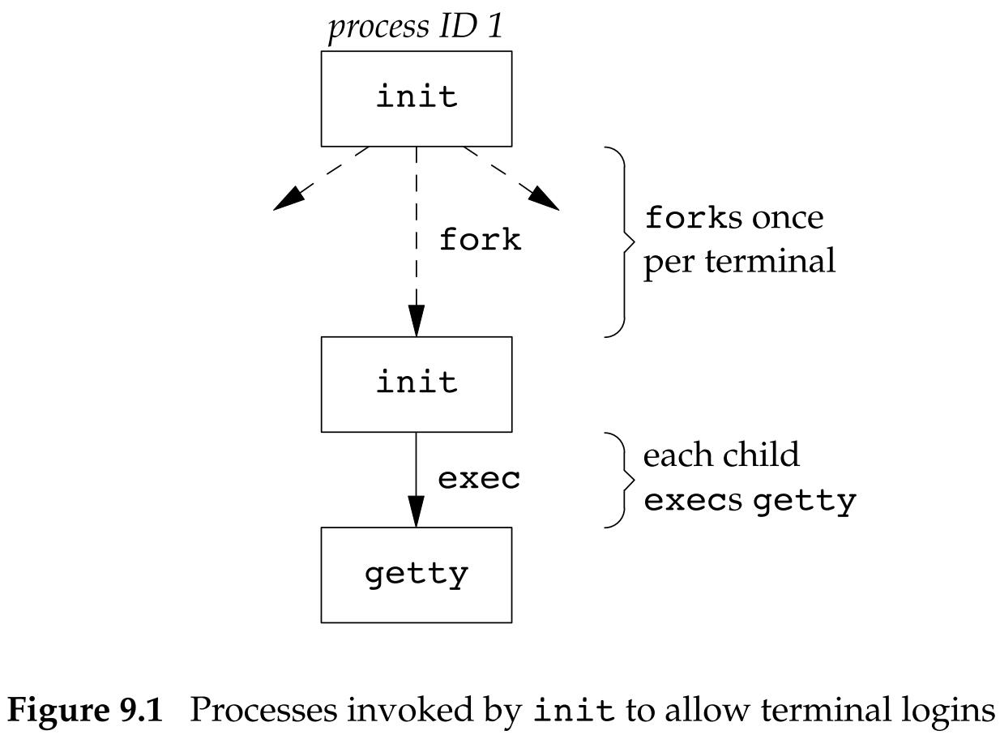
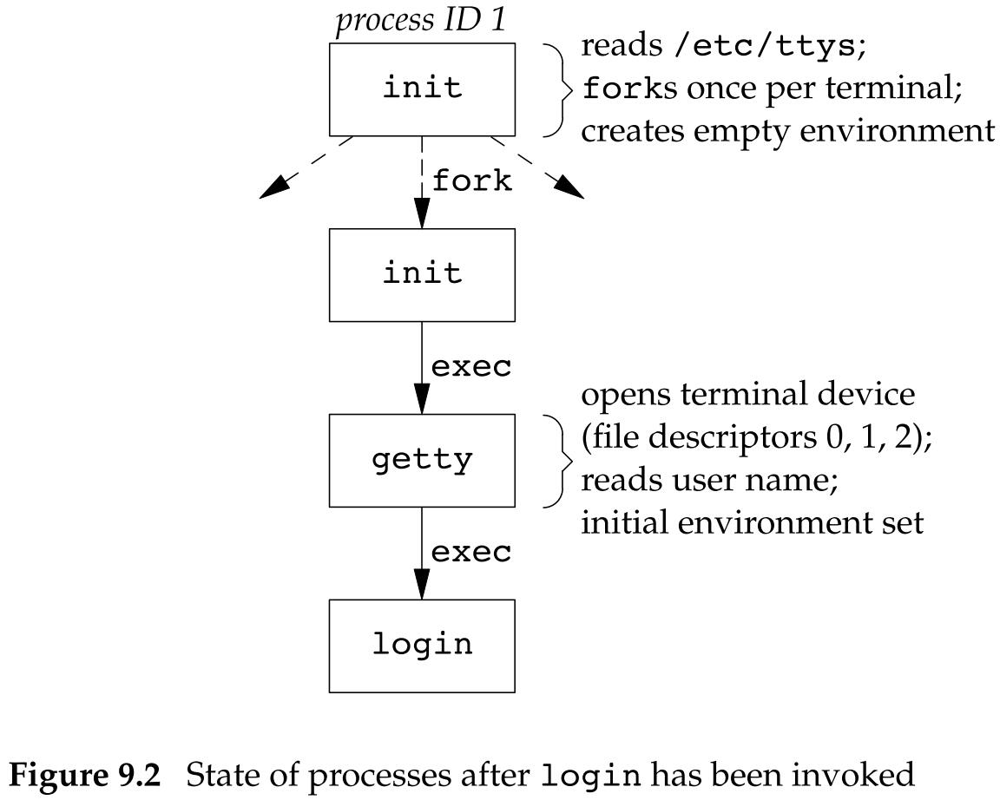
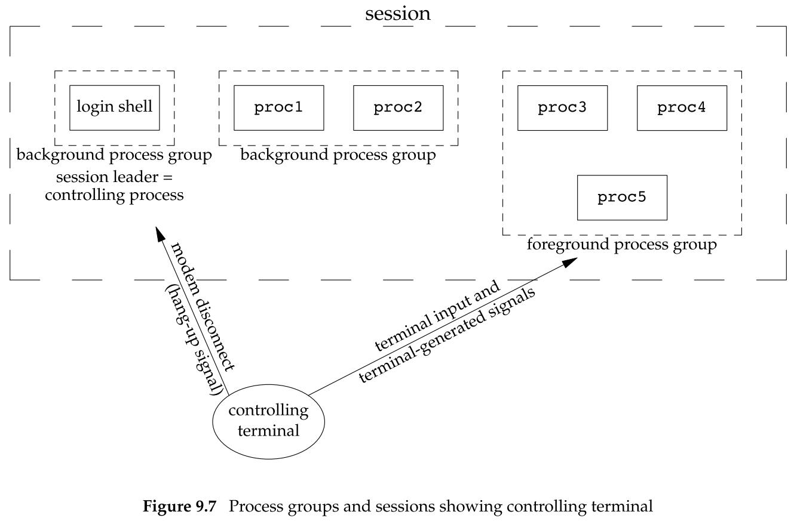
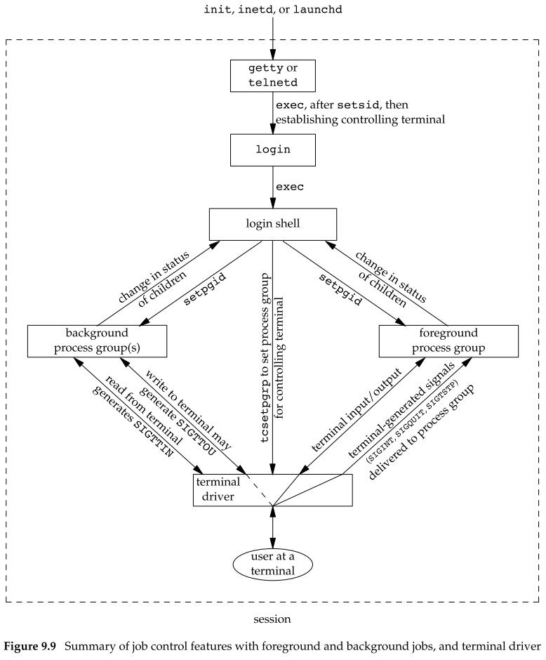

## 进程关系

### 9.1 引言

进程之间具有关系。

首先，每个进程有一个父进程（初始的内核级进程通常是自己的父进程）。当子进程终止时，父进程得到通知并能取得子进程的退出状态。

### 9.2 终端登录

在早期的 UNIX 系统（如 V7）中，用户用哑终端（用硬连接连到主机）进行登录。终端或者是本地的（直接连接）或者是远程的（通过调制解调器连接）。在这两种情况下，登录都经由内核中的终端设备驱动程序。因为连到主机上的终端设备数是固定的，所以同时的登录数也就有了已知的上限。

随着位映射图形终端的出现，开发出了窗口系统，它向用户提供了与主机系统进行交互的新方式。创建终端窗口的应用也被开发出来，它仿真了基于字符的终端，使得用户可以用熟悉的方式（即通过 shell 命令行）与主机交互。

#### BSD 终端登录

系统管理创建通常名为 /etc/ttys/ 的文件，其中，每个终端设备都有一行，每一行说明设备名和传到 `getty` 程序的参数。

当系统自举时，内核创建进程 ID 为 1 的进程，也就是 init 进程。

- init 进程使系统进入多用户模式。

- init 读取文件 /etc/ttys，对每一个允许登录的终端设备，init 调用一次 `fork`，它所生成的子进程则 exec `getty` 程序。

  - `getty` 对终端设备调用 `open` 函数，以读、写方式将终端打开。如果设备是调制解调器，则 `open` 可能会在设备驱动程序中滞留，直到用户拨号调制解调器，并且线路被接通。

  - 一旦设备被打开，则文件描述符 0、1、2 就被设置到该设备。

  - 然后 `getty` 输出 “login:“之类的信息，并等待用户键入用户名。

  - 当用户键入了用户名后，`getty` 的工作就完成了。

  - 然后它以类似于下列的方式调用 `login` 程序：

    ```c
    execle("/bin/login", "login", "-p", username, (char *)0, envp);
    ```

    `-p` 标志通知 `login` 保留传递给它的环境，也可将其他环境字符串加到该环境中，但是不要替换它。

- `login` 能处理多项工作。

  - 因为它得到了用户名，所以能调用 `getpwnam` 取得相应用户的口令文件登录项。
  - 然后调用 `getpass(3)` 以显示提示”Password:“，接着读用户键入的口令。
  - 它调用 `crypt(3)` 将用户键入的口令加密，并与该用户在阴影口令文件中登录项的 `pw_passwd` 字段相比较。
  - 如果用户几次键入的口令都无效，则 `login` 以参数 1 调用 `exit` 表示登录过程失败。
  - 父进程（init）了解到子进程的终止情况后，将再次调用 `fork`，其后又执行了 `getty`，对此终端重复上述过程。

<center class="half">
    
</center> 

现代 UNIX 系统已发展到支持多个身份验证过程，PAM（Pluggable Authentication Modules，可插入的身份验证模块）允许管理人员配置使用何种身份验证方法来访问那些使用 PAM 库编写的服务。

如果应用程序需要验证用户是否具有适当的权限去执行某个服务，那么我们要么将身份验证机制编写到应用中，要么使用 PAM 库得到同样的功能。使用 PAM 的优点是，管理员可以基于本地策略、针对不同任务配置不同的验证用户身份的方法。

如果用户正确登录，`login` 就将完成如下工作：

- 将当前工作目录更改为该用户的起始目录（chdir）。

- 调用 `chown` 更改该终端的所有权，使登录用户成为它的所有者。

- 将对该终端设备的访问权限改变成”用户读和写“。

- 调用 `setgid` 及 `initgroups` 设置进程的组 ID。

- 用 `login` 得到的所有信息初始化环境：起始目录（HOME）、shell（SHELL）、用户名（USER 和 LOGNAME）以及一个系统默认路径（PATH）。

- `login` 进程更改为登录用户的用户 ID（setuid）并调用该用户的登录 shell，其方式类似于：

  ```c
  execl("/bin/sh", "-sh", (char *)0);
  ```

### 9.3 网络登录

通过串行终端登录至系统和经由网络登录至系统两者之间的主要（物理上的）区别是：网络登录时，在终端和计算机之间的连接不再是点到点的。在网络登录情况下，`login` 仅仅是一种可用的服务，这与其他网络服务（如 `FTP` 或 SMTP）的性质相同。

init 知道哪些终端设备可用来进行登录，并为每个设备生成一个 `getty` 进程。但是，对网络登录情况则有所不同，所有登录都经由内核的网络接口驱动程序（如以太网驱动程序），而且事现并不知道将会有多少这样的登录。因此必须等待一个网络连接请求的到达，而不是使一个进程等待每一个可能的登录。

为使同一个软件既能处理终端登录，又能处理网络登录，系统使用了一种称为伪终端（pseudo terminal）的软件驱动程序，它仿真串行终端的运行行为，并将终端操作映射为网络操作，反之亦然。

#### BSD 网络登录

在 BSD 中，有一个 inetd 进程（有时称为因特网超级服务器），它等待大多数网络连接。

作为系统启动的一部分，init 调用一个 shell，使其执行 shell 脚本 /etc/rc。

由此 shell 脚本启动一个守护进程 inetd。

一旦此 shell 脚本终止，inetd 的父进程就变成 init。inetd 等待 TCP/IP 连接请求到达主机，而当一个连接请求到达时，它执行一次 `fork`，然后生成的子进程 exec 适当的程序。

### 9.4 进程组

每个进程除了有一个进程 ID 之外，还属于一个进程组。

进程组是一个或多个进程的集合。通常，它们是在同一作业中结合起来的，同一进程组中的各进程接收来自同一终端的各种信号。每个进程组有一个唯一的进程组 ID。进程组 ID 类似于进程 ID——它是一个正整数，并可存放在 `pid_t` 数据类型中。

函数 `getpgrp` 返回调用进程的进程组 ID：

```c
#include <unistd.h>

pid_t gitpgrp(void);
// 返回值：调用进程的进程组 ID
```

在在早期 BSD 派生的系统中，该函数的参数是 `pid`，返回该进程的进程组 ID。

Single UNIX Specification 定义了 `getpgid` 函数模仿此种运行行为。

```c
#include <unistd.h>

pid_t getpgid(pid_t pid);
// 返回值：若成功，返回进程组 ID；若出错，返回 -1
```

若 `pid` 是 0，返回调用进程的进程组 ID，于是，`getpgid(0)` 等价于 `getpgrp()`。

每个进程组有一个组长进程。组长进程的进程组 ID 等于其进程 ID。

进程组组长可以创建一个进程组、创建该组中的进程，然后终止。只要在某个进程组中有一个进程存在，则该进程组就存在，这与其组长进程是否终止无关。从进程组创建开始到其中最后一个进程离开为止的时间区间称为进程组的生命期。某个进程组中的最后一个进程可以终止，也可以转移到另一个进程组。

进程调用 `setpgid` 可以加入一个现有的进程组或者创建一个新进程组：

```c
#include <unistd.h>

int setpgid(pid_t pid, pid_t pgid);
// 返回值：若成功，返回 0；若出错，返回 -1
```

`setpgid` 函数将 `pid` 进程的进程组 ID 设置为 `pgid`。如果这两个参数相等，则由 `pid` 指定的进程变成进程组组长。如果 `pid` 是 0，则使用调用者的进程 ID。如果 `pgid` 是 0，则由 `pid` 指定的进程 ID 用作进程组 ID。

一个进程只能为它自己或它的子进程设置进程组 ID。在它的子进程调用了 exec 后，它就不再更改该子进程的进程组 ID。

在大多数作业控制 shell 中，在 `fork` 之后调用此函数，使父进程设置其子进程的进程组 ID，并且也使子进程设置其自己的进程组 ID。

- 这两个调用中有一个是冗余的。
- 但让父进程和子进程都这样做可以保证，在父进程和子进程认为子进程已进入了该进程组之前，这确实已经发生了。
- 如果不这样做，在 `fork` 之后，由于父进程和子进程运行的先后次序不确定，会因为子进程的组员身份取决于哪个进程首先执行而产生竞争条件。

### 9.5 回话

会话（session）是一个或多个进程组的集合。

通常是由 shell 的管道将几个进程编成一组的。

进程调用 `setsid` 函数建立一个新会话：

```c
#include <unistd.h>

pid_t setsid(void);
// 返回值：若成功，返回进程组 ID；若出错，返回 -1
```

如果调用此函数的进程不是一个进程组的组长，则此函数创建一个新会话。具体会发生以下 3 件事：

- 该进程变成新会话的会话首进程（session leader，会话首进程是创建该会话的进程）。此时，该进程是新会话中的唯一进程。
- 该进程成为一个新进程组的组长进程。新进程组 ID 是该调用进程的进程 ID。
- 该进程没有控制终端。如果在调用 `setsid` 之前该进程有一个控制终端，那么这种联系也被切断。

如果该调用进程已经是一个进程组的组长，则此函数返回出错。

- 为了保证不处于这种情况，通常先调用 `fork`，然后使其父进程终止，而子进程则继续。因为子进程继承了父进程的进程组 ID，而其进程 ID 则是新分配的，两者不可能相等，这就保证了子进程不是一个进程组的组长。

会话首进程是具有唯一进程 ID 的单个进程，所以可以将会话首进程的进程 ID 视为会话 ID。

`getsid` 函数返回会话首进程的进程组 ID：

```c
#include <unistd.h>

pid_t getsid(pid_t pid);
// 返回值：若成功，返回会话首进程的进程组 ID；若出错，返回 -1
```

如若 `pid` 是 0，`getsid` 返回调用进程的会话首进程的进程组 ID。

出于安全方面的考虑，一些实现有如下限制：

- 如若 `pid` 并不属于调用者所在的会话，那么调用进程就不能得到该会话首进程的进程组 ID。

### 9.6 控制终端

会话和进程组还有一些其他特性：

- 一个会话可以有一个控制终端（controlling terminal）。这通常是终端设备（在终端登录情况下）或伪终端设备（在网络登录情况下）。
- 建立与控制终端连接的会话首进程被称为控制进程（controlling process）。
- 一个会话中的几个进程组可被分成一个前台进程组（foreground process group）以及一个或多个后台进程组（background process group）。
- 如果一个会话有一个控制终端，则它有一个前台进程组，其他进程组为后台进程组。
- 无论何时键入终端的中断键（Delete 或 Ctrl+C），都会将中断信号发送至前台进程组的所有进程。
- 无论何时键入终端的退出键（Ctrl+\），都会将退出信号发送至前台进程组的所有进程。
- 如果终端接口检测到调制解调器（或网络）已经断开连接，则将挂断信号发送至控制进程（会话首进程）。

<center class="half">
    
</center> 

有时不管标准输入、标准输出是否重定向，程序都要与控制终端交互作用。保证程序能与控制终端对话的方法是 `open` 文件 /dev/tty。在内核中，此特殊文件是控制终端的同义语。如果程序没有控制终端，则对于此设备的 `open` 将失败。

### 9.7 函数 `tcgetpgrp`、`tcsetpgrp` 和 `tcgetsid`

需要有一种方法来通知内核哪一个进程组是前台进程组，这样，终端设备驱动程序就能知道将终端输入和终端产生的信号发送到何处。

```c
#include <unistd.h>

pid_t tcgetpgrp(int fd);
// 返回值：若成功，返回前台进程组 ID；若出错，返回 -1

int tcsetpgrp(int fd, pid_t pgrpid);
// 返回值：若成功，返回 0；若出错，返回 -1
```

函数 `tcgetpgrp` 返回前台进程组 ID，它与在 `fd` 上打开的终端相关联。

如果进程有一个控制终端，则该进程可以调用 `tcsetpgrp` 将前台进程组 ID 设置为 `pgrpid`。`pgrpid` 值应当是在同一会话中的一个进程组 ID。`fd` 必须引用该会话的控制终端。

大多数应用程序并不直接调用这两个函数。它们通常由作业控制 shell 调用。

给出控制 TTY 的文件描述符，通过 `tcgetsid` 函数，应用程序就能获得会话首进程的进程组 ID。

```c
#include <termios.h>

pid_t tcgetsid(int fd);
// 返回值：若成功，返回会话首进程的进程组 ID；若出错，返回 -1
```

需要管理控制终端的应用程序可以调用 `tcgetsid` 函数识别出控制终端的会话首进程的会话 ID（它等价于会话首进程的进程组 ID）。

### 9.8 作业控制

作业控制允许在一个终端上启动多个作业（进程组），它控制哪一个作业可以访问该终端以及哪些左右在后台运行。

作业控制要求以下 3 种形式的支持：

- 支持作业控制的 shell。
- 内核中的终端驱动程序必须支持作业控制。
- 内核必须提供对某些作业控制信号的支持。

从 shell 使用作业控制功能的角度观察，用户可以在前台或后台启动一个作业。一个作业只是几个进程的集合，通常是一个进程管道。

当启动一个后台作业时，shell 赋予它一个作业标识符，并打印一个或多个进程 ID。

终端驱动程序必须处理与作业控制有关的另一种情况。我们可以有一个前台作业，若干个后台作业，只有前台作业接收终端输入，如果后台作业试图读终端，这并不是一个错误，但是终端驱动程序将检测这种情况，并且向后台作业发送一个特定信号 SIGTTIN。该信号通常会停止此后台作业，而 shell 则向有关用户发出这种情况的通知，然后用户就可用 shell 命令将此作业转为前台作业运行，于是它就可读终端。

后台作业输出到控制终端是一个可以允许或禁止的选项。通常，可以用 `stty(1)` 命令改变这一选项。

<center class="half">
    
</center> 

上图总结了前面已说明的作业控制的某些功能。

- 穿过终端驱动程序框的实线表明终端 I/O 和终端产生的信号总是从前台进程组连接到实际终端。
- 对应于 SIGTTOU 信号的虚线表明后台进程组进程的输出是否出现在终端是可选择的。

### 9.10 孤儿进程组

POSIX.1 将孤儿进程组（orphaned process group）定义为：该组中每个成员的父进程要么是该组的一个成员，要么不是该组所属会话的成员。

对孤儿进程组的另一种描述可以是：一个进程组不是孤儿进程组的条件是——该组中有一个进程，其父进程在属于同一会话的另一个组中。如果进程组不是孤儿进程组，那么在属于同一会话的另一个组中的父进程就有机会重新启动该组中停止的进程。

当孤儿进程组产生时，POSIX.1 要求向新孤儿进程组中处于停止状态的每一个进程发送挂断信号（SIGHUP），接着又向其发送继续信号（SIGCONT）。

- 这个顺序是不能变的。
  - 进程在处于停止状态时是不能响应信号的，只有当进程继续运行的时候，才能响应之前的信号。
  - 如果先发送 SIGCONT 信号再发送 SIGHUP 信号，那么 SIGCONT 信号后，进程就开始重新进入运行态，这个和马上响应 SIGHUP 信号的用意相违背。


